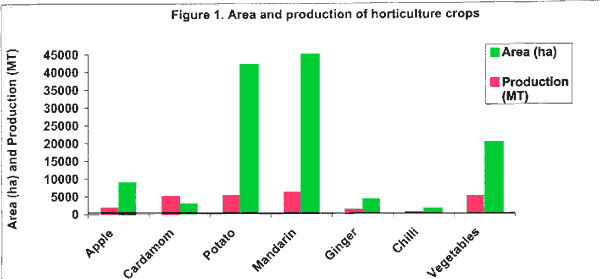

<body bgcolor="#ffffff">
 
<!----- Start of Author-n-Text below ...... ---->

<h2>
An Overview of the Citrus Industry in Bhutan
</h2>

 

<h3></h3>
  

Ministry of Agriculture  
Integrated Horticulture Development Programme  
PO Box 119  
Thimphu, Bhutan  
ATCROS Reference:  
  


<h1>An Overview of the Citrus Industry in Bhutan</h1>

<h2>Introduction</h2>
<ul><li>Bhutan is a small landlocked kingdom in the eastern Himalayas.  85% of the population is involved in farming.</li>
<li>Mandarin orange <i>(Citrus reticulata</i>Blanco) is the most important sub-tropical fruit grown in Bhutan (Figure 1) and the second largest export crop.</li>
<li>It is cultivated in the southern foothills between 300-1400 m above sea level (Table 1).</li>
<li>Other species such as lime (<i>C. aurantifolia</i>) and lemon (<i>C. limon</i>) less important.</li></ul>

<b>Table 1  Climate in the Mandarin Growing Areas</b>

<table border="1" width="600">
<tr><td> </td><th colspan="2">Temperature Range in Degrees Celsius Summer     Winter  </th><th>Annual Rainfall (mm)</th></tr>
<tr><td>Lowlands below 650 masl</td><td>15-38</td><td>10-25</td><td>above 4000</td></tr>
<tr><td>Mid altitudes up to 1400 masl</td><td>14-31</td><td>3-21</td><td>1500-2000</td></tr>
</table>

<b>Orchard on Hill Slope</b>

<h2>Development Activities</h2>

Development activities largely carried out through Government initiatives.  The research system is relatively young.  On-station and on-farm research focus on:
<ul><li>Identification of suitable location-specific species and varieties that can improve diversification and have marketing potential.</li>
<li>Generation of appropriate management and post-harvest technologies (eg. tree size control, water, nutrient and pests/diseases management).</li></ul>

Other development activities include 
<ul><li>generation of inputs (eg:planting material)</li>
<li>market research, information and infrastructure</li>
<li>human resource development</li></ul>

<h2>Variety</h2>
<ul><li>Phenotypically similar trees and fruits, believed to be of one variety.</li>
<li>Trees are usually tall, upright with small to medium canopy structure, multi-stemmed with thorny lower trunks.  Fruit is loose skinned, easy to peel, medium (45-70 mm in diameter), slightly flattened with a prominent button, moderate seeds, excellent flavour and texture.</li></ul>

<h2>Post-Harvest Management</h2>
<ul>
<li>fruits are harvested manually using long bamboo ladders.</li>
<li>harvest damage to fruits can range between 5-20% at the farm level.</li>
<li>fruits are visually graded according to size, colour and appearance.</li>
<li>local price ranges between Nu 40-100 (1 A$=Nu 23) for 80 pieces while export price range from Nu 80-160 per 80 fruits.</li></ul>

<h2>Potentials</h2>

<b>Harvesting</b>

<ul><li>Wide agro-ecological zones with potential to produce wide range of citrus</li>
<li>Seasonal comparative advantage (out of season) over neighbours</li>
<li>Proximity to markets (India, Bangladesh and parts of south east Asia)</li>
<li>Rapid economic growth in the region, expanding tourism and emerging of middle class in the country resulting in increased demand in fruit variety.</li></ul>

<h2>Constraints</h2>

<ul><li>Mountainous terrain and narrow valleys with steep slopes would limit large scale expansion, mechanization, accessibility and management.</li></ul>

<b>Transporting</b>

<b>Grading</b>

<h2>Propagation</h2>
<ul><li>Traditionally grown from seedlings.  Now initiating vegetative propagation.</li></ul>
<h2>Management</h2>
<ul><li>is generally basic and organic because of the difficult montane topography (slopes ranging from 0-60%), small orchard sizes (0.2-6ha).</li>
<li>mid density (400-550 trees per hectare), in the absence of tree size management and poor management results yields = 40-80 kgs/tree.</li>
<li>intercropping with other crops such as fodder species and vegetables are practiced by a few farmers.</li></ul>

<b>Packed fruits ready for Export</b>
<h2>Pests and Diseases</h2>
<ul><li>Chinese Citrus fruit fly (<i>B. minax</i>) is a major pest, causing fruit drop and reducing yield by up to 50% in some places.</li>
<li>Trunk Borer (<i>A.nr.versteegi</i>)and citrus shield bug (<i>R. poseidon</i>)are also quite common.  Other minor pests and diseases include whiteflies (<i>Aleyrodidae</i>), mealybugs (<i>Pseudococcidae</i>), aphids (<i>Aphididae</i>), sooty mould, powdery mildew and parasites such as Loranthys (<i>S. parasitica</i>L).</li></ul>
<table>
<tr><td align="right"></td><td align="left"><b>Citrus shield bug (<i>Rynchocoris poseidon</i>) and tree parasite, Loranthus(<i>Scurrula parasitica</i>)</b></td></tr>
<tr><td align="right"><b>Chinese Citrus Fruit Fly, <i>Bactrocera minax</i> Adult and Larvae</b></td><td>Bactrocera minax</i> Adult and Larvae" src="Bhutan2.jpg"/></td></tr></table>

(END)

</body>
