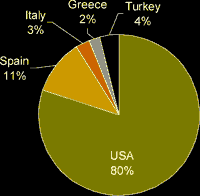
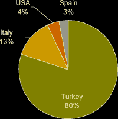
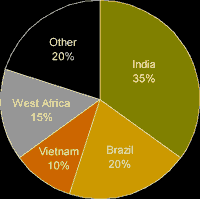
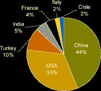
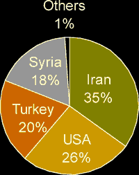
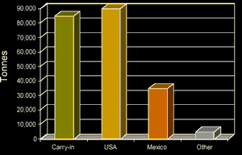
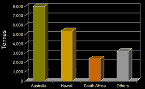

<body>

<h2>
The International Nut Trade
</h2>

  
<h3></h3>

Phil Coutts  
  
  
/

Scalzo Food Industries  
Melbourne Head Office  
156-174 Kensington Road,  
West Melbourne, Vic 3003  
Phone: +61-3-9245 7000 Fax: +61-3-9245 7050  
Email: phil.coutts@scalzofoods.com.au  
Website:
[www.scalzofoods.com.au](http://www.scalzofoods.com.au).  
ATCROS Reference: A3513.  
  
  
  


<b>Abstract</b> 
A comprehensive survey of the international trade in six nuts.

I work for Scalzo Food Industries. Scalzo is a member of the International Nut Council.

The major tree nuts that are used in Australia are almonds, hazelnuts, pistachios, pecans, and macadamias. The numbers here today are in general for world production for this year and next year's crop estimates. These have been taken from the International Nut Council Statistical Review. I'll talk about the major producing countries of each of the tree nuts and their share of total production. I'll try and talk about some of the major markets for those tree nuts I've mentioned. Also some of the countries that grow these nuts and the programs designed to increase consumption. I'll talk about forecasts for future crops. I'll briefly touch on some of the applications for some of the products we highlight.

<table><tr><td></td><td bgcolor="99ffff">
 <h2>Almonds</h2> World Production, 2000/01 Estimate:  Total 396,000 tonnes shelled
Australia: 2001 Estimate Production 8,200 tonnes, consumption 9,500 tonnes.  In
1986 - 450,000 trees, 2001 - 1.2 million trees, 2005 - 1.9 million trees.  In 2005 production
13,000 tonnes.</td></tr></table>
<table bgcolor="99ffff"><tr><td>
<ul><li>Shelled almonds account for 91% of total USA almond exports.  Major buyers of USA shelled almonds are the EU.  Asia is the most significant importer of in-shell almonds.</li>
<li>The USA almond industry continues to dominate the export market.  Expanding consumption is critical in selling the large USA crop so marketing campaigns are focused in this area.</li>
<li>Other EU countries are the major destinations for Spain's exports.  While there is no price support for tree nuts the EU does have an improvement plan that is implemented in Spain's almond sector.</li>
<li>Output in the medium to long term in Italy is projected to decline due to reported uprooting of the oldest, least productive trees and no significant planting of new orchards.</li>
<li>Greece has the highest per capita consumption of nuts in the world and produces mainly to meet domestic demand and the growing tourism industry.</li>
<li>Applications--Processed kernels include both roasted and blanched whole, sliced, slivered and meal.  The baking and confectionery industries are the largest consuming industries.</li></ul></td></tr></table>

The first nut is almonds. World production for 2000/2001 estimate is 396,000 tonnes, shelled, that is, the kernel shells taken off. (See Pie Chart) 80% are produced in the USA, then we have Spain, Italy, Turkey and Greece. Australia is a producer of almonds. It is estimated we'll produce 8,200 tonnes in the year 2001. Consumption in Australia is 9,500 tonnes. You can see we're close to a situation in a few years time where we'll be a net exporter. Just to give you some idea of growth, in 1986 there were 450,000 almond trees but in 2001 there are 1.2 million almond trees and it is expected there will be 1.9 million trees in 2005.  Significant growth.

In the USA for the moment, shelled almonds account for 91% of the total US exports and the major buyers are the European Union. At the moment the significant importer of in shell almonds is Asia. The US almond industry continues to dominate the export market, expanding consumption is therefore crucial to selling the huge US crop, so marketing campaigns are focused in this area. The last 3 almond crops in the USA have been very large so they've got the product, but they need to sell it. Other EU countries are the major destination for Spain's exports and while they don't have a price support program, the EU does have an improvement plan that was implemented in Spain's almond sector. Italy's output is in decline. There has been a lot of uprooting of old trees and the least productive trees. They haven't been replanting. Greece has the highest per capita consumption of nuts in the world. They are grown mainly to meet domestic demand and their growing tourist industry. The main application for almonds is as processed kernels. You can blanch them, whole kernels, slice them, sliver them and make them into meal. The 2 major industries that use them are the baking industry and the confectionery industry.  People like Cadbury, Nestlé and Mars are significant users of almonds.

<table width="100%"><tr><td></td><td bgcolor="99ffff">
 <h2>Hazelnuts</h2> World Production, 2000/01 Estimate: Total 638,000 tonnes in-shell
</td></tr></table>
<table bgcolor="99ffff"><tr><td>
<ul><li>Turkey dominates world hazelnut trade and largely determines world export proces.  Their largest export market is the EU.  Turkey is trying to expand markets in Asia as well as the USA where it is involved in a joint promotion program with US growers to increase US consumption of hazelnuts.</li>
<li>Virtually all of the expected USA production will come from Oregon.  US exports will face increased international competition from lower priced Turkish product.</li>
<li>Italy's main export market is the EU.  The EU program favouring domestic hazelnut producers has expired and no new support actions have been adopted by the EU for the hazelnut industry.</li>
<li>Hazelnut exports in Spain are expected to decrease and imports to increase as a result of a smaller crop.  While there is no support program for tree nuts, the EU does have an improvement plan that is implemented in Spain's hazelnut sector.</li>
<li>Applications: Processed kernels include roasted, sliced, chopped, paste, meal and flour.  The confectionery and baking industries are the largest consuming industries.</li></ul></td></tr></table>

The second nut I would like to focus on is hazelnuts. The estimate for 2000/2001 is 638,000 tonnes and that's in shell. The pie chart shows that there is one country that stands out and that is Turkey, which has 80% of production, followed by Italy, USA and Spain. Turkey dominates and largely determines world export prices. Their largest export market is the EU. Turkey is trying to expand into Asia and they also have a joint production program with US growers to increase US hazelnut consumption. All the USA production will come from Oregon but they will continue to face competition from lower priced Turkish product. The EU program favouring domestic hazelnut producers has expired and there's no new support action been adopted by the EU for the hazelnut industry in Italy. Also hazelnut exports in Spain are expected to decrease and imports to increase as a result of a smaller crop. Again while there is no support program, the EU does have an improvement plan and it is implemented in Spain's hazelnut sector.
Applications for hazelnuts is mainly in the baking and confectionery industries and once again the hazelnuts can be roasted whole, slivered, sliced, turned into a paste. One of the largest users in Australia is Ferrero for their Nutella and hazelnut blocks.

<table width="100%"><tr><td></td><td bgcolor="99ffff">
 <h2>Cashews</h2> World World Production, 2000/01 Estimate: Total 600,000 tonnes kernel
</td></tr></table>
<table bgcolor="99ffff"><tr><td>
<ul><li>Although accurate figures are difficult to get, it is estimated that the Indian crop will be a normal one.  Although every link in the chain has inventory, there does not seem to be any excess inventory anywhere.</li>
<li>In Brazil the crop in the Northern States has been delayed due to unseasonable rains, but any shortfall should be compensated by a good harvest in the Southern States.</li>
<li>The Vietnam crop is below normal.</li>
<li>Overall, the West African crop appears to be normal.</li>
<li>Imports of cashew kernels into the largest consuming country, the USA, are declining from India but increasing from Brazil and Vietnam.</li>
<li>Applications:  Predominantly roasted and salted as a snack food, but also used in the confectionary industry.</li></ul></td></tr></table>

The expected 2000/2001 production of cashews is 600,000 tonnes of kernel. The production of cashews is fairly evenly spread amongst countries. India is still the major producer, but they are being challenged by Brazil, West Africa and most recently Vietnam who have risen to a 10% share over a very short number of years. It is difficult to get figures but it is expected that the Indian crop will be a normal one. The way India operates in the cashew market there is inventory spread right throughout the system so everyone is being looked after at this stage. The crop in the northern states of Brazil has been delayed due to unseasonal rains, but that shortfall has been compensated by the southern states. The Vietnamese crop is below normal according to early indications and overall the West African crop appears to be normal.  Imports into the largest consumer of cashews, the USA, is declining from India and increasing from Brazil and Vietnam. That's also occurring in Australia, not so much from Brazil but from Vietnam. The largest importer into Australia is still India but closely followed by Vietnam. That's mainly due to quality issues because the Vietnamese product in some areas is a much superior product.  Cashews are sold mainly as a snack food, roasted and salted, but can also be used in the confectionery industry. Some confectioners still use cashews in their fruit and nut blocks.

<table width="100%"><tr><td></td><td bgcolor="99ffff">
 <h2>Walnuts</h2> World World World Production, 2000/01 Estimate: Total 676,000 tonnes in-shell
</td></tr></table>
<table bgcolor="99ffff"><tr><td>
<ul><li>Walnut production in China is forecast to increase as new, higher yielding varieties of trees planted during the last decade come into production.  Output is likely to increase in the short to medium term due to improved varieties and advanced growing techniques.  Major export markets include UK, Japan, Canada and Hong Kong.</li>
<li>The large quality USA crop combined with support from the Market Access Program (MAP) as well as publicity following the publication of several health studies showing health benefits of walnuts all combined to make a good export year for walnuts.</li>
<li>Government and non-official sources in Turkey agree that walnut production is expected to rise as new trees with improved varieties reach bearing age and acreage is increased.</li>
<li>In India there are no restrictions on walnut exports and the Government provides no export subsidies.</li>
<li>Applications: As raw kernels in the baking and cake industries and as a snack food.</li></ul></td></tr></table>

Walnut production is estimated at 676,000 tonnes in shell. There are 2 major producers, China and the USA. The pie chart shows Turkey is getting quite large while India, France, Italy and Chile have small percentages. Walnut production in China is increasing due to high yielding varieties of trees planted in the last decade. Outputs are likely to increase in the short to medium term due to improved varieties and advanced growing techniques but China still has a problem with quality due mainly to hygiene concerns, but they are improving in that area. The major export markets include UK, Japan, Canada and Hong Kong. The last US crop is a very good quality crop. They also get support from a market access program and there's a lot of publicity on walnuts.  A lot of health studies have been done on the health benefits of consuming walnuts, not only in the USA but also in Australia.  Walnut production is expected to rise in Turkey as a lot of new trees start to bear fruit. In India, there's no restriction on walnut imports and the government does not provide any incentives in that industry. 
In terms of applications, they are used in the baking industry and also sold as a snack food, but it does not predominate.

<table><tr><td></td><td bgcolor="99ffff">
 <h2>Pistachios</h2> World World Iran and USA are the two major pistachio producers.

Estimates from Iran vary from 120,000 to 180,000 tonnes in-shell.

The 2000 crop produced another record for California with 109,000 tonnes in-shell being reported. Australia:  The 2001 crop is estimated at 900 tonnes, about 65% of domestic consumption.
</td></tr></table>
<table bgcolor="99ffff" width="100%"><tr><td>
<ul><li>Iran is continuing with its efforts to combat the aflatoxin issue and to comply with the European Commission regulations on aflatoxin.  The industry is progressing and becoming more mechanised.  Import statistics into Europe show increasing volumes are found suitable for the EU market.</li>
<li>The USA industry continues to remain focused on consistent market expansion on a global basis to provide orderly sales and shipment volumes throughout the year.  The concerns for aflatoxin have increased the demand for pistachios from California due to the industry's ability to meet the stringent aflatoxin tolerances of importing countries in the EU and Asia.</li>
<li>Applications:  Predominantly roasted and salted in-shell as a snack food.  Kernels used in the baking and cake industries.</li></ul></td></tr></table>

While Iran and the USA are the 2 major pistachio producers, estimates coming out of Iran vary from 130 to 180,000 tonnes in shell. So that's a fairly wide-ranging estimate. The 2000 crop produced another record for California with 109,000 tonnes in shell. Turkey and Syria are now becoming quite significant producers. Australia does have a pistachio industry and the 2001 crop is estimated at 900 tonnes and that is about 65% of domestic consumption. The pistachio industry has grown quite significantly over recent years in Australia.

Iran over recent years has had significant problems with aflatoxin.  So much so, that the product was banned from import into the EU. So the Union is now working with Iran to help them overcome the problem. The industry in Iran is becoming more mechanized and while the imports into the EU have reduced over recent years, there is now beginning to show a trend that suitable product is being produced in Iran that can be used in the EU. The USA still remains focused on consistent market expansion on a global basis. Concerns about aflatoxins have increased the demand from California, as they are able to meet the stringent aflatoxin tolerances the EU has placed on the industry. 

<table><tr><td></td><td bgcolor="99ffff">
 <h2>Pecans</h2> World Supply, 2000/01 Estimate: Total 215,000 tonnes in-shell. Australia, 2000: 1,100 tonnes in-shell.
</td></tr></table>
<table bgcolor="99ffff" width="100%"><tr><td>
<ul><li>Pecans are alternate bearing and 2000 is the year for lower production in the USA.</li>
<li>In the USA yields have been reported to be, for the most part, 20% below pre-harvest expectations.</li>
<li>The current holdings of pecans in cold storage indicate there should be an adequate supply.</li>
<li>Applications:  Predominantly used in the baking and cake industries.</li></ul></td></tr></table>

The world supply of pecans 2001 estimate is 215,000 tonnes in shell. As you can see (pie chart) there will be a carry in this year in the USA, which is quite significant. The USA dominates, followed by Mexico. Australia will produce 1100 tonnes of pecans in shell in 2000.

 
Pecans are alternate bearing and 2000 is the year for lower production hence the carry in we saw in the previous slide. For the most part yield is expected to be 20% below preharvest expectations and the current holding of pecan in cold storage indicates there should be adequate supply. Pecans are predominantly used in the baking and cake industries.

<table><tr><td></td><td bgcolor="99ffff">
 <h2>Macadamias</h2> World Production, 2000 Estimate: Total 19,000 tonnes shelled.
</td></tr></table>
<table bgcolor="99ffff"><tr><td>
<ul><li>The Australian crop is officially 29,000 tonnes in-shell.  However, the new crop will be short due to recent flooding.</li>
<li>Major markets are USA, Japan and the EU.  Promotional activities include a market development program in Japan and public relations programs in USA and Europe aimed at increasing awareness.</li>
<li>Hawaii's relatively short crop impacted by drought may be even lower due to heavy rain and flooding.</li>
<li>The South African crop is ahead of earlier forecasts and prospects for growth remain good.</li>
<li>Applications:  Kernels roasted and salted as a snack food.  Roasted and raw keernels used in the confectionery, baking and ice-cream industries.</li></ul></td></tr></table>

Macadamias are another important tree crop to Australia.  2000/2001 estimates are 19,000 tonnes shelled (graph). Australia dominates, followed by Hawaii and South Africa and a number of other small producers. The Australian crop is officially 29,000 tonnes in shell. The new crop just coming in will be short due to flooding in New South Wales and South Queensland. The major market for macadamias is the USA, Japan and the EU. Growers have in place promotional and market development programs, as well as the USA and Europe to increase awareness of macadamia nut.

Hawaii has a short crop this year impacted by drought and followed by some recent heavy rain. The South African crop is ahead of forecasts and crop growths remain sound. 
The applications for macadamia again roasted and salted and sold as a snack food, but roasted/raw kernels are starting to be used more in the confectionery and ice-cream industries.

<h2>The Traditional Healthy Mediterranean Diet Pyramid.</h2>

In 1994 the International Nut Committee held a symposium in San Francisco entitled "Tree Nuts and the Healthy Mediterranean Diet."  Here are some excepts: "The good news is that the oil in nuts is quite similar in composition to the oil in olives."  If we lower cholesterol by eating nuts frequently, you could predict a 20Ð25% lowering of heart attack risk. The walnut diet further decreased cholesterol as compared to a cholesterol-lowering diet. The issue right from the beginning in establishing the role of nuts in the American diet was one of cost and one of protein. People in the Mediterranean ate diets that were very low in saturated fats and very high in fruits, nuts, vegetables and had very low rates of heart disease. The Mediterranean Diet Pyramid puts nuts much more firmly in the category of beans and at the base of a healthy diet.

Scalzo is a private company based in Melbourne but we do have sales offices and warehouses in all the states of Australia and New Zealand. Apart from being an ingredient supplier to the manufacturing industry, we also have manufacturing and dehydration facilities. Our manufacturing facility is in Kensington in Melbourne and we process our nuts, almonds, hazelnuts mainly roasted for the manufacturing industry. We also do some dried blending. Our dehydration facility is in Bales, near Packenham, Melbourne and we dehydrate meat, mainly beef, chicken and pork, and again the products are sold into the manufacturing industry for things like Cuppa soup and prepared meals.

We are also fairly dominant in the New Zealand market. There is a list of our contact addresses on our website, <a href="http://www.scalzofoods.com.au" target="parent">www.scalzofoods.com.au</a>.   Thank you.

</body>
