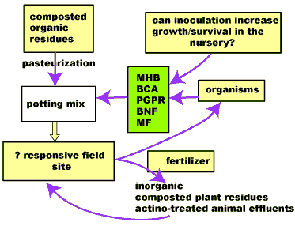

<body>

<h2>
Mycorrhiza and Tree Nutrition
</h2>

  
<h3></h3>

Bernie Dell  
A/Professor  
E-mail: dell@central.murdoch.edu.au  
  
  
/

Mycorrhiza Technology and Tree Nutrition Laboratories,  
School of Biological Sciences and Biotechnology,  
Murdoch University,  
Perth, Western Australia 6150  
Tel. Int: +61 8 9360 2875  
Fax Int: +61 8 9360 6303  
Web Site: http://www.murdoch.edu.au/  
ATCROS Reference:  
  


<b>Abstract</b> 
The most important part of the tree is below the ground: the root system and the rhizosphere.  The quantity and nature of fungi and bacteria in the soil are very important to a plant's health and productivity.  These factors can be manipulated to give great increases in growth, survival, productivity and quality.

Do you know the most important part of the tree is below the ground: how often do we ignore that part?  We are very happy to collect above-ground parts for food and medicine, and we tread on its roots in so doing.  Today I want to focus you below ground, because without taking care of the roots, you don't really have a tree or crop at all, and I think that sometimes we forget about that.  Those of you who are into organic practices, you are feeding the microbes and fungi in the soil, which is what I want to talk about.  So, maybe inadvertently, you are doing the right thing.

I want to say a little bit about the rhizosphere environment and then give you two examples of beneficial organisms we have worked on.  I heard mycorrhizal fungi mentioned a couple of times this afternoon, so I know you are familiar with that, plus something about bacteria.

slide, drawing of root 
This is the part we are concerned about.  If you look at pictures in students' text books, you tend to see pictures like this of naked root systems with root hairs.  These books will say things like, this is what it is all about.  But these root systems are produced under artificial environments.  The reality is that when you look at root systems growing in soil, they are always colonised by fungi and bacteria.  Here we can see part of a lateral root emerging and this wire-like material here is fungal hyphae.  When we magnify this under a scanning electron microscope, we can see bacteria on the surface of the fungal hyphae.  This is the rhizosphere.  It is the interface between the root and the soil.  It is the key part for the root system.  It is where everything happens.  It is where the plant gets access to all the goodies from the soil.  It is where the soil is fed by the plant.

The hyphae extend out through the soil.  Here is a profile through soil, with fungal hyphae growing through the soil, with bacteria attached to the hyphae or attached to particles in the soil.  It is a very complex environment.  I will try to simplify that, and then show you some slides.

There is a lot of information in this overhead.  This is a schematic of a root growing into soil.  It has to protect this delicate growing area so it produces a mucilage material around the root cap that contains carbohydrates, provides a food source for many soil organisms.  In addition, other parts of the root excrete organic carbon in many different compounds, sugars, for example.  This carbon source can be very large.  In many plants, we know, they redistribute perhaps 30% to 60% of the carbon they fix in the leaves to the roots.  About half of that big amount of carbon the plant fixes ends up out in the rhizosphere.  It is that carbon source in the rhizosphere that really drives the living system around the roots.  I am particularly interested in the good guys, the beneficial fungi and bacteria that live in that interface.  It is a special habitat, a rich carbon source, a nice, protected environment.  But it also has distinct gradients, which can occur both longitudinally, down the root, and radially, away from the root.  I don't have time to show you these gradients in detail.  But, for example, if I were to look at that whole root system under a scanning electron microscope, I would see that there were big gradients in distribution of the microbes: different bacteria live in different places along the root, in specialised habitats there.  It is not like a root growing in a soup, where everything is all mixed up.  There are micro environments.

There are also big gradients in exudates.  I mentioned carbon as one of them.  There are big gradients in nutrients, which is one of the areas I am particularly interested in, the nutrients of microorganisms.  There are also gradients in pH.

The combination of environments, the changes in different places provide sites for bacteria and fungi.  Some of these fungi are symbiotic.  They form mutualistic associations with the roots.  I have indicated this in my diagram in black.  Over here we have an emerging root that is covered in yellow fungal hyphae.  The roots of pecans, hazels, oaks, pines, have roots that proliferate close to the surface in organic horizons, called ectomycorrhizas.  Then there are fungal systems you can't see with the naked eye, with very fine hyphal systems that enter into the cells of the roots.  Most plants produce these: only a small number don't.  They are there--they ought to be there, if you are managing your trees sustainably.

One of the key roles these fungi play is to access nutrients for the tree.  This can be in soil solutions, or forms that the tree cannot get without the help from the fungus.  A good example of that would be where there is organic material accumulating in the soil, the fungi can access phosphate and nitrogen in the organic matter, creating enzymes.  These enzymes are not produced by the plant roots, but can be produced by the beneficial fungus.  They can also excrete things like organic acids, so they can access phosphate in insoluble forms.  In our Australian environment this is a key process because, generally, in most soils, elements like nitrogen and phosphorous are limiting for growth.  That is one of the reasons you should be using compost and increasing organic content.  You are providing substrate, you are providing minerals that are going to drive this biosystem.  I am really talking about this key place of living, which is between the root and the soil.  Without that, you wouldn't have trees at all.

slide  flooded landscape. 
There are many parts of the world with agricultural systems.  If you count the number of microorganisms present, the diversity is far less than would have been there prior to the clearing of land for agriculture.  One of the challenges is to increase the microbial diversity, increase the microbial biomass in the soils.  Microbial biomass is one of the indices that people are starting to use around the world as a crude measure of sustainability.  This is after Mt Pinatubo went up in the Philippines.  I was working on a project there shortly afterwards.  These catastrophic events will destroy all forms of life.  One of the challenges in that sort of environment is to try to get farming systems back again.  What we have to do there is to try to introduce the sort of microorganisms that were present at the time.

Slide, orchard 
This is in northern Thailand.  The way the soil is being managed is really quite catastrophic for microbial diversity.  There is almost no organic matter, for a start.  It has been removed, erosion over time, and we are trying to grow crops on the subsoil.  I think most of you recognise that as being an environment where we have to do a great deal to improve it.  In many cases, where land has become degraded, we don't recognise it.

slide, hyphae 
What we should see is something like this.  If you remove the litter layer, for example, underneath the tree, you should see healthy roots.  They are not naked, but covered with fungi.  The white colour is the symbiotic, ectomycorrhizal fungus growing on this root system.  It occurs in large mats.  The more organic material that is present in those horizons, then the more symbiotic associations will develop.

slide, woman with mushrooms. 
Some of those associations we know, we are very familiar with them, because, in their sexual phase, with the macroscopic fungi which produce fruiting bodies, many of which are edible.  Unfortunately, Australia was settled by people who came from a little set of islands off the coast of France.  These people had no culture of using fungi for food at all.  In fact, they were really frightened of fungi, whereas the continental experience right through into southeast Asia, except right down in the lowlands in the tropics, is one that makes great use of forest fungi for all sorts of reasons.  And so in Australia, we have actually lost the indigenous knowledge that people had of which fungi you could use for food, which you could use for medicine.  Our challenge is to rediscover that knowledge.  Perhaps the way we could do that is to interact with our neighbours to the north where there are similar kinds of fungi occurring.  When you see these fungi, keep in mind that the key part is below ground, and for many of them, it is the association of a root system.

slide, fungi 
Australia is well known because we have a huge diversity of fungi that most of you have never seen, because these fungi fruit in the soil, particularly in the organic horizon.  Here are truffle-like fruiting bodies one or two centimetres across; here are specialised cluster mycorrhizal roots and fungal fans that are feeding on the organic material.  They have come to interest recently, because people have become aware of a tripartite relationship that occurs between fungi, a tree, and in this case, a marsupial.  The marsupial is dependent on the fruiting body for food.  The fungal spores passage through its gut, and are deposited in little nutrient-rich packages, which are distributed about.  The fungus benefits from the dispersal of spores.  The spores germinate; they can only produce fruiting bodies if they form a symbiotic relationship with a tree.  The tree benefits because the fungus provides the tree with inorganic nutrients and other things, and the fungus gets its carbon source from the tree.  So you have this absolutely fabulous relationship.  We just have to discover where we fit into that picture.

slide, laboratory 
Quite a lot of fungi we can artificially culture.  We can see here a native mushroom-type fungus, tissue being isolated from the centre under sterile conditions.  It is possible then to produce inoculum in various forms.  In the Philippines, spores are pressed with natural clay in a hand-pelleting machine.  The fungus can be grown in liquid culture, on solid culture and on agar.  In China, one lab we worked with in Yunnan, they had one tiny little pressure cooker.  Three people produced, each year, thirty tonnes of inoculum, not growing it on vermiculite and peat the way we do, but growing it on rice husks.  They were interested in doing this because they were getting substantial increases in the growth of trees by adding the inoculum at the seedling stage.

A number of ideas here.  We have a choice when growing trees.  You can fertilise them with inorganic fertilizers, but I think most of you would agree it is much better to use composted plant residues or treated animal effluent, which is a huge problem in many countries.  If we are producing trees in a nursery, we need to think about the way we produce our potting mixes.  We should should be using composted organic residues, and if that is done correctly, we don't actually have to sterilize our potting mixtures to kill the nasties: it already occurs as pasteurization.  We asked ourselves the question as to whether there is an advantage to adding organisms into the potting mix.  There are two reasons for that: in some cases we get better growth and survival in the nursery.  In other cases, we get better growth, better quality, better yield, better survival in the field.  There is a whole range of organisms that we can use.  Generally, what we try to do is isolate them under the conditions that we will be growing our trees in.  If we are growing trees for an alkaline soil, we want organisms that will persist in alkaline soils.  We also try out organisms that are indigenous to the countries that we are working in.  We don't like the idea that some people go around the world with a culture of one organism and try to sell it for every tree under every situation.  Clearly that is absurd.</img>

There are a whole range of organisms: there are plant growth promoting rhizosphere (PGPR) bacteria, there are biological nitrogen-fixing organisms (BNF), there are mycorrhizal fungi (MF), and I don't have time to go through those.  All of us who are involved in commercial activities of this scale should take the organisms into account.

slide.  roots 
For example, the way that we grow trees in many nurseries produces plants with root systems like this (right side).  When you pull that out and have a look, the initial impression is that is fine, there is an extensive development of roots.  But what about the organisms that are of some value to this plant when it is going to go out into the field?  This potting mix has simply been changed and you can see now there are white roots in here and this fluffy material that is the mycorrhizal fungi.  So, just by changing the potting mix, we now have a root system that is mycorrhizal at the time it is transplanted, it has a symbiotic system that is working. One of the reasons we often get this is that we overuse fertilizers, we overuse fungicides in the early stages in the nursery.  So, we actually kill off the beneficial organisms we want.

We have done a lot of work in China, working in nurseries similar to what we might have in our back yards in Australia.  Here we are inoculating seedlings in containers prior to planting out.  Overall, tree productivity is very poor in this part of the world, primarily because, for thousands of years people have collected the organic material from the tops of hills, carted it down, burnt it to provide nutrients for growing rice and other food crops in the lowland areas.  So the nutrient capital had been transported to the lowlands.  What we had to do was try to kick-start that system, get organic carbon back in, get beneficial organisms back into that system.  So here we are, setting up and trying to screen a whole range of organisms.

slide, graph, Yield and mycorrhizal inoculation 
What we find is that we have to screen a large range of, in this case, fungi.  This is tree height, and these are eucalypts.  Here is a control, going out from the nursery with no beneficial fungi put in.  Each of these bars here is a different organism.  They were grown in pure culture and put onto the root systems.  What is quite clear here is that there is only the odd isolate that stands out as having any benefit for improving productivity on this site.  The majority of organisms aren't doing anything.  In some cases, they make the situation worse.  All of these organisms that we screened in the laboratory trials all worked, but actually on this hill site, only a few of them do. There is a lot more work to be done with identifying the useful ones.

slide, trees in bags 
In the Philippines we were working with soils that naturally contain high levels of heavy metals like nickel and chromium.  The same situation occurs across many mining operations.  This is a soil which has six parts per million of nickel, which is quite low concentration compared with some heavily contaminated sites.  What we have done here is taken a fungus that was growing on a nickel-rich ore body in New Caledonia, associated with eucalypts. And we have two other isolates that came from areas where there were no heavy metals.  This is an uninoculated control on the left side.  You can see that the fungus selected from the heavy metal site is far superior to the other two.  So there is tremendous potential that can be made by targeting the constraining factor and then identifying the organism that can assist the tree to grow in that case.  Why did the tree with this fungus grow better?  Simply that the fungus gets hold of the nickel and prevents the tree from getting a toxic level.

slide, graph of Avocado trial, Florida. 
We can do the same thing with bacteria.  We can isolate bacteria in pure cultures and screen them for different beneficial effects.  One that has been extraordinarily successful is a locally-made product called SC27.  In trials with avocados in Florida, the harvest weight in three time periods is shown.  The blue is without the application of the live bacteria to the soil, and the red shows results with the application of SC27.  This kind of yield increase has been quite dramatic.  There have now been over a hundred trials in China showing great responses on everything ranging from vegetable crops to tree crops, in terms of both quality and quantity.

slide SC Plantation 
Here is an inoculation trial in China on Paulownia, again dramatic results. 
slide  Effect of two biological products ... 
Here is one for trials on potatoes, looking at disease on potatoes.  The higher the disease level, the lower the quality of the potatoes.  We see the control and two different products: SC27 and AR20, both of which decreased the amount of damage caused by the disease.

slide, Sclerotinia 
How are these bacterial products working?  They are bacteria that normally live in the rhizosphere.  We just isolated a wide range of these, packaged them into a product that can be used on-site.  One way in which they work is that they are biocontrol agents.  Here, for example is the fungal hyphae of<i>Sclerotinia,</i> a really nasty soil-borne fungus.  The series of images shows that over time the fungal hyphae are being attacked by bacteria and are being broken down.

slide biomass of eucalyptus plants 
The other way in which these organisms work--it says eucalypt, but it is really pimelea--they are plant growth promoting rhizobacteria that produce plant hormones; so they actually stimulate root development.  Typically what you see is larger root development on plants that have been inoculated with bacteria.  Think of it this way, that these plants should have this type of root system, but in most of our soils the organisms are either absent or their numbers are so low that there isn't the stimulation they ought to be getting.  So, this is remediation of soils.  Hopefully, one day, we will be in a situation with all of our soils that we won't need to apply these organisms.

I mentioned quite early that conditions in the rhizosphere are incredibly important because it is through the rhizosphere that the tree gets all of its nutrients.  I also indicated that the roots providing the organic carbon are driving the organisms that live in the rhizosphere.  I didn't talk about the nasty organisms, the pathogenic ones, but they also can live in the rhizosphere.

The rhizosphere is a key habitat for microbes, they can be non-infecting, free-living ones like SC27, the brew that I mentioned.  Or they can infect, and I concentrated on the symbiotic ones.  It turns out that the more beneficial organisms you have, the less pathogenic ones occur.

Roots of most soil-grown plants are mycorrhizal, and this is the norm.  Many trees have this type of ectomycorrhizas, many nut trees.  In WA, the most common one is a small cream-coloured puffball that produces purple spores, called <i>Scleroderma.</i>

These are the larger fungi that you would be familiar with.  We have a number of projects looking at trying to introduce some of these mycorrhizal fungi for food, ranging from the French black truffle to things like Matsutake.

We often see, where I have worked in Asia and Australia, that things do better if you put in the right organisms, and that is because land has been mismanaged in the past.  The same thing can occur with bacteria.  If land has been mismanaged so that soil biodiversity has declined, and generates low in organic matter, there is great advantage in putting beneficial bacteria back into that system.

Overall, the aim of the sort of work that we are involved in is to increase the populations of beneficial fungi and bacteria.  We think that is a good thing for sustainable farming practices.

<b>Summary</b> 
<ol>
<li>  Rhizosphere=soil-root interface.</li>
<li>  Conditions very important for nutrient uptake.</li>
<li>  Roots are source of organic carbon.</li>
<li>  Rhizosphere is a key habitat for microbes [noninfecting, infecting (symbiotic, pathogenic)].</li>
<li>  Roots of most soil-grown plants are mycorrhizal.  Many trees (hazel, chestnut, pecan, oak, eucalypt, pine) form associations with the larger fungi.</li>
<li>  Inoculation with selected fungi is often of commercial and environmental value.</li>
<li>  The addition of plant growth promoting rhizosphere bacteria can often improve plant yield/quality.</li>
<li>  Aim to increase the populations of beneficial bacteria and fungi in the rhizosphere for sustainable cropping.</li></ol>

</body>
