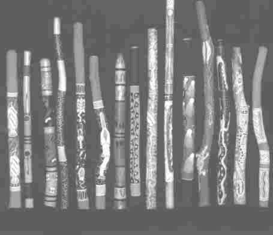

<body bgcolor="#ffffff">
 
<!----- Start of Author-n-Text below ...... ---->

<h2>
The Didjeridu Industry in Northern Australia : Is It Sustainable?
</h2>

<h3></h3>

Joshua Forner  
E-mail:  
joshua.forner@ntu.edu.au  
  
  
/

Key Centre for Tropical Wildlife Management  
Northern Territory University  
Darwin, NT, 0909, Australia  
Phone: +61 08 89 466713  
ATCROS Reference:  
  
Key Centre for Tropical Wildlife Management Northern Territory
University Darwin, NT, 0909, Australia Ph : +61 08 89 466713 email :
joshua.forner@ntu.edu.au  
  


<b>Abstract</b>

The didjeridu is a distinct wind instrument used by Aboriginal people in a variety of spiritual and secular situations. The instrument originated in areas of Northern Australia, including the Kimberley region in Western Australia, the Arnhem Land region in the Northern Territory and the Cape York region of Queensland. It is generally made from the naturally hollowed branches or stems of eucalypts, or sometimes from bamboo stems. The species most commonly used in the Northern Territory are <i>Eucalyptus miniata, Eucalyptus phoenicea, Eucalyptus tetrodonta</i> and <i>Bambusa arnhemica.</i> In the last decade there has been a regional, national and international increase in the recognition, use and sale of the didjeridu. The worldwide popularity of the instrument has seen its status mutated from a spiritual and cultural object for some Aboriginal groups to an internationally identified symbol of Australiana.  This is reflected in the rapid expansion of commercial ventures geared towards sale of the didjeridu. 

<h2>Traditional Didjeridu Production</h2>

Traditional methods of harvesting were documented after accompanying men from the Beswick, Barunga and Manyallaluk regions (south-east of Katherine, NT) and through consultation with a range of didjeridu craftsmen from the Northern Territory.  Young Aboriginal men learn where, when and how to find and cut didjeridus from elder craftsmen. The men often proceed on foot to areas known to contain the preferred species. <i>Eucalyptus phoenicea</i> is the species preferred by harvesters in the Katherine region, however other species are preferred in different parts of the country. Once a suitably sized and aesthetically pleasing stick (stem or branch) is found, a small section of bark is chopped away with a axe. To judge the stick, in terms of the presence of a suitable hollow, the exposed wood is then tapped several times with the fingernail. Through years of experience the craftsman assesses the sound of the 'knock-knock' and accepts or rejects the stick. If the stick is considered suitable it is cut, the bark is skinned and the hollow cavity is washed out with water. Care is taken not to cut the tree too close to the ground, so it has maximum probability for recovery. Harvesting is of a low intensity and is often spread over a large area.

<h2>Commercial Didjeridu Production</h2>

Commercial methods of harvesting are documented after assisting such harvesters and through discussions with harvesters and shop owners. Commercial harvesters in the Northern Territory target a wide range of species including <i>E. miniata, E. tetrodonta, E. phoenicea</i> and <i>Bambusa arnhemica.</i> They are often of non-Aboriginal origin and, in the Northern Territory, many have not obtained the permits required by law. 

Four-wheel drive vehicles, trailers, all terrain motor bikes, chain-saws and mechanical drills are some of the tools used by large scale commercial harvesters.The size, appearance and species of sticks cut by such harvesters are generally variable, with any stick of a reasonable width and length chosen. The state of the internal hollow is often considered less important and in some cases irrelevant. A large mechanical drill can be used to expand or create the cavity if required. Inexperienced harvesters who do not know how to spot a hollow stick (and do not have the tools needed to create an artificial hollow) often cut first and look later, resulting in many unnecessary dead trees.  More experienced commercial harvesters can collect a large number of stems in a short period of time. Either way, this often results in small areas of land being decimated. The objective is profit and this is related to yield - the effects on the forests and woodlands are secondary.

<h2>Summary</h2>

The Aboriginal people of Northern Australia have, for many years, produced didjeridus for their own use, and more recently, for sale to an expanding market. However the enormous size of the market has created a situation whereby traditional production methods have been supplanted by high yield commercial methods. Many Aboriginal craftsmen are angry at "greedy " harvesters that  "steal " sticks from the land without care or consideration of the environmental consequences or of the cultural origins of the didjeridu. After less than a decade of commercial scale harvesting, both Traditional and commercial didjeridu manufacturers have noticed that finding stands of suitable trees is becoming more difficult. It is feared that the commercial industry stakeholders' desires for maximum profits and lack of any real connection with the product or land, may be leading to an over-exploitation of the resource. Harvesting for didjeridus, as it is presently occurring, may be unsustainable, and requires active management to ensure both its long term success as a business and to minimise environmental damage. 

(END)

</body>
