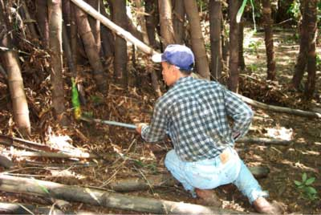

<body bgcolor="#ffffff">
 
<!----- Start of Author-n-Text below ...... ---->

<h2>
Ecology and Sustainable Use of the Top End Bamboo <i>Bambusa arnhemica</i>
</h2>

  

<h3></h3>

Don Franklin  
E-mail: don.franklin@ntu.edu.au  
  
  
/

Key Centre for Tropical Wildlife Management  
Northern Territory University  
Phone: Aust. (08) 8946 6976  
Fax: Aust. (08) 8946 7088  
Darwin NT 0909  
ATCROS Reference:  
  
  
  


<b>Abstract</b> 

Top End Bamboo is endemic to the high-rainfall north-western portion of the Top End of the Northern Territory.  It is most commonly found in riparian vegetation along major watercourses such as the Adelaide, Mary, Finniss and lower Daly Rivers, and along the South Alligator River in Kakadu National Park.  It also occurs along many minor tributaries of these river systems but is inexplicably absent from many others.  Exceptionally, stands may also be found on rocky hillsides and coastal headlands.  Top End Bamboo is locally abundant, but its distribution is patchy and it has a restricted distribution.

This is a large, clumping bamboo.  On the most favourable sites where soils are fertile and deep and moisture is available throughout the year, clumps may grow to 30 m tall, and in the open the canopy may spread nearly as far across.  More commonly, clumps are 15 to 25 m tall in riparian forests and 10 to 15 m tall on harsher sites.  Individual culms (stems) are up to 12 cm in diameter.  Each clump consists of a few to 100 or more culms connected underground by a system of rhizomes.

Top End Bamboo has a most interesting life cycle.  Though long-lived, it flowers only once and then dies.  Furthermore, many clumps do this synchronously, causing die-off and regeneration in patches which range from less than a hectare to as much as 90 km (sic!) across.  A wave of flowering commenced in 1996 and has since spread to about half of all Top End Bamboo stands, affecting all river systems except the South Alligator.  The phenomenon is of considerable ecological interest.  It also renders entire stands unavailable for shoot harvest for an as-yet-unknown period of years.

<h2>Uses of the Top End Bamboo</h2>

The Top End Bamboo has a long history of local utilisation.  Aborigines used branches and culms for the manufacture of spears and didgeridoos, and as water containers.  Bamboo materials were traded and thus transported into areas where the species does not naturally occur.  The use of bamboo for didgeridoo production continues today, although eucalypt stems are generally preferred and the harvest is small.  The culms are thought to have potential as a construction timber.  However, the major bamboo product in recent years has been the shoots, which are harvested principally by people of Asian origin as a source of food.  There have been attempts to commercialise the harvest, but these are currently constrained by the Parks &amp; Wildlife Commission NT's concerns about the sustainability of the practice.  Sustainability issues relate to the conservation of stands of the species and the riparian vegetation in which it most frequently occurs, and the contribution of these stands to riverbank stability and to sustaining the fauna of riparian ecosystems.  This project was initiated by the PWCNT in response to the management issues they were confronting. 

<h2>The Project (a Ph.D. Project)</h2>

Much of the project is concerned with establishing ecological background for understanding and managing the species.  Studies will cover many aspects including reproductive biology, fire ecology and seedling survival and growth.  Intensive monitoring of the survival of culms and the production of shoots and thus new culms will provide a baseline dataset, which when combined with the results of harvest trials, will permit management options to be modelled and examined for their impact on subsequent shoot and culm production.  Individual culms have a shorter lifespan than the clumps they form.  For the clump to survive, sufficient shoots must be allowed to mature to replace the older culms; for the clump to achieve full reproductive potential, even more shoots must be allowed to mature so that the size of the clumps continues to grow up until the climactic flowering event.  The analysis of sustainability is rendered unusual by the clonal nature of clumps and the unusual life cycle of the species.

(END)

</img> 
</body>
