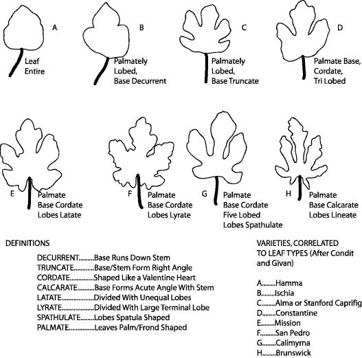
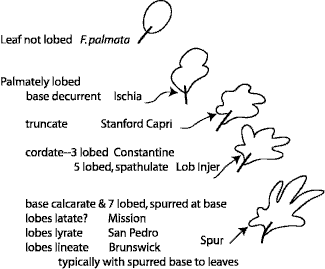
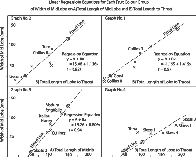
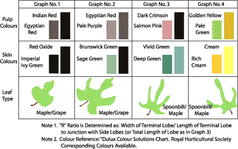
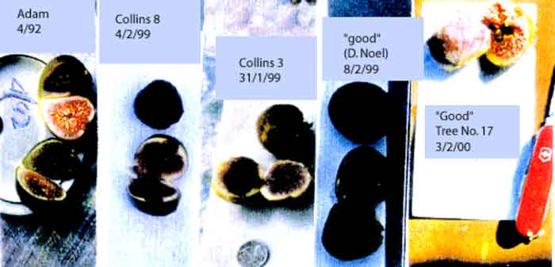
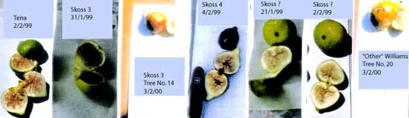
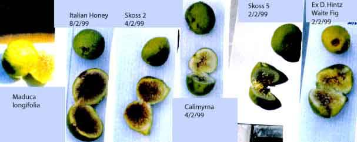
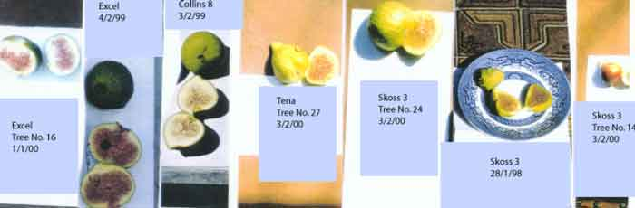

<body bgcolor="#ffffff">
 
<!----- Start of Author-n-Text below ...... ---->

<h2>
Problems Identifying Fig Varieties
</h2>

  

<h3></h3>

Alex Hart  
E-mail: hartg@hutch.com.au  
  
  
1. *The Fig* Condit 1950.  
  
2. *Figs in The Home Garden or Better Fig Harvests* A.
Reynolds.  
  
3. *'Pomona'* April 1990 A. J. Bullard.  
  
4. *Identifying Fig Varieties; 'Ray's Figs* R. Givan
1999.  
  
  
  


<b>Abstract</b> 

Figs are one of the oldest known crops.  The identification of different varieties is clouded and confused because of this long history.  Efforts were made at various times to describe an accurate system for identifying varieties, with limited success.

<h2>SUMMARY</h2>

	
The main research efforts into the classification and identification of figs in the genus <i>Ficus carica</i> are summarized briefly: 
<ol>
<li>Figs have been generally accepted as having four (4) types:</li>
<ol type="a">
<li>a) Caprifig, a primitive type.</li>
<li>b) Calimyrna (Smyrna), productive when pollinated.</li>
<li>c) Common figs giving commercial crops when not pollinated.</li>
<li>d) San Pedro figs,  pollination characteristics of both Smyrnas.</li> </ol>
<li>Figs are considered to exhibit 5 leaf types described as follows:</li>
<ol type="a">
<li>Palmate, not lobed</li>
<li>Three (3) lobed as in Constantine.</li>
<li>Five (5) lobed as in Lob Injir.</li>
<li>Seven (7) lobed with spurred and calcarate base as in Mission,	
San Pedro and Brunswick.</li></ol>
These variations are shown in Diagram 1.
<h2>Diagram 1</h2>

<li>Results of New Zealand investigations are noted, eg. A Reynolds and N. Hiam.</li>
<li>Results of leaf and fruit examination in the West Aust. Nut and Tree Crop gene pool of fig varieties has produced a provisional key to these varieties based on unique leaf dimensions and fruit color.  (Appendix 1 and 2)</li></img></ol>
<h2>
INTRODUCTION:</h2>
	
The difficulties of identifying fig varieties of the species <i>Ficus carica</i> have been known for hundreds of years. It is therefore necessary to examine the history of various workers in the field in their attempts to sort out the problems. The salient
features of the attempts are included in this paper. The overall results seem to be	summed up rather succinctly by <a href="Author-n-Subs.htm#3" target="Subs">I. Condit</a> who states "few, if any,  keys are entirely satisfactory to the systematist" (p67).

		From consideration of efforts of various workers it seems evident that the major part	 of the problem arises from hybridisation of different varieties over a long period of	 time. Indeed, Trabbut endeavoured to prove that<i> F. carica</i> had developed by	hybridisation of <i>F. persica; F. virgata</i> and <i>F. johanus</i>? The result of his effiorts were to produce <i>F. palmata</i> and <i>F. pseudocarica.</i>

Starnes considered there to be five (5) different leaf type viz: OKRA, GRAPE,	
MAPLE, SPOONBILL &amp; OAK type leaves. He and Monroe developed a new system	
in 1907 which was adopted by I. Condit in 'HILGARDIA' and currently used by R.	Givan. It requires the user to be familiar with the descriptive terminology of leaves in a botanical sense (as per diagram.)	

LINNAEUS in 1737 reduced all the species of <i>Ficus</i> to one spp and the caprifigs as	 as one designated as Erinosyce (a Capri fig). Willis (1957) records that the genus	
<i>Ficus</i> has 800 spp mainly in tropic and sub tropical areas, with <i>F. carica</i> concentrated mainly in Mediteranean regions.	

It was recognized by some workers, eg. Mauri (1939), that leaf characters varied	widely within the same variety and demonstrated with 9 leaves to show the variation	 in a single variety, I. Condit (p32) records that leaves from a single tree differ considerably in that juvenile leaves have deeper "sinuses" and narrower lobes than	leaves in fruiting branches. In 1907, Starnes &amp; Monroe adopted an approach of generality based on physical features of leaves.

Dimensions of leaf laminas was investigated using 'w'= width of blade, 'l'= length of blade, 'P' = length of petiole using at least 50 specimens per tree.

Texture of leaf was also examined, FRAGA, ADRIATIC, &amp; CONSTANTINE having a  glossy or shiny surface compared to a dull surface of DOTTATO and LOB/INJIR.

Color of the leaf was not recorded extensively except that BAALITE &amp; MARABOUT have distinctly lighter green foliage.

This is of interest, in that in all the literature, no attempt appears to have been made to refer colour of leaves, fruit or flesh to any colour standards. Eg. British Horticultural Society or even paint colour charts.

These authors investigated features of the petiole for ratios of 'P=' petiole length to 'L=' length. of blade and found the highest value, ie approaching 1.0, to be so in MARSEILLES type figs and MARABOUT type figs (0.75).

Varieties which have longest petiole per se, were recorded as CROISIC,and
MARABOUT of approximately 12 cm. but this feature is affected by shading.

Long styled flowers are typical of Smyrna, WHITE, SAN PEDRO and Common figs.

CHIMERAS occur as a result of somatic mutation but are not common. Leaves in these cases show white areas or sections, as do the fruit. PANACHE is a variety in this class, with immature fruit having striped bands of green and yellow-sulphur to golden yellow at maturity.

Several attempts have been made at classifying figs by, namely:

<ul><li>NOISEITTE - based on external color of figs.</li>
<li> HOGG - based on shape color of skin and color of flesh.</li>
<li> BOBONE - based on Breba and second crops &amp; external colour &amp; shape of the base, body &amp; colour of the puip.</li></ul>

Fruit colour was arbitrarily divided into 3, viz:  l. Green to yellow; 2. Shades of bronze copper or violet; 3. Decidedly dark violet or purplish black.

Accordingly, all major varieties of the time were designated as follows:

<table align="center">
<th>1. GREEN /YELLOW</th><th>	2. VIOLET</th><th>	3 . PURPLE/BLACK.</th>
<tr><td> </td><td>Brunswick	</td><td>San Pedro</td></tr>
<tr><td>Dottato</td><td>Rouge Noir</td><td>Ischia Balck</td></tr>
<tr><td>Calimyrna</td><td>St. Jean</td><td>Mission</td></tr>
<tr><td> </td><td>Celeste</td><td> </td></tr>
<tr><td>Clarke</td><td> </td><td> </td></tr>
<tr><td>Adriatic	</td><td>Partridge Eye</td><td>Beall</td></tr>
<tr><td>Ischia Greber</td><td>Hunt</td><td>Pastiliere</td></tr>
<tr><td>Verda Longue</td><td>Ces</td><td>Barniscotte</td></tr>
<tr><td> </td><td>Gour and Rouge</td><td> </td></tr>
<tr><td> </td><td>Pied de Boeuf</td><td>Marabout</td></tr>
<tr><td> </td><td> </td><td>	Pastiliere</td></tr>
<tr><td> </td><td> </td><td>Barniscotte</td></tr>
<tr><td> </td><td> </td><td>Marabout</td></tr>
</table>

Fruit and neck dimensions were investigated with 'L'= C, Diam.= D. and ratio D/C
determined leading to the terms Oblate when R>1.1, Round when R=0.9 - 1.1 and Oblong
when R<0.9. The neck was described as circular, angular, or  triangular in cross
sections.

<a href="Author-n-Subs.htm#6" target="Subs">Ray Givan</a> has studied figs extensively and written booklets on identifying figs based on leaf and fruit features but does not refer to colour standards.

Otto Warburg (l9O4) produced a key to separate the ';Encyce' sections of<i> F.carica</i>
using lobing of the leaves into either not lobed or 3-5 lobed segments, broad at the
base, and features of degree of hairiness or lack of same at maturity.
This does not seem to have had much appeal.

It is of interest to note the evolutionary trail of where figs have originated. Evidently figs were cultivated in South Arabian fertile areas. Aidin was the centre of the Smyrna Fig District. Fig culture is known from the 9th century in Greece and Crete and possibly earlier. <i>Ficus palmata,</i> the Eastern representative, was marketed in the Punjab.

The Texas (U.S.) industry is based solely on the varieties Magnola.  Californian (U.S.) plantings were of 'MISSION' while later introductions from France included three white figs: 1. Chimeras(?);  2. Angelique; and 3. Violet. Fresno in California (U. S.) used White Adriatic (four years from planting to harvest). However, imported Smyrna figs gave better-flavoured dried figs. Hugh N. Starner (1903) used a system to identify fig leaves into 5 leaf types, OKRA, GRAPE LEAF, MAPLE, SPOONBILL and OAK LEAF, but oak leaves are different in the U.S. so he and Monroe (1907) published another key adopted by Condit and Givan which depicts 8 leaf variations. Paul Starnes (G.A.) (U.S.) refers to four main leaf types: SB = Spoonbill; G. =Grape; C.= 0ak. (OKRA = Hibiscus esculenta) and classified figs into four main groups.

1. CAPRI FIGS, primitive types
2. CALIMYRNA (Smyrna) productive only when pollinated and no longer grown
commercially.
3. COMMON FIGS, produce commercial crops even when not pollinated.
4. SAN PEDRO FlGS, pollination characteristics of both Smyrna and common figs.
The only known variety in Australia is 'Adam.'

Another fig specialist, MAURI (1939) showed 91eaves to exhibit the variations in a single variety of fig. Essentially, the figs could be defined as: 
<table>
<tr><td>1. CONSTANTINE </td><td> (	</td><td>3 Lobed</td></tr>
<tr><td>2. ISCHIA </td><td> (	</td><td>3 Lobed</td></tr>

<tr><td>3. CELESTE </td><td>                           )</td><td> </td></tr>
<tr><td>4. DOTTATO=KADOTA=HIRADA</td><td>)</td><td> </td></tr>
<tr><td>5. PASTILIERE JAPAN             </td><td> )	</td><td>5 Lobed</td></tr>
<tr><td>6. ADRIATIC=GROSSVERTE      </td><td>)</td><td> </td></tr>
<tr><td>7. LOB INJIR                            </td><td>)</td><td> </td></tr>

<tr><td>8. SAN PEDRO=MAGNOLA       </td><td> (</td><td> </td></tr>
<tr><td>9. BRUNSWICK                      </td><td> (	</td><td>7 lobed</td></tr>
<tr><td>10. MISSION                          </td><td> (</td><td> </td></tr></table>

Fruit classification has been based on length 'C', diameter 'D', giving a ratio D/C
when D/C>1.1 fruit Oblate 0.9-1.1 Round and 1 0-0.9 Oblong. The 'neck,' the constricted part
between the body and stalk, may be round or angular or triangular in cross section.

Flavour terms have been described as: 
A. Agreeable; B. Exquisite; or C. Poor.

Quality has been described as: 
1. Poor; 2. Inferior; 3. Medium; 4. Fair; 5. Good;  6. V. Good; 7. Superior; 8 Fine; 9. Excellent

	It is not recorded as to what these terms refer to as a standard, presumably personal assessment. The above investigations have resulted in an acceptance of four main types of fig. 

1. CAPRIFIG - Primitive type of fig used to give current types.  
2. Smyrna - requires pollination of flowers to produce figs.  
3. SAN PEDRO - similar to Smyrna &amp; common figs 'ADAM' (the only known variety in Australia)  
4. COMMON - commercial production from unfertilized flowers.

<h2>NEW ZEALAND APPROACH TO IDENTIFICATION</h2>

<a href="Author-n-Subs.htm#4" target="Subs">Ada Reynolds</a> is one of the leading authorities on figs in N.Z. and her booklet "Figs in the Home Garden or Better Fig Harvests" sets out considerable information about
growing and identifying figs in N.Z. along with Nat Hiam, the latter using colour photos of figs.

Starnes' method of identification is generally followed by N.Z. investigators.  <a href="Author-n-Subs.htm#5" target="Subs">A. J. Bullard</a> of North Carolina (1990) in 'Pomona' stresses the confusion between Celeste and Brown Turkey. These are two very common types in Australia because of their hardiness, Celeste having more serrations on leaf lobes than Brown Turkey, smaller fruits and no Breba crop. Fruit are usually lopsided in Breba crops of Brown Turkey and leaves less serrated.

<h2>N.Z. FIG TREE IDENTIFICATION</h2>

Ada Reynolds (p8) of"Figs in the home Garden or Better Fig Harvests" states that this aspect of figs is the main problem in trying to identify a particular named cultivar.  It is of interest to note that her information from overseas indicates that the same fig cultivars can have slight differences depending on location and soil types.  Her identification chart lists many varieties and indicates the following features: 
1. LEAF TYPE: four in all, Spoonbill, Grape, Maple and Oak. This follows the
system of Hugh N. Starnes (U.S.A.) in 1903. Because of variations in the reference of leaf types he and Monroe (1907) published another key adopted by Condit and Givan which depicts eight leaf varieties (see diagram 1).

A. Reynolds acknowledged to me that she did not know what 'OKRA' meant but is
generally taken to be 'OAK' or possibly, 'Hibiscus leaf' type. A. Reynolds has listed
many varieties with synonyms and ascribes them:
a) leaf types; b) fruit size;  c)  skin colour; d) pulp colour; e) meat colour.
A very useful reference for the uninformed.

Unfortunately, she also has not adopted a colour standard for her descriptions, eg.
R.H.S. colour or similar, so the colour descriptions are not strict for adequate
comparisons. None the less, it is a very useful reference.

As indicated, there have been many attempts to classify for identification the many
varieties of figs. Overall these attempts have arrived at some generalities.
These are regarded as four (4) main types: 
<ol type="a">
<li>Caprifig, primitive types.</li>
<li>Calimyras (Smyrna), productive when pollinated.</li>
<li>Common Figs, giving commercial figs when not pollinated (Adam in Aust.)</li>
<li>San Pedro Figs, pollination characteristic of both Smyrnas.</li></ol>

2. Four to five leaf types covering four groups (but extended to eight leaf types by Starnes &amp; Monroe).

3. Acceptance to several botanical descriptive terms in relation to:

<ol type="a">
<li>Leaf formations.</li>
<li>Petiole shape and size.</li>
<li>Fruit shape and size, definition of oblate, normal or oblong.</li>
<li>Colour of leaves and hairiness.</li>
<li>Fruit colour including 'chimera' or white parts to figs.</li>
<li>Colour of pulp or flesh.</li>
<li>Colour of fruit skin.</li></ol>
None of these have been referred to a standard colour base.

4. Flavour )/5. Quality  ): Both these factors have been assigned general subjective values.

<h2>W.A.N.A.T.C.A INVESTIGATIONS</h2>
Studies in the W.A.N.A.T.C.A. gene pool of figs have been directed towards identifying various varieties planted from various sources so that: 
<ol type="a">
<li>Planted varieties can be given a name with some confidence.</li>
<li>The public can be introduced to figs more suitable and of better quality than currently available and probably unknown, or known by one of many ascribed synonyms.</li>
<li>Multi various names can be identified and separated.</li></ol>

Early efforts to identify from leaves only proved futile except that it was observed
that over the range of figs in the pool, leaves varied from almost ovoid/cordate to truly 'Spoonbill' type, depicted in diagram 1 and in A. Reynolds descriptions and also R. Givan and Condit.

When fruit developed, a further diagnostic feature emerged in that a range of skin
colours developed with varying pulp colour. A. problem however, was that the fruits
developed to maturity over several months. (In fact it would seem with the right
collection of varieties, figs could be produced for nearly 6 months). (Cf. Hawaii
productions).

As figs are very perishable (but chillable), it was necessary to photograph all the figs as they ripened so that the element of time was eliminated. All photos were then compared and referred to a colour standard (initially Bergers paint colour chips) and later to the R.H.S. coIour charts.

Further examination of the leaves of the various varieties indicated a unique
relationship between length of midrib and width of central lobe at the widest point,
such that regression lines could be constructed of the lobe width on mid lobe length to the axil with other lobes. This aspect needs further refinement as results so far were derived from random selection of leaves. It is felt collection of leaves from say, the fifth leaf from the growing apex of branchlets could be more accurate.

These factors in conjunction with fruit colour and pulp colour have enabled
production of four groups of figs covering those in the gene pool and serve as a
reference for figs brought for identification.

lt is considered probable that, although the key may be suitable here, the ability of
figs to vary leaves and fruit depending on local edaphic and climatic factors, may render this key inoperable (which again reminds one of L. Condit's conclusion that "few, if any keys are entirely satisfactory to the systematist"(P67).
This is not surprising when the origins of the fig are considered and the length of time over which the opportunities for cross pollination and mutation have occurred.

As observed earlier, Trabbut tried to prove that <i>F. carica</i> was derived from the hybrid between <i>F. Persica, virgata</i> and <i>johanus.</i> All that resulted were <i>F. palmata </i>and <i>F.pseudocarica.</i>

Nevertheless, there is quite apparently an array of leaf types as shown (diagram 1)
ranging from ovate/cordate to the 'Spoonbill type' and various combinations between
these two extremes.  Indeed, most of the identification problems seem to be located in the varieties midway between the ovate and 'Spoonbill' leaf types. This, together with the combinations of fruit colour, pulp colour, shape and quality and texture of the fruit arising from figs with the leaf combinations, makes identification of any given fig difficult, to put it mildly.

Consequently the key presented here is regarded as a useful aid in the local situations and the refinement, as mentioned (examination of leaves from specific positions in the branchlet), may well produce a key with far more accuracy and it is hoped this will ensue.

This will allow for better use and dissemination of figs which are superior to many available at present, particularly if given the correct silvicultural and fertilizer treatments.

In conclusion, the varieties planted in the gene pool at Gosnells Hillside Farm are listed below: 
<table width="500">
<tr><td>*Williams No. 5</td><td>Collins No. 5</td><td>*Skossno?</td></tr>
<tr><td>*Williams-other</td><td>Collins No. 3</td><td>Calimyrna</td></tr>
<tr><td>'Good'</td><td>Collins No. 8</td><td>Deanne</td></tr>
<tr><td>'Adam'</td><td>*Skoss No. 1</td><td>Ex Nedlands (Yellow?)</td></tr>
<tr><td>'Tena'</td><td>*Skoss No. 2</td><td>'Italian Honey'</td></tr>
<tr><td>'Excel</td><td>*Skoss No. 3</td><td>Ex Nedlands (Purple)</td></tr>
<tr><td> </td><td>*Skoss No. 4</td><td>Ex.R/Rill No. 1(Deane?)</td></tr>
<tr><td> </td><td>*Skoss No. 5</td><td><td> </td></td></tr>
</table>

Ex D. Hintz (Bl Genoa) 

Ex D. Hintz (White Adriatic) 
Maduga Longifolia 
Ex. Northampton 	TOTAL 29 (including synonyms). 

(*Stock orginally derived from importations from U.S.A. via N.S.W.)
<table width="500">
<tr><td>Brown Turkey</td><td> *Panachee</td><td>Celeste (S.Aust.)</td><td>*Archipal </td></tr></table>

are included in a separate and more recent portion of mixed plantings at Hillside Farm.

 ATTACHMENT TO REVISED KEY TO SOME FIG VARIETIES, APPENDIX 1

<b>RED/BROWN FIGS</b> (See Graph No.1) 
<table border="1" width="500">
<tr><td> </td><td>COLL8</td><td>GOOD</td><td>ADAM</td><td>COLL3</td><td>B'field</td><td>PINK JERUS</td></tr>
<tr><td>X</td><td>68</td><td>48</td><td>96</td><td>87</td><td>16</td><td>15</td></tr>
<tr><td>Y</td><td>95</td><td>83</td><td>145</td><td>103</td><td>18</td><td>16</td></tr>
</table>

X = WIDTH OF LOBE,    Y = LENGTH OF LOBE TO 'THROAT' 
X/Y = R RATIO FOR THIS AND NEXT GROUP

<b>SAGE GREEN/ BRUNSWICK GREEN COLOURED FIGS</b> ( See Graph No.2) 
<table border="1" width="500">
<tr><td>  </td><td>EXCEL</td><td>EXCEL</td><td>COLL8</td><td>R/RILL</td><td>DEANNE</td><td>TIP</td></tr>
<tr><td> X</td><td>55</td><td>60</td><td>54</td><td>93</td><td>82</td><td>16</td></tr>
<tr><td>Y</td><td>60</td><td>105</td><td>108</td><td>109</td><td>100</td><td>18</td></tr>
</table>
X = WIDTH OF BULGE,     Y = TOTAL LENGTH TO 'THROAT'

<b>MIXED TYPES...DEEP/VIVID GREEN FIGS</b> (See Graph No.3) 
<table border="1" width="500">
<tr><td> </td><td>CALIMYR</td><td>SKOSS2</td><td>SKOSS5</td><td>HINTZ</td><td>COLL5</td></tr>
<tr><td>X</td><td>105</td><td>112</td><td>120</td><td>145</td><td>118</td></tr>
<tr><td>Y</td><td>160</td><td>155</td><td>158</td><td>175</td><td>142</td></tr>
</table>

X = WIDTH OF BULGE,     Y = TOTAL LENGTH OF MIDRIB

<b>CALlMIYRNA TYPE FIGS...CREAM TO RICH CREAM FIGS</b>(See Graph No.4) 
<table border="1" width="500">
<tr><td> </td><td>SKOSS1</td><td>SKOSS4</td><td>SKOSS3</td><td>TENA</td><td>SKOSS?</td><td>OTHERWILLIAM</td></tr>
<tr><td>X</td><td>117</td><td>122</td><td>100</td><td>98</td><td>88</td><td>55</td></tr>
<tr><td>Y</td><td>190</td><td>205</td><td>165</td><td>138</td><td>155</td><td>145</td></tr>
</table>

X = WIDTH OF BULGE,     Y = TOTAL LENGTH TO 'THROAT'

<h3>Appendix 2</h3>

<b>Refer to Graph of Regression Line 1</b>

<b>Refer to Graph of Regression Line 2</b>

<b>Refer to Graph of Regression Line 3</b>

<b>Refer to Graph of Regression Line 4</b>

 

 
(END)

</body>
