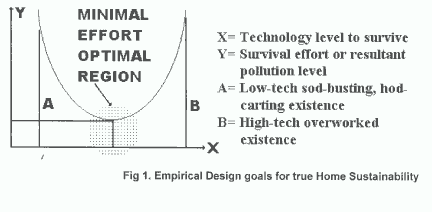
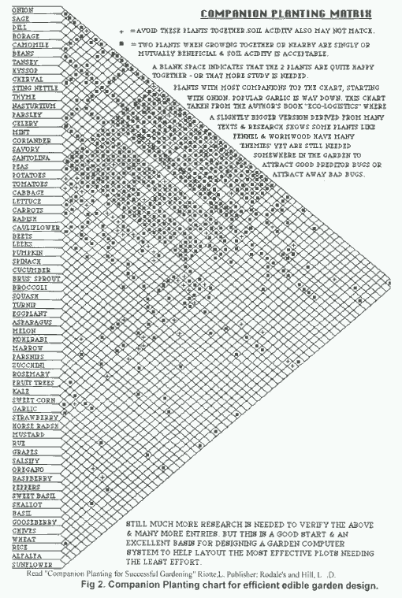

<body bgcolor="#ffffff">
 
<!----- Start of Author-n-Text below ...... ---->

<h2>
Living for Free, Sustainably</h2> 
<b>GREEN  ECO-OP  LIST  FOR  EVERYBODY  ESPECIALLY  BEGINNERS A KEY  BENCHMARK  for  HOME  SUSTAINABLE  RELAXED  LIFESUPPORT</b> 
or  <b>THERE'S  ALWAYS  a  SMALLTERNATIVE</b>

  

<h3></h3>

Dr Pat Howden  
  
  
/

Backyard Tech  
Cone Street  
Macleay Island Qld 4184  
Phone/Fax +61 7-34095100  
ATCROS Reference:  
  
1. first ref  
  
2. second ref  
  
  
  
  
  
  
  
  
  
  
  
  
  
  
  
  
  
  
  
  
  
  
  
  
  
  
  
  
  
  
  
  
  
  
  
  
  
  
  
  
  
  
  


<b>Abstract</b> 

How else can our planet &amp; we all be fed &amp; saved cheaply except by effortlessly planting edible jungles everywhere? Like our 1/4 acre partial-wetland version where even road verges are also very multi-use food-tree / vine / shrub / groundcover productive, many with native foods - with enough remaining for fruit-timber. 

Sustainable Home Engineering, as we title the largely Renewable total System, is as practical as shelf making - not worth wasting time nor paper on philosophising or justifying. Simply make Lists &amp; Do it! Here's our List, largely land-related (you should see what was omitted!).

All items below are job-creation businesses, many our own discovery: This ECO-LIST looks pretty boring, but don't be fooled for it accessibly inverts the usual cumbersome Lists for uses of such as milk cartons, bananas... The disk version with word processor will easily Find whatever.
We have good workable solutions to most all the planet's serious problems. Thus we're here for everyone who ever thought there must be substantially better, cheaper, simpler, more sensitive, compassionate &amp; practical secrets in Renewable, Sustainable &amp; Conservable (RSC) planet-saving home lifesupport systems but has never had capital, garden space or know-how to get started. No single item can save much, 150 of them including essential plants certainly will, which could mean true wealth. So why pay to live with ever less space, taste, purity or freedoms? "If ya gotta buy, DONT".

Virtually every appropriate publication I review, environmental Conference I attend or green group we visit glibly prattles out the old cliche "we Must all live more Sustainably"! But how many sola heaters on your nearest 1000 houses? Or food tree gardens? Queensland groups seem most guilty! We've been fooling ourselves too long that a TOKEN goat, bike, pawpaw tree + vegie patch = TOTAL RSC, a complete caring &amp; sharing with nature &amp; neighbours. Far, far from it.

Unlike so many Greenie mags, we haven't space to waste making a Reader's Digest-style ripping yarn out of trivia like when to plant cabbages, turn off lights, green clean... Nor can we waste more tree paper trotting out the usual hints like: get a small shower, stop dripping taps, turn off lights, delete the iron &amp; clothes drier, don’t hose driveways or cars to clean them, avoid electric stoves &amp; hot water systems… We'd like to credit you with vastly more common sense, awareness &amp; motivation.

<b>INTRODUCTION: </b>Professors, media &amp; 'experts' are too busy telling us of world problems rather than simple, cheap, reliable, long-lasting RSC job-creating solutions, or trend-setting such domestic role-models themselves. Pity governments &amp; councils only start to function after a string of Chernobles, eco-disasters, refugees or when we're down to the last 2 whales + 3 trees. It appears the public's attitude to ineffective ignorant politics = a greedy wishful-thinking Cargo Cult, a Santa Syndrome which will definitely not help self-reliance in any way.

No point in saving a few whales, some Amazon bush or Atlantic dumping done ECO-disastrously with greater waste than that saved; whilst still ignoring all home &amp; transport RSC. Energy groups aren't into Permaculture, food producers nor related energy waste. P'culture ignores animal stock, energy, transport &amp; architecture. Animal husbandry ignores P'culture &amp; energy. Transport experts reject food growing &amp; home energy. Architects seem oblivious of the lot. To preserve good balance we ARE the lot.
Catch this: 2 coffee @ $2ea + newspaper @ $1.5 daily = $2000/y, a whopping 7% of rail porter's pretax salary!! With anyone earning about $28,000 &amp; working 40 hours, the 1st 23 hours is direct or indirect taxes - surely the best motivation for near-total disconnection. Imagine markup on smoke / drink. Yet I read where on a trifling 3sqm all your year's food can be grown in 3 dimensions - dunno if that includes meat.

Civilised western house-sharing ways exist to live really well on less than $25/w, as we do in Queensland's reputedly most Autonomous house, by effortlessly redesigning, reconfiguring, rechoosing &amp; inventing one's home lifesupport; whether on a farmlet, a small block, an apartment or remote jungle village. Greatest costs are post + phone + rates.

However though I'm really not much at handiwork, our pleasant budget all-sola house on a mere 1/4acre of near-self-tending edible jungle looks like some research lab! I can't say I thrill to gardening that much, despite enjoying the final all-edible jungle &amp; feeling obligated to do my bit - as WW1 soldiers going off to save the world. This Eco-List isn't from an isolated experience rendered easy by a tropical climate, because I did similar in Cornwall (UK) when visiting for 7 years till '84. They have much more preoccupation with energy &amp; food crops than us in warm climates.

Male &amp; female survival desires often differ widely &amp; it's easy to guess in what areas, as gender-defining frugality book authors verify. Curiously, female backpackers can seldom carry their massive packs far - yet few would have tools, penknife...! Guys usually lack chemicals, wardrobe as we find amongst scores of international visitors...

<b>OVERPRICED: </b>Supermarket buying consumes folk with primitive hunter/gather urges that, from total lack of resourcefulness, inhibit stone-age evolution into productive agriculture &amp; ingenious make-do. Try to Give / Get most things / labour / data FREE. So, before paying uncivilised prices at far too high a ripoff for average folk, ASK can I:

 Avoid it?	borrow it?	share it?	make it?	grow it?	delay getting?	simplify need?	find at tip?
bargain it?	barter it?	swap it?	buy 2nd hand?	use alternative?	fix another	ask round re freebies?
Never give up trying! Years later I've got it.

How to change TASTE in food, lifesupport or requirements to maximise RSC &amp; the above list see (Fig1)? Could save you $millions/lifetime. If you really MUST buy, figure will it last 10 - 20 years? Has it other uses &amp; minimal packaging? Is it home repairable, or could you learn how to rather than brag being an uncreative Techno-Inept who must forever pay outrageously for getting anything fixed or done? Always select Home Brand, using a sola-powered calculator to calibrate items as $/kg. Even for batteries, cheapest usually best.

Have I seriously bargained, shopped around, asked re pension discounts? If you still Must buy food, get the cheapest &amp; smallest; eg. fruit, eggs, meat &amp; bread slices: you need an apple or meat slice not big ones, an egg or bread slice not thick ones. Never buy virtually anything without first consulting Choice (or Which UK) magazine in most libraries - you can't live long enough to evaluate or learn all parameters. Keep on asking "what else can I be self-sufficient in"?
Note that Disaster Survival correlates with RSC.

Alternatively, to buy at after-tax rates, are we job-content in a job area so small that RSPCA would arrest me for keeping a piglet incarcerated there? Then to let city living take all we have, rather than get near-all Free resources from a rural idyll? 

<h2>NOW THE LIST WITH FOOD GROWING AS A
TOTAL SYSTEM + APPLICATIONS</h2>

<b>HELP FREE:</b> Tap into Colleagues, friends, students, shared workers, WWOOFers (willing workers on organic farms) &amp; my Eco-Op of neighbourhood work-sharing folk (eg. home digging). Barter labour for produce, fixing, skills, lending mower, data, favours... If the kids aren't into RSC at age 1 onwards, you'll be doing them, yourself, your family + their future partners a severe disservice.

<b>RECYCLE:</b> Although by not buying packaged goods which are typically price-inflated &amp; polluting, we're beyond most gross recycling albeit enjoy home-recycling, tastefully patching, fixing or exchanging our largely old items like clothes, paper, envelopes, bags, appliances, engines &amp; boxes (haven't had to buy them for years; try street skips). Hardware, lumber, spare parts, plants, pots, hose, containers, materials &amp; galvanised iron are from 'Woolies' = the locally renamed open tip where civilised junk is set aside for free pickup &amp; later dismantling, repairing, selling etc. "Junkyard", the 1999 solaracer from Japan was most recycled!

<b>INCOME, INVEST, COSTS:</b> Let's be Frugal at all costs. We can all make vastly more wealth &amp; job creation in saving than wrecking the planet. Personal inflation is minus still further as I discover shrewder ways of plugging holes. To quote one wag: "If we die with more than one cent in our pocket we've worked too hard". So for us cash is a seldom-needed low priority - assuming that one's tastes don't stretch to high-rise inner city living; or to impractical remote lonesome transport-prone areas. Or that with new savings, we're not sucked into polluting jetsets. Every penny not spent on trivia or indulging gives less pollution, more mouths fed, more edible landscapes planted.

Years ago in frugal luxury we saved $130/week on the dole, which with the 1st Home Owners grant paid for this $10,500 kit home in 10 months! Now Pensioner + Seniors cards discounts + friendly L.E.T.S. bartering are treasured (never use own name for LETS or you may lose privacy + tax); more still if sharing costs, tasks &amp; facilities in family or community. Many now confirm there's no guarantee they'll ever pay off mortgages by which house price at least trebles &amp; there are too many disincentives to employing; whilst working for is often demeaning. Indeed there's a permanent recession in that, curiously, it's much easier to make your own work than get a job especially at home like those other 35% Aussies, regardless of training as my brother found - &amp; he's a professor. Need a job or business? Make your own more reliably, like opening your new sola home, ECO-Tour or selling our manual? I made $100s selling it cheaply to some Fiji schools. Paid for the entire already cheap trip several times over!

* Investment: Be a saver &amp; investor not borrower slavishly bemoaning 'high' loan rates. Banks seriously ripoff, so invest in the highest safe %, possibly pooling neighbour's amounts for bigger returns &amp; never deposit with banks that charge! Debentures are secure, but when %s are low, invest for only about 6 months, later for 5 years if the % suddenly reaches more, as mine did. Eco-investments still too low % for us. Safer mortgage trusts etc. yield 8-11% paid monthly when most investments hit 4%. Thus work 1 year, save $15,600 to invest @ 8% (keep reinvesting some interest) = $24/w = retire comfortably as we do! Save a kg of ALL stamps to take overseas &amp; pay for fares.

Rapid savings &amp; health = leave the city to invest in yourself by buying all things you may ever need: tools - appliances - fuel - fish nets - food trees - boat - bike - stockpiled food - sola panel, windmill - small horse - land &amp; river - books - computer - stove - backup items - a home business etc. It's always easier to save $1 or "kill a watt" than to generate them. If you must work, start with a Bold resume emphasising how you WILL help THEM, make yourself indispensable, then periodically bargain your own salary armed with an achievement list. That way in visiting USA in 1964 I was netting $1400/y.

<b>
HOME &amp; SITE: </b>Have lived super cheap in vans, squats, shared farmlets, sailboats &amp; houseboats on creeks (my brother suggests on a farm dam) avoiding campsites &amp; marinas. Home site choice was based on a special Scoring System I developed to identify such parameters as: natural water, good soil, fire wood, closeness to desired facilities (like easy cycle to town, farm gate selling), 'jobs', an open dump &amp; friends, double transport to town (eg. train + bus) together with ambience. But distance from possible: strategic targets, pollution, motorway blight, development expansion, flood or fire threat. Suggest < 5k to town, < 30k to city; more &amp; could get lonesome isolated if partner quits.

You can still buy our type steel (fireproof with less embedded energy than wood &amp; no ants, dry rot) highset (flood-free with caravan + workshop + BBQ under), multi-use single-room open-plan unlined unpainted house with covered veranda for $16,000. Needs no insurance or paint &amp; up in 3 weeks with no council hassles, but get Trust Acc in case supplier folds. Alternatively try: mud - pise - subsoil - bushpoles - waste - rock - cave - strawbale - bender - rammed earth - cable-tarpaulin house - trash + 4% cement - coral...
If you don't learn to maintain/fix at least the basics of all your equipment, gadgets &amp; appliances, for ever after repairers can charge at LEAST $30-$75 just to enter their shop!! Finally figured how to maintain the laser printer, copier &amp; cartridges, saving $100s - the shop showed me.

<b>
TOILET: </b> A composter toilet saves 1/3 house water, accepts kitchen scraps &amp; gives safe plant munchies every two years. We also use worms + our urine straight or diluted 5:1 (= Chairman Mao Special) on plant Megamulch. Alternatively, with ventilated cylinder + seat of tyre cut in two + plywood lid, shit only in a 1 metre deep earth hole surrounded not by shed but with munchable bamboo or sugar cane. Result: no spiders, frogs, snakes etc; wind blows smells, rain &amp; sun sterilise, view terrific. Plant food tree there 2 years later when full. Some chemical loos can be composted. Save septic toilet water by not flushing after urinating - pee near the plants on Megamulch. Muslims wash hands Before toilet. If going shopping, save your soap + paper by visiting public loo - got to retrieve rates somehow.

<b>
WATER: </b>Sources = own well, rain tanks for best &amp; safest ever, swim pool, swamp, dam (new could take 2 years to seal with muck) or creek by selecting home site wisely - add fish &amp; investigate Aquaculture. Use small cheap rain tank to avoid drinking polluted city water - automatic or manual rainwater delay rejects first 1/2 hour of dirty rain &amp; roof muck. Save hot water in many thermos. Garden uses limited-soap waste shower &amp; washing water - we scarcely need soap ever, see WASHUP, LAUNDRY. Rinse car, laundry &amp; paths only when raining; at least use runoff on garden. Thick-mulched plants seldom need water. Don't flush after urinating. Clean teeth having only a mug of water. Composting toilets or ground hole loos need no water.

High Tanknology: Set levels OK &amp; tank water flows to shower + kitchen, thence to toilet holding tank (excess to garden), thence toilet, finally septic. Effortlessly <b>plug big or little holes</b> in full leaking galvo tank &amp; double its life (a) enlarge &amp; smooth rusty squirting hole with small round file; (b) poke in plastic shopping bag with pencil round end, withdrawing each time to thrust more bag in until 1/2 still outside; (c) can withdraw or leave pencil in - wet bags don't biodegrade for years! Without empting water, a slow weeping tank hole can be cured by scattering in &amp; pole-stirring some handfuls of cement or fine diatomaceous filter powder = "bentonite" = dry blended kitty litter. Pole-stir again if fine leaking restarts.

To seal empty leaky rusty water tanks use farmers old recipe: sand + linseed + cement. To seal leaky pipes or joints, wrap tightly around with wheel innertube rubber strip &amp; tie with string etc.

We often get 5 gallons of roof dew nightly; also a cup of dew nightly dribbles down a single galvo sheet stuck vertically beside a needy plant. Rain concentrator = galvo sheet on the ground sloping slightly down to a plant. Channel the waste, overflow or runoff water for plants/trees to Swales = ditch of rotting mulch. A Tank House incorporating huge open shallow tanks as a roof also provides automatic fire fighting water; floating foam keeps water dark &amp; thus algae-free. Make such tank on a flat roof + polysheet-lined bricks.

 
Filter dam or stream water by burying an upside-down drum below water + under the bottom mud or sand, &amp; extracting the sand-filtered water from a top pipe inserted into the middle of the drum.

                                                                                                                                                                                                                           Several ways, including old CSIRO, of making sola, waste heat &amp; desert stills.  On 1965 Pacific sail crossing I had 6 lifeboat Marie Telkes-style sola stills = 1 litre daily.

<b>
 C O O K I N G : </b>  T h e r m o s   ( e g .   h e a t e d   h e a l t h i e r   b r o w n   r i c e   i n jar, porridge, vegetables... in preheated widemouth unit) - insulated "haybox" continues cooking preheated munchies - Pressure cooker (meat on bottom, veges middle, fruit in top open bowl wont disflavour) - 3 triangular saucepans together share a burner - tea leaf spoon replaces teabag - Hawaii grill to save cooking fat over open flame or lantern - hubcap wok (devoid of logo) - cupcaps on drink mugs save heat - camp oven - toaster mesh on flame. Preheat water or pans of food by placing on top of a cooking pot. Fruit juice = 1/2 fill thermos with diced fruit + fill with boiling water &amp; cap for 20 minutes then pour juice; add dried fruit + honey/sugar to taste + fill with boiling water &amp; in 2 hours = delicious fruit stew.

 
This hollow-base 10" tin-snipped angel food cake + lid loses little heat with tiny central flame: 
 _____|_____  
  \___/  \___/ 
  

<b>
STOVES:</b> Never ever use LP gas - too many boats, caravans, tents &amp; homes became infernos. For years In my sailboats, campervans &amp; house I use blue-flame (perfect burn) $8 kerosene wick stoves - but use much cheaper diesel especially abroad where no kero.

If you don't want to be a lifetime chainsaw jockey like my brother, stick with efficient stick stoves or sola (see libraries + cited text below for these common techniques) - I 'chop' quite thick 'logs' by breaking them in the stout Y fork of a tree. In W.Aust' they have huge city park Solar oven/cooker festivals to display their glass-covered insulated boxs for heating food. On camping trips, my foster daughter would take our ancient 600gm-size jam can twig stove. In Cornwall our small (1-2gal) nut tin stove or converted thick-steel 44gal drum stove/oven, both with internal after-burner shelf + air preheater, warmed the house, heated water &amp; cooked - wonderful using bush oven.

Thin aluminium sheet under pot keeps it flame-clean. My best invention was the air preheat/afterburn Helix stick combustor - smokeless like a gas stove in the kitchen - that gets even hotter with tiny fan. A Yankee encourages junk mail as stove &amp; house-heating fuel; though even on my 1/4 acre there's huge twigs aplenty! For powerful sola cookers, we now have a big Fresnel lens TV enlarger &amp; also seek a searchlight parabolic mirror. A smaller such lens (from overhead projector) or mirror (truck headlamp) will ignite paper.

<b>
LAUNDRY GIVES DETERGENT-FREE WATER FOR GARDEN:</b> Free yourself from "whiter than white" fetish with patterned clothes. It's bacteria poo that stains + stinks, so easiest to wash or at least soak laundry same day used. If not washing by hand, suggest: an automobile vacuum cleaner reversed to blow bubbles into a garbage can of water &amp; laundry (stir periodically) - a rotating box concrete-like mixer driven by belt-connected windscreen wiper motor (at 0.9 amp these wont rob a 42W sola panel.) - favourite is use clothes as a body flannel in the shower &amp;/or, better still with family, trample on them in a big shower bowl sans extra soap - swim simultaneously in many garments - launder clothes in esky of warm water whilst travelling in car or boat - laundry in bucket hanging from wind-shaken branch or in a stream - commercial spherical hand tumbler seems Ok, but why buy &amp; work?
Hang out laundry on drying line when raining (saves rinse); or when travelling after washing a set of clothes, roll them in towel to be dryish &amp; immediately put on again - feels dry in minutes &amp; radically saves backpack load (for 2 weeks University Conference, I get by on One shirt + pants + sarong)!

<b>
WASHUP DETERGENT FREE:</b>Wash immediately after meals - don't let food scraps dry, or at least temporarily cover used bowls with a plate. Dip all dirty cutlery in hot drink after licking, then stand them upright in a vase of daily-changed water. Leave mugs full of water till next time. Without cleanser, stiff-brush plates under hot water, preferably sola-heated fine-spray water. Spread wash (harmless grey) water to loving garden.

<b>
SOAP SAVING:</b> See above. Soap not needed for most bathing, use firm plastic foam or brush - save soap scraps in a stocking = like big piece of soap, or dissolve &amp; keep them in jar of water for washing if still needed - economically use 3 soap pieces, with 2 drying in rotation under sunlight - shampoo now considered dangerous to hair, simple soft soap best. To clean feet, legs &amp; boots, we fill Wellington boots with water &amp; walk around final 10 minutes in garden.

<b>
WARMTH, EXERCIZSE &amp; SAVING WOOD:</b>Move to warmer climate because obviously you're busting your gut trying to be self-reliant in cold climates. Else hot bottle &amp; 12v bedwarmer. I easily survived W.Cornwall (Brit's warmest) outside winters with: wellies, small socks, thin parka, garden gloves, thin sweater + beanie. Come sunset, as here, the heaterless retire-early strategy is to jump into an all-bed Ecology surrounded with current projects like computer, papers, books, meal, TV, girl friend(s)... complete with waterbottle, beanie, doona, socks &amp; lumber shirt. Small wood stove (see STOVES) used only 4 times per winter; though visiting friends reclined on beanbags in a circle covered by a large round doona at the center of which is a biggish hottie bottle if necessary.

House was well insulated with box cardboard, had cosy glass veranda to heat the house, plastic sheet double glazing bluetacked on &amp; blinds drawn or open depending on sun angle. Except outside fridge, place all heat-producing items at house center: stove, hot water tank, washer, bath, shower, lights, computer, tools... Sola air heaters below sunny window. Warm water left in bath &amp; washer helps heat house. Best warm house assumes correctly sun-oriented + sleep Downstairs at back of house away from street, lounge/cook/dine/work upstairs, laundry/bathroom/storage/rumpus downstairs facing street. Think about it!

Why waste gym cost when you can: plant food trees, canoe, run to next bus stop &amp; get off before destination, cycle to work, play music, look at a mortgage bill, help out colleague's farmlet or the disadvantaged, make &amp; fix things? Place office trash, fax, phone, copier &amp; desk on different floors....?

<b>
BUSH DOCTORING:</b> Slow down! Hospitals now negatively affect millions. Average Brit sees a doc 6 times annually. Freely ask Chemists or Health Food shop expert for help. Observe "8 Laws of Health". Docs are best to diagnose, but often it's safer to treat yourself. As a pensioner, I haven't needed a doc in 16years - must be a good life.

Re Nutrition: With litres of drink water, select a wide variety of fresh, organic, unmodified, unprocessed, non-additive, mostly uncooked &amp; "brown is beaut" foods, but little salt, fat, sugar or genetically modified muck (that hasn't passed my strict 20-40 year safety test to see if you don't grow 3 ears on your head). Have a BIG breakfast, Snack lunch, Pauper dinner! 

<b>
PUMPS:</b>  My 1985 single 42w Solarex panel (Americans etc need 10-20!) with the series diode removed + 12 volt truck battery + automatic cutout has provided all home appliance electric needs over 20 years for only $380 = one dole payment then. This panel thus runs my Archimedes-style high-lift garden dripfeed pump invention, which is merely a $40 garden hose reel rotated by a geared-down windscreen wiper motor. Tiny bilge pump for house water turns on by switch not tap. Water'windmill-power also great if nature provides. Curiously such dirt-cheap homemade electric mills cost much more/watt to buy than sola! Contact me re simple flipflop pump powered from very low head water &amp; floating drum pump powered by stream...

<b>
EDIBLE JUNGLE GARDEN &amp; FARMLET:</b> We may never win garden prizes despite having spent years feeding poverty communities &amp; ourselves from wastefully chucked near-perfect food at city markets, but 3000 years ago the Bible insisted we not overgraze, overstock or overpopulate land. Extraordinarily, there's near-universal rejection by homeowners, councils, government &amp; industry for planting ANY food flora, much less universally - except a few wonderful encouraging councils like Fremantle, Athens &amp; Oslo! What pathetic contrast to thousands of mismanaged farms nearby rapidly desertifying under identical droughts (120 days recently) - barely a token tree in sight. Instead, consider a line of FOOD trees right across the entire nation, plus Public Edible Parks (PEP) in every town, school &amp; lane - whether native or exotics. For cold sustainability you must read Welsh Hovel in the Hills.

Way before kit home assembly began, we planted long-leadtime food trees right on the border &amp; in holes each of which we used as a toilet for one week - my little Indian got good at that. One tree from market fruit seeds or cuttings easily planted weekly 2m from the next, starting possibly in a mulch-filled Swale ditch right on your border, annually = a 52-tree edible forest. Some trees start from chucking 'clean' kitchen scraps over the upper veranda. In apartments or small gardens, budget lifesupport can be highly self-reliant, as my sister-in-law proved in 1970s with potted veges + mini fruit trees covering their veranda. To feed 2 very lazy folk like us, tree garden work = 2 man-hours each weekly (hugely less than taxed job hours to buy same munchies), fauna possibly extra - in contrast to Permaculture.

Apart from awesome Bayside munchies, virtually our only edible ground crops are: bush tucker weeds, fungi (including "Beefsteak"), culinary herbs &amp; ground cover (clover, alfalfa...); together with a few Perennial crops: comfrey, beans, tomatoes &amp; sweet potatoes (also for highly nutritious salad leaves).

*   Home Forests: Have been saddened recently concerning Forestry V Greens, yet on my part-impenetrable food jungle there's all the Wood you'd need for a smokeless helix stove and long straight Lumber: mango, olive, mulberry, loquot, nuts, avocado... Therefore densely Reforest with mixed Multi-use Edibles including natives. Then in 2-3 years Loggers become Pickers. Years down the track some of those rebecome Loggers - an example of problems for which there is usually a simple Lateral Solution. 3 home Projects are thus evolving: the Public Edible Park (PEP) as above + Tree-Mend-Us in which we and others fund $2000 for anyone to plant 1000 documented Edible (preferably native) trees anywhere - surely the most planet-saving initiative. We've successfully trialed a real farm-saver producing monstrous fruit/food like luxuriant bananas, Malay coconut, passionfruit… I call it Swagriculture (Swamp Ag) for food species needing no maintenance when planted in semi (or sometimes full) wetlands or peat. There are also dense strands of dry-land native trees (+ mangroves) growing colossal in seaside SALT wetlands - surely a miracle!!

*   Secrets: Slotted pipe or drum vertical gardens for strawberries etc - earth-filled stacked tyres for spuds (plastic under against bugs) - passionfruit grow up trees, fruit dropping when ripe like collecting eggs - grapes cover veranda drop leaves to let in winter sun - Companion Plant chart useful as inter-plant protection as in Fig 2 - scythe always starts mowing (albeit my worst job), though home-made power scythe = hedge trimmer on 2 wheels. Non-stooping effortless multi-mode fork/spade has right angle shaft. I discovered that if too-tall branches are snapped over permanently tepee fashion (assist by cutting half through), there's plenty of remaining bark &amp; fruit is easily reached + greater root shade maintains moisture + sun better shared &amp; grass cutting saved. Actually grass helps new plants survive, especially in the cold. Planting 3 different tree types in same hole yields same size fruit, smaller tree! We grew mushrooms in Cornwall on insulating sod roof.

*   Myth: It's a finally dying myth that torching bush = productivity because the 3.5% species surviving such vicious treatment (animal food plants too delicate to survive) soon become the only survivors. Logging - except in thin close automatically recoverable strips (thanks to bird + root help) as starting in the Amazon - also takes its ghastly toll of native edibles. Thus I witnessed Stradbroke Island, native reforested from sand mining, was utterly devoid of fauna/birds. Domestic farm stock were generally jungle/forest animals, including pig, goat, cows, fowl... which would have thrived vastly better on original more productive bush than on trampled &amp; denuded rubbish grassland. 

*    Miracle trees, especially Multiuse: See Cow tree in MILK section. Huge readily available Drumstick tree, formerly rampant for Indian survival till Poms near-deleted it so now India starves, includes edible: seeds + their cooking oil, flowers, horseradish-like roots &amp; slightly "hot" greens. Self-propagating pigeon pea + leaves. As we never seem to get sick in this lifestyle our medicinal plants are minimal, yet do include such as Aloe vera for scratches + burns etc. 

*   Nutriment Fertiliser: As well as rubbish recycling, we prove that food landscapes can be largely "Regenerative" with no added inorganic external fertilisers. Thus apply: 50cm deep &amp; meter wide Megamulch to plants for attracting worms (compost too labour intensive), ash, "green manure" = planted legumes &amp; grass cuttings, buried kitchen scraps, leaves, weeds/grass allowed to rot in water, phenomenal total long-term volcanic rock dust, worms, burnt shells &amp; coral, river/pond mud, non-colored paper, clover, nettles, ferns, comfrey, peecan (dilute with 5 parts water for Chairman Special) &amp; humanure (possibly buried) + old animal manure as well as non-plastic clothes, rags, bags &amp; trash... Burying such rubbish especially seaweed is better still.

For Aquaculture, ideally species should be weed/scraps-eating; &amp; for Hydroponics we use a crude very effective pot plant of soil in a tray of fertilised water - like Pineapple &amp; starting Bele tree (highly nutritious hibiscus), Guava... Composting toilets provide safe plant nutrients every two years. American Indian women enrich luscious gardens with their menses. Put plastic waste under buried trash as in previous paragraph to revive sand &amp; deserts. Occasional slow drip feed water can be free, as can waste household grey water recycle, especially when you radically reduce washing detergent &amp; soap as described above. Urine (more value than shit) of an adult in compost claimed = enough nitrogen for 7 acres of corn.

*  Pesticides, a natural sample (see earlier Grass Roots mag): Some such as recommended garlic spray might not = value of protected fruit. Never use any 'chemicals'. Fruit tree wasp/fly trap = bottle of sugary (1 tsp) water or other bait. A portable bath placed under ripening fruit trees attracts birds to eat nasty critters. Nasturtiums or soap solution against ants &amp; aphids. Picking crops like small tomatoes, banana, persimmons or pawpaw etc early to ripen indoors avoids more critters. Plants that still can't cope get no second chance here. Spider webs catch bugs. Try the antiant table where each leg stands in a jar of water. Recently proven: crowded Lantana suppresses orchard pests.

*   Herbicides: Not needed with Megamulch.

*  Status: Over 16 years here we've been hell bent to rescue our islands from developers, the council, bulldozer operators who reign world-supreme or estate agents wishing to torch the last remnant forests, fill &amp; drain wetlands, slash &amp; concrete the bush, secretly wreck mangroves, or develop foreshores as a marina. This seems to have led, with the help of stronger environmental protection acts, to partial Marine Park status - formerly enjoyed only by surrounding Moreton Bay waters - being extended to our wetlands &amp; remaining forest. We discovered delicious extensive luxuriant ground-cover plants &amp; soft sweet grasses growing under high tide in sand; only a few taste slightly salty! What awesome potential for bringing all global sea/desert interfaces to life - even for domestic animals? Moreover, huge typical native dryland trees were thriving in these salt bayside wetlands!! The council insensitivity almost eliminated this Ramsar swamp spinoff. Scads of food plants acclimatise to increasing salty water = tomatoes, barley... Ever hear of the lady who daily waters her thriving English vege garden in Birdsville desert on artesian bore water? British Green Deserts colleagues did similar to fruit trees in Sudan, Morocco... Piss, buried plastic, seaweed &amp; muck helped enormously.

<b>
TEETH: </b>Brit Consumer Assoc. shows 1mm paste sufficient. As claims so lousy we employ 3 brands in rotation! Strange how dental procedures are abysmally longer than heart-lung surgery! Toothpicks &amp; floss essential so I use artist's 90cent "lead" sharpener, or sharpen a similar thickness hobbyist's carbon fibre strip with a nail file for long-term picking. A sharpened quill OK - superior is a long cactus thorn I picked in a Melbourne &amp; NZ suburb. Don't laugh, these are estimated to save $35 to $50 annually! Sour drinks &amp; wine before brushing = enamel loss. Fijian Indians into eating sugarcane as lollies = no decay!

<b>
MOSQUITOES, INSECTS: </b>Keeps people outa where they shouldn't orta be, at least those with wrong genes - you acclimatise - repellent citronella &amp; cedronella trees brush visitors when climbing the top veranda steps to change mozzie attitude - hi-set houses fairly immune, but window nets essential - several home-made sprays - use plastic swatter or rolled up tea cloth - 12 volt electrical zapper with blue fluorescent light inside - spider webs get lots - wasp/fly trap is bottle of sugar water - we have plans of successful floating mozzie larvae trap.

<b>
HANDKERCHIEF:</b> In private, block one nostril &amp; blow gently (too hard &amp; you'll blow your brains) on the grass or in shower recess through the other, like many Indians - much healthier than &amp; can't be anywhere bad as smoking.

<b>
JEWELLERY, FASHION &amp; MAKEUP:</b> Invent versions in natural wood, hair flowers, wire &amp; metal, leaves, coral, dried berries, seeds, shells &amp; junk - s/he'll love ya. Frankly, makeup, lingerie &amp; colourless or un-natural fashions have always revolted me. As for plucking, it's the most insidious way of making a gorgeous face characterless, insipid, vapid &amp; vacuous - the only effect is identifying with agony in its practice. Furthermore, I feel severe disquiet over home cupboards crammed with jars &amp; bottles of chemicals directly traceable back to vast polluting factories cranking out millions of tons of polluting filth annually - for what?? Cosmetics are a typical 500% ripoff. Avoid TALC like the plague - it's a ROCK as Asbestos!

Huge recent study results showing bras are needlessly killing colossal numbers of American women via breast cancer, because their body's Lymph waste drain is stifled. Surprisingly results showed that loose breasts &amp; their Cooper's ligaments sagged much LESS into age than when supported! Few if any females need feel conditioned to wear.

<b>
SHOES:</b> Test that your thumbnail can't easily peel thong pieces before buying. Make thongs out of crossed dog collar straps woodscrewed onto truck tyre soles. My sandals = parallel garden stake "runners" much shorter than the thick exterior bridging plywood sole + thin rope straps. Cut away wellies = ideal slip-in shoes. Ignore shoes needing polish. Remove shoes at door for clean house.

<b>
CLOTHES: </b>Give most to the poor, keep repairing or dyeing the remainder with interesting color patches. Nix in bed, albeit nighties often = fab cheap tough dresses. Few clothes save air conditioning - did you know that Mongols invented ties to wipe their face of manure sprayed up from galloping horses ahead, and trousers to make riding easier than with wraps or pantaloons!
Haunt garage sales &amp; heavy bargain for plant forms (flax, hemp, linen, cotton...) dirt-cheap secondhand, recycled, repaired clothes &amp; broad single cloth strips needing no cutting or sewing of which few people take advantage like: mu-mus, kaftans, ponchos, sarong, saris, dresses, dhoti, Polynesian bottoms, tops, tents, toga, bikini... For extra long sock life, wear new &amp; old ones alternately upside down - nobody will notice even the holes. My universal summer/winter, night/day super budget long-wearing garb are sarongs for fe/males stitched into a tube from tropical colored cloth 1.1m tall, 1.7m wide. As in my 1965 Hawaii sail days, step into them, wrap around a bit &amp; roll down from the top once. Simple!

<b>
MILK:</b> If you MUST buy, stick with Skim Milk Powder - guess why? Else:
   Blending custard apple, banana or white sapote alone = icecream when frozen, cream or milk when blended with equal or twice water. Years ago from Cuba I imported our prize milker, an eventual 35meter monster the multi-use Peruvian Cow tree (Brosimum Alicastrum or better milker B' Utile) to also eliminate land &amp; forest destruction by cows. 3 splendid specimens now thrive, one at home the other 2 in Mt.Coot-tha Bot' Gardens, Brisbane. Their milky nutritious, delicious 'latex' makes cheese, cream, yoghurt from. Calcium content less than milk but more assimilable, especially by milk allergics &amp; Orientals. Cooler-climate Malay coconuts help. More alternative: blend finely ground nuts else well cooked soy flour (no calcium here unless added &amp; now considered dangerous), seeds or porridge oats in water to desired consistency. Fine strain for tea/coffee or add oil drops for creaminess.

<b>
BUTTER &amp; MARG:</b> Avocado spread directly = a rich source of heart / cholesterol-harmless mono-unsaturates. Others include peanut, sunflower, olive &amp; canola, but may need processing. We enjoy banana as marg. Wartime necessitated (meaty?) dripping or lard.

<b>
YOGHURT &amp; CHEESE:</b> Yoghurt &amp; Cheese are easily made. The latter by swagmen is cold without starters in light-tight container of fresh or bottled milk placed in warm room or sunny veranda for 2-4 days. Too long &amp; again liquefies. Simple "cheese" = mash cooked beans + Marmite (Tastex, Promite...) to taste (can have more herbs than vegemite) + herbs + flavour, press into dish &amp; leave to set; wont keep long. For Peruvian cow tree see MILK.

<b>
COOL DRINKS:</b> Water bag-cooled rain water (cooling is humidity dependent) &amp;/or sugar-free blended fruit or vegetable juices are most effective quenchers. Passionfruit pulp lightly blended to loosen juice &amp; strained can be diluted 20 times for near same flavour! Big easily peeled &amp; delicate-flavoured Pomelos should replace all useless cans of machine COKE. Tamarind tree seed contains readily dissolvable lemony pulp. See COOKING.

<b>
TEAS:</b> Tea from your garden = leaves of dried or green lemon grass &amp;/or hibiscus flower, raspberry &amp;/or citrus &amp;/or lemon leaf &amp;/or eucalypt leaves (or flowers), nettles, dandelion flower, 50/50 peppermint + chamomile, unroasted barley, apples and many herbs are tasty and healthy. Use teaspoon strainer 3 times - never tea bags! Less cost &amp; dependency by drinking water or very weak teas/coffees. Usual tea now thought to be good antioxidant.

<b>
COFFEE:</b> Barleycup = favourite nutritious Pomie grain coffee, also Carob &amp; Ecco, these are among the instant types. Roasted grains like milo, oats + barley... 
   Yankee Civil War coffee = peanut + potato + chicory. German ersatz greeny-yellow acorn &amp;/or beech nut coffee almost abominable.  Cappuccino = shake jar of boiling water + powdered ingredients. 
    Parsnip, carob, beetroot, chicory &amp;/or dandelion (medicinal) coffee = scrub + grate them thinly onto shallow baking dish &amp; bake till dark brown. Pestle/mortar it before storing in a jar.  Iron Age coffee = roast handfuls of equal wheat + barley till dark brown, grind to fine powder. S'easy. 

<b>
DRINKS/SNACKS IN TOWN:</b> Delicious apple or mandarin only few cents, not $1+ per can as in shops. Typical soft drinks not only unhealthy but unsafe aluminium can dissolves. Hard to beat water fountain (water correlates with intelligence, activity &amp; health) - else carry water, fruit juice or water thermos for tea. I carry powdered tea, coffee, soup, milk, sugar in backpack + plastic mug to avoid using disposables. Pensioners &amp; those on dole often get free hot drinks with purchased snack. Several churches, conferences or voluntary groups oblige; though if you don't take your own, supermarts are cheap re bread, fruit, marg, sardines, cheese.

<b>
BREAD &amp; TOAST:</b> Nan, roti, chapattis, tortillas, dumplings, pastry, seedless Breadfruit (what else), damper, biscuits, scones or cake made from such as potato, pumpkin, corn, beans... As always "Brown is best". Toast OK on flamed grill. During WW1, Brits diluted scarce flour with above dried ground vegies. The author's manual cited below mentions a fascinating range such as: sola powered bread &amp; biscuits, cake from fruit mush, yeastless bread, "Essene" bread from grains sprouted for best nutrition... 

<b>
JAMS &amp; SPREADS:</b> Our strong budget jams have no added water, use blended mixed fruits with only 1/4 usual sugar or honey. Fill jar with boiling jam to brim, wipe &amp; immediately tighten metal lid, store upside down (why?). Resultant vacuum + tangy jam lasts years - not so long opened &amp; out of fridge. But such as persimmons, small fruits from a common palm, banana, mango are sweet enough uncooked to spread directly. Nut Butter = lightly roast 1.5 cup nuts &amp; seeds + 2 tbs oil + 1/2 tsp salt + blend.

<b>
EGGS:</b> Still no egg-laying trees so recipes needed for scrambled equivalent. Geese, unlike very labour intensive chicks, make great guard dogs, are sell-foraging without needing bought grain &amp; lay a greater weight but less number of eggs annually. I was brought up with stupendous layers - Indian runner ducks. Someone successfully halves duck feed with equal Sand.

<b>
COOKING OIL:</b> Little needed, but squeeze plants like olive or Drumstick tree pods for 40% oil content or coconut. Only mono-unsaturated oils (not 'polyunsaturated' or saturated) are safest like olive, sunflower, avocado, canola, peanut. But cooking down-converts some oils. Specialised pots avoid need of oil. Dripping.

<b>
CEREAL REPLACEMENTS:</b> Most grains OK like oats, bran, semolina, sago, amaranth &amp; sorghum (perennial like some others!). Brown unpolished wheat or rice could be too labour-intensive to grow. Try a range of roasted ground heavy seeds like Pandanus, Bunyips, nuts, legumes, perennial crops, sweetcorn, potatoes, beans, pigeon peas, some dried fruit, breadfruit &amp; perennial crops. Also wholemeal biscuits, muesli, bread. The grains can usually be sprouted for good nutrition. Still "Brown is best".

<b>

PEPPER, CURRY, SALT:</b>All of nasturtium + their seed, pawpaw seed, Drumstick tree leaves + its root. Salt = evaporate seawater.

<b>
LEGUMES, GRAINS:</b> Grow only perennial beans. Self-propagating Pigeon pea hedge = Indian dhal; dry blend to de-pod &amp; throw into bucket of water to quickly float off pods. Sprout grains for extra nutrition &amp; less cooking energy. I prefer cheaper bulk cooked brown wheat over white rice any day. "Brown is beaut".

<b>

VEGETABLES:</b>Rather than ground-level veges we often prefer fruit including: mango, banana &amp; pawpaw (both green too), avocado, chokos, plenty of bush tucker (eg. Dungwell fern roots = tiny yam) &amp; big bamboo shoots. Perennial veges include: beans, broccoli &amp; kale types, sweet potato, sea vegetables (10-20 times more minerals etc), Jerusalem artichokes (better than spuds), boiled Prickly pear leaf (first flame off spikes) &amp; here a feral Central American passionfruit eaten whole when unripe green, raw or cooked! Carrots keep best in plastic bag under house if no fridge. Try easily grown vine ("air") potatoes &amp; onions! Have just discovered the delicious flavour of unpeeled raw potato! Spaghetti: Yes, there is such. Prolific Aussie food sources growing naturally on a pittance are usually illegal! 

<b>
GREENS:</b>We select bug free &amp; never grow them especially except as trees. Our total diet can come mainly from multi-use Food Trees, especially Native species - necessitating near-zero effort &amp; flood / drought-proof. So Never Burn the Bush! Preferably dark green leaves uncooked, as most plant foods should be. Sprout seeds for best greens nutrition. Most flowers delicious, try tiny bit first. Pea/bean pods often green + their leaves. Boiling water + pine needles = Leningrad siege vitamin-C.

Enjoy exotics &amp; perennials like: hibiscus, bele (a hibiscus containing 50 times more vitamin-A than cabbage &amp; lettuce!), Aboriginal favourite 'paddy lucerne' (a hardy woody weed); clover &amp; lucerne ground covers; tops of vegetables like carrots, radish, cauli; leaves of pumpkin &amp; varied sweet potato (also a ground cover); chopped mulberry leaf, fennel, pigeon pea leaves, Indian drumstick tree leaves &amp; nasturtium (both like mild curry), a native leaf that tastes exactly like lemon on lettuce, cool climate NZ spinach plus a wonderful weed-like liquorice. Most greens keep best in water, even connected to original root.

<b>
MEAT, SEAFOOD, POULTRY:</b> Vegetarian equivalents: fungi especially "Beefsteak" gives meaty flavours, Promite, Marmite, Tastex, soy stuff (no longer considered safe &amp; inherent poison if uncooked, heavy additives)... Supermart end-cut leftover meat pieces usually cheap &amp; can be kept ages in accompanying wide thermos. Over-BBQed meat = health problem.
If not desperate for bush tucker - which can also be bred like snakes, lizard, grubs, eggs, frogs, crustacea &amp; shell fish (30 seconds microwave after 3 hour soak), birds, oysters, jellyfish... - choose min-effort self-breeding, self or easily-fed stock like: rabbits &amp; guinea pigs also mow the lawn from portable pen - goats love sugar/cow-cane &amp; bush, geese (see EGGS) - dangerous feral dogs &amp; cats (= best-ever Himalayan hamburger) - worms &amp; snails, also as kitchen scraps-eaters to feed fish, besides weed-eating dam fish. Falling fruit feeds small stock whose droppings vital.
Country &amp; city pigeons adoring tourist trash are easily caught by a black thread loop you tighten when they step in it. But spare forever us the revolting spectacle of media-promoted "Sport" fishing sadism, when all one needs is one fish for dinner.

<b>
DESSERTS:</b> All uncooked fruits drenched with plant cream (see MILK). Black Sapote is called the Xmas Pudding with good reason. For delicious syrup, tap huge sycamore trees which also give timber &amp; helicopter seeds that automatically propagate. Carob gives chocolate.

<b>
FRUIT &amp; NUTS:</b> Too numerous to mention with tropical fruits the most nutritious. Our discoveries include boil seeds of sell-propagating loquats when jam making - taste like peanuts! Grapes act as deciduous veranda shade, whilst passionfruit gives permanent shade &amp; happily wind up into trees or fences. Welcome thornless blackberries soon. Grateful birds import several fruits &amp; edible weeds - an advantage of all-food gardens. See PRESERVING. Buy cheap or scrounge leftover bruised fruit to discard bad bits.

<b>
CHEWING GUM:</b> Evidence that usual gum chewing gave me holes, so chew on toothpick-size sticks, sugarcane, soggy used tea leaves, your chewed-off fingernail or round pebbles like Apache desert travellers.

<b>
SWEETENER &amp; LOLLIES:</b> Sweetener not needed if tea etc very weak. Sugarbeet &amp; fruit (dried?), especially banana &amp; fruit 'leather' (see PRESERVING). Several bottlebrush-like wild flowers simply dripping with nectar to shake or dissolve off. Bees give honey even from Sydney &amp; NY City flowers. Plant 50cm of sugar cane + water &amp; soon kids thumping your door for more - drive a screwdriver 2 ways (li k e   Äð  )to assist chewing.  Squeeze sugar cane/beet in an upside-down vice to catch juice: 4 tsp juice = 1 tsp sugar.  Also chop cane into discs as lollies; 100s of Fijian ladies IÕve known never got toothache thus!  Any part of Fennel = liquorice flavour.

<b>
 PRESERVING without fridge, WINE &amp; "CHAMPERS": </b>Fruit 'leather' is blended fruit pulp sun-dried for 2 - 3 days on black-painted roasting dish with plastic cover, leaving a peg on the rim under the cover to let out vapour. Corrugated black galvo iron is ideal sola bulk food drier (bring in at night against ants) - clear plastic open-ended cover helps for cool days.
Mulberries, cut-apples &amp; pawpaw etc last much longer in water even outside fridge. To ripen early-picked fruit, put in big bowl possibly atop the warming fridge (which for efficiency should not be inside) &amp; covered by a towel to avoid 'roaches yet still allow drying - some also in a plastic bag like custard apples, carrots &amp; passionfruit that needs stay moist. Liqueur = sherry + lemon + sugar; can steep fruit in mix. Egyptian Beer = fermented bread + water.

Other fruit we preserve for years with no loss of nutrition in nothing but water - no sugar (unless to taste), mashing (except cut mango &amp; squeezed apple...), cooking or yeast. Simply add water to within 2cm of top of jar (or big plastic drink bottle) full of fruit, screw down tight-fitting metal lid. Keep warmish &amp; shake daily for about a week, say in the car. The water turns to weak wine in days (except grapes, which yield 'champers' in a week!). Open the lid &amp; fruit sometimes pickles. What a dirt cheap way to preserve global cold short climate harvests!!

<b>
FRIDGE INITIAL + RUNNING COSTS:</b> Virtually only meat, some medicine &amp; dairy produce need cooling to preserve - never eggs, honey, most jams, spreads, sauces, drinks. Keep a top-opening fridge Outside, Under the house, in Shade &amp; Wind, possibly partly Underground, Never in closed room or kitchen - it's too inefficient. In cool climates, such a fridge would never turn on in winter; whereas in summer may seldom turn on if closed by day, open nightly.

Commercial water bag variations hung in shady windy place is good for drinks. Also completely cloth-covered Coolgardie water evaporator "safe"; water ponds or holes deep underground. Best is portable "esky" lid-mounted 12volt COMPRESSOR unit, but further insulate sides &amp; bottom with 15cm foam. Ammonium nitrate + water = cool; recycled later by solar evaporation.

<b>
NEWS, MAGS, TV, VIDEO, COMPUTER: </b>Share papers + mags around or see in library because paper ruins millions of trees - unlike radio, TV, Internet, disk news/books notice boards... Free TV guides in local rags or library. We're so revolted with un-enlightening TV trivia drivel that in 8 receivable channels only about 1% worth recording to view - the remainder reflects moronical national tastelessness, brain-numbing ads, brainless sport, rage videos, political lies, cop bashing, repetitious insulting of kid's intelligence, tiresome pointless sitcoms..., &amp; sadly, wonderful foreign news which SBS refuses to translate for all-morning insight &amp; relief - boo hoo! We're currently setting up an island swappable Disk newspaperless (ie. treeless) media for articles, cheap adverts, advice… No costs, dirt cheap startup (1000 disks = $300) &amp; virtually all income = profit.

<b>
PRESENTS for XMAS, B'DAY...: </b>Recycle most that you get &amp; keep these in a "Presents box", but it's easy to make natural presents like pressed flowers, or best some potted food trees. Concentrate on Creative Practical suggestions: How-to &amp; How-it-works books are vital, big Meccano, carpentry &amp; metalwork tools + scrap timber &amp; junk (from dismantling stuff), educational computer (learn BASIC programming), Food Garden &amp; masses of cheap kit sets (Biology, Geology, Electronics from Dick Smith's, Chemistry, Microscope...), all especially for young girls bragging they're technically inept. Save every stamp including locals to sell abroad by the kilo to pay fares.

<b>
CARDS, ENVELOPES, STAMPS &amp; PAPER:</b> Never had to buy cards or most paper since 1940s! For greeting/Valentines etc cards I staple 3 big coloured leaves &amp; flower together (smaller on top when laid flat) &amp; write on them in silver felt pen = gorgeously emotional. Use envelopes (slit down one end to save more resealing sticky) many times by crossing out old address without adding wasteful re-address sticker. Or fold writing paper + stick with tape (author's text shows envelope made from origami-folded letter using only stamp as sticky). Collect half-used paper sheets especially for students; hand-write notes in capitals to save printer ink/toner/ribbon. Cut off blank left-hand picture usually unwritten side of all Xmas etc cards to use again as post cards. Only accept junk mail printed on one side for photocopying, computer printing or scribbling. Never ever chuck scrap paper - blank bits even the size of business cards cut from pages are bulldog-clipped for notes, memos... 

<b>
PARTNERS?: </b>Years ago a penfriend advert in the Fiji Times attracted over 520 replies! Eventually, during the brutal coup I brought 400 women to safety here - Pat's List (see Shindler's, Raol Wallenberg, Japanese Sempo Sugihera, Brit Frank Foley). Now you have Internet.

<b>
EDUCATION, FUN, HOLIDAYS &amp; TOYS:</b> Toys = Waste junk, planks, cardboard boxes, tins, old car, wheels, plastic bits that kids adore. Concentrate on Inventive &amp; Constructive toys &amp; kits (see PRESENTS), seldom anything that already operates. As wartime kids &amp; in 1947 S.African school we had 2 hours rest daily after lunch to read How-to &amp; How-it-works books + the Classics - wow what an education! I'd have liked to take in the entire Encyclopedia. Weekly we'd be taken to ballet, over a submarine, gardens, to parliament debates, a factory &amp; zoo that I hated, though how else can kids determine preferences?

Re TV, it's been shown that kids watching all drivel have about 95% chance of failing all exams. Yet viewing Documentaries, News, Educational, Science, History, Open Learning-style... programs produces exactly the opposite effect. TV in this country is so brain-dead in sport, ads, drivel &amp; politics that is ultra cheap or effortless to broadcast, you need a VCR to extract extremely tiny goodies - producers shouldn't only seek lame popularity but be a leading mind expander. 

Why not home educate by a wise family member or neighbours? The smartest &amp; happiest kids I know are those Always talked to &amp; considered as adults; whilst best family relationships are closely related to having scads of common interests + projects. Let this List be one! Libraries can freely answer most questions on crafts, inventions, knowledge, skills &amp; entertainment. Or start a one-day weekly library of contributed books, magazines &amp; cassettes in your village. Also why not help set up special interest/skills clubs in your area to get people &amp; oldies moving once more? Personally by such mixed means &amp; relentlessly asking I managed to cheaply self-learn most all needed, however technical.

Hold parties, functions, conferences &amp; weddings for free in parks, beach or bush. As in Cornwall, the affair is much more fun &amp; cheaper if everyone BYO food etc. Take low-energy holidays: horse, bike, sail, hitchhike, camping, beachcombing, tree planting, summer courses. But compare $/day, $/km, or places + events/week.

Students &amp; professionals alike who pass Cantab 'paperwork' exams stream toward wealth/management instead of learning relaxed genteel frugality, taste, how to make do &amp; plug holes, to cope with hard times &amp; consequent backyard planet-saving, such as: making &amp; fixing; growing gardens; stock husbandry; processing &amp; preserving own food; recycling; creativity &amp; inventiveness; calibrating &amp; publishing cheapest market prices to get negative inflation; nutrition &amp; the 8 Laws of Health; how to start a home business; being your own "bush" doctor &amp; lawyer; home building; Physics &amp; what we here title Sustainable Home Engineering; also survival &amp; human relationship skills. In all these, inept education has seriously failed &amp; can no longer shirk such issues. It's the children we must now concentrate on. So, be frugal a few short years or slog away for decades with little to show &amp; pensions slated to fall?

<b>
FINALLY: </b>If you run a washer, sewing machine, Lotus 123, spreadsheet, 4WD... - none of which I can (though I usually design simpler better alternatives) - then without excuses you can certainly succeed most of the above. All of which sounds like we joined Scrounges &amp; Bludgers Anonymous as if there's no time for anything but survival. On the contrary, problems can be a crisis or myth as here! By our following a relaxed worry-free RSC lifestyle, no wonder folks think us pensioner types (66, 78yo) think, look &amp; act a genetically engineered over a quarter century younger!
Hard to visualise? Imagine a tropical laid-back version of BBC-TV series "The Good Life". How we easily achieved such Great Escape self-reliance levels is detailed particularly for beginners in our large practical, budget &amp; well-illustrated home-published manual / disk version HOW TO LIVE - FREE AT LAST.

Help us to share &amp; greatly expand the above land-oriented "summary" list which is riddled with potential R&amp;D projects, to discover new bargain ideas &amp; to invent a vastly more appropriate future. Also to adapt taste, comfort, attitudes &amp; diet for more relevant expectations - a scientifically fascinating pastime in its own right. What an opportunity initiative especially for indigenous peoples, students &amp; women to shame world 'leaders' into accepting &amp; promoting global RSC methods. Welcome to contact us for clarification &amp; stop over to see miracles for yourself, or stay much longer if happy to WWOOF. 

<b>
    REFERENCES:</b> Each usually a further wealth of references. Checkout all green Australian, UK, USA mags too.

<ol>
<li>
 1st Aid &amp; Yachting manuals like Advanced 1st Aid Afloat. Alternative Aust 1st Aid Manual helps avoid doctors.</li>

<li> J.V.Bartlett, Handy Farm &amp; Home Devices ('83) first compiled '45... during WW 2 - a must have.</li>

<li> M.Beazley, Publishers, Your Kitchen Garden ('75).</li>

<li> Consumer Associations: Choice (Aus), Which (UK) - refer before purchasing anything as they enlighten re products.</li>

<li> A.B. &amp; J.W. Cribb, Wild Food in Australia ('75,) plus many native foods publications.</li>

<li> E.De Bono, works, lateral thinker/inventor - catch his reversed wheelbarrow.</li>

<li> R.English &amp; J.Lewis, Nutritional Values of Australian Foods ('92...) + later editions.</li>

<li>M.Fukuoka, One Straw Revolution ('78), definitive.</li>

<li> Government 1997 Green paper on Sustainable Energy Policy for Australia. One day they might get a clue!</li>

<li> L.D.Hills, UK Organic Gardening Books plus many monographs of The Soil Association.</li>

<li> P.f.Howden:  How to Live - Free at Last; ECO-OP LIST (complete); We Can Survive (Disaster &amp; Nuclear Survival Modelling ...1998); Electric Vehicle &amp; Solar Racer Budget Design; monograph Architectural Advisory Guide for Energy Efficient Home Design (1998); monograph Modelling a Cattle Ranch: all BackYard TEch, continuously updated &amp; also on disk for text &amp; sums, plus many related papers. Eco-Logistics, (...1980), detailed how-to history of appropriate technology that we must look backwards to better proceed.</li>

<li> L.Jordan, 200 Money Saving hints.</li>

<li> Lennox &amp; Nicholls, Survival.</li>

<li> J.W.Lincoln, Driving without Gas ('80).</li>

<li> B.Mollison, Permaculture 1,2,3...(Corgi 1978...) enjoyed staying there on my '75 Tasmanian conference lecturing tour. Though we find PC far too labour intensive compared to our near-total tree crops.</li>

<li>L.Riotte, Companion Planting for Successful Gardening ('78).</li>

<li>M.A.Roads, Guide to Organic Gardening in Aust ('76).</li>

<li>J.Seymour, Self-Sufficiency (UK) etc. He offered me to buy his Welsh commune farm (about '79). I noticed it was his 2 friendly wives (one ex) did the work, he preferred to travel, write, promote, enjoy!</li>

<li> K.&amp; I. Smith, Hard Times Handbook ('84...), + many inspirational texts from these 2 EG editors. Where ever are you both?</li>

<li>Tyrrell, The Survival Option for nuclear etc disasters.</li>

<li>B. &amp; R.Vale, The Autonomous House ('77...), definitive. Last time I went, their farm was utterly run down. Now in NZ.</li>

<li>D.Werner, Where there is no Doctor ('83...).</li>

<li> A.Wolfsen, (Natural) Healing (1st edit 1972 &amp; '80s...), American Missionary 'barefoot' natural healing Doctor with whom I'd enjoyed over 30 years professional &amp; personal association since our sailboats met in '65 Vanuatu. </li>
</ol>

                              Suncerely, Sustainably yours, God bless &amp; may all your Y2K bugs be compostable, Pat.

 

(END)

</img>

 
</body>
