<body bgcolor="#ffffff">
 
<!----- Start of Author-n-Text below ...... ---->

<h2>
Northern Australian Plant Species with Cultivation Potential for Food or Useful Extracts
</h2>

  

<h3></h3>

Honorlea Massarella  
E-mail: honorlea2@hotmail.co  
  
  
/

The Key Centre for Wildlife Management  
88 Freshwater Rd  
Jingili, Darwin NT 0810  
8-89994516  
&amp;gt; ATCROS Reference:  
  


<b>Abstract</b> 

A discussion of twelve widely used and commonly occurring food plants in the wet and dry tropic of the Northern Territory.

<h2>Introduction</h2>

This presentation is about North Australian  plants with a potential for food.  The material presented in this talk is based on the Top End Bush Tucker poster, produced by the Parks and Wildlife Commission of the NT.  This poster was prepared to promote an awareness of the importance of bush foods in Australia and especially in the Top End of the Northern Territory.

The information focuses on plants that are commonly used for food by Aboriginal people in the region.  These plants are still widely used at present for food, and in fact, many are preferred by Aboriginal people over "shop tucker."

The knowledge used to prepare this talk and poster was recorded as part of a larger project aimed at conserving and promoting traditional Aboriginal plant and animal knowledge in a scientifically sound and culturally appropriate manner in the northern part of the Northern Territory.

I would like to thank Mr Glenn Wightman who is the ethnobotanist from the Northern Territory Wildlife Commission for sharing this information with us today.

<h2><i>Vitex glabrata,</i> Black Plum, Verbenaceae</h2>

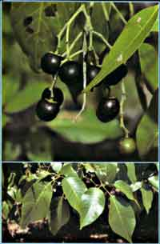
A tree to 10m high, it occurs sporadically in savannas and monsoon vine forests in northern Australia, but is not common.  The shiny black fruit are very sweet and tasty; they are about 1 cm in diameter.</img>

The fruit are available in the wet season from November to March.

In the past, some Aboriginal groups sun-dried the fruit and then rubbed them with red ochre to keep the fruit for up to six months.  The dry straight branches are also used to make fire sticks (sticks that are rubbed between the palms to produce heat to ignite fire).  Fruit is often sundried and rubbed with ochre to increase storage periods.

<h2><i>Sterculia quadrifida,</i> Peanut Tree, Sterculiaceae</h2>

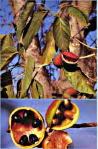
A deciduous tree to 12m, found around the edges of monsoon vine forests and in coastal areas across northern Australia.  The black seeds are held in a red fruit and are exposed to attract birds when ripe.  The seeds are very tasty and are often produced in large numbers.

Fruit are produced for a long period between the late wet season, through the dry season and into the early wet season.

When ripe, the fruit is split to expose the black seeds.  These are peeled and eaten raw; they have a similar taste to peanuts.

The bark is used to make string and rope for various uses.  The taproot of young plants is also edible, and it has several medicinal uses.  Leaves may be used to treat marine and insect stings.  A bark infusion is used to treat eye disorders.

<h2><i>Persoonia falcata,</i> Milky Plum, Proteaceae</h2>

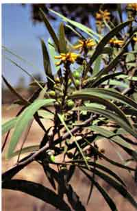
A small tree that is very common in the open woodlands and forests in northern Australia.  The fruit remain green when they ripen, but become soft to touch.  The fruit have an unusual taste and the skin is often spat out.  The fruit are often seen in large numbers, forming a carpet under larger trees.

Fruit are available in the late dry and early wet from October to March.

This plant is also used for a number of medicinal purposes.  A leaf infusion may be taken internally to treat coughs, diarrhoea and chest infection; alternatively, a few leaves may be chewed.  An eye wash is made from scrapings of inner wood and inner bark boiled in water.  This is then strained and used as eye drops.  A bark infusion is also used to treat ear disorders.

The hard timber is used to make boomerangs, woomeras, axe handles and clap sticks.

<h2><i>Pandanus spiralis,</i> Pandanus, Pandanaceae</h2>

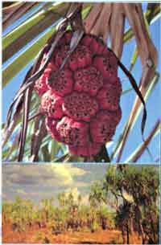
A multi-trunked tree to 5m high.  This plant is very common in poorly drained areas across northern Australia; it often forms dense stands in areas that are seasonally flooded.  The seed inside the woody fruit is very tasty, although very difficult to extract,  and is often likened to pine kernels or peanuts.  Each fruit contains up to 15 seeds, and each fruiting head up to 30 fruit.

Fruit are produced in the mid to late dry season from June to October.

One of the most useful plants in northern Australia with important cultural and spiritual connections for some Aboriginal groups.  The cabbage, peduncle and fruit bases are also eaten and contain carbohydrates, good walking tucker.  A green dye can be made, and the new leaves are used extensively for fibrecrafts.

<h2><i>Syzygium suborbiculare,</i> Red Bush Apple, Myrtaceae</h2>

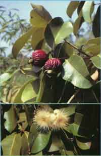
A tree to 8m high, found in savannas and riparian habitats across northern Australia.  The flesh of the large, red fruit has a sharp, tangy taste, which some people find too sharp but others enjoy.

The fruit are often produced in large numbers in the late dry and early wet from October to February.

The flesh of the large fruit is eaten raw when the fruit turn red.  The flesh is crisp and crunchy.  A juice from cooked fruit is drunk to treat coughs, colds and congestion.  Fruit pulp is applied to sore ears.  An infusion made from the leaves is drunk for diarrhoea, heated leaves are applied to wounds to stop bleeding and reduce swelling.  Infusion of bark and leaves is used for stomach pains and to bathe sores.

<h2><i>Antidesma ghesaembilla,</i> Black Currant, Euphorbiaceae</h2>

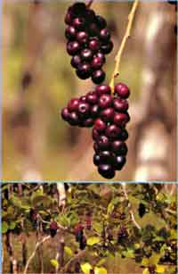
A spreading shrub to 3m, commonly occurring near creeks and rivers across northern Australia. The fruit have a sweet and pleasant taste.  Most population produce only a few fruit per inflorescence, but some populations in certain areas produce much larger fruit in great profusion.  The fruit stain the lips and tongue a dark blue colour.

Fruit are produced in the wet season and early dry, from January to April.

The timber of larger plants is used to make spears and the fruit are also used to make a blue colour for fibrecrafts.  But mostly fruit is eaten immediately due to its sweet taste, and sometimes is made into a jam.

<h2><i>Flueggea virosa,</i> White Currant, Euphorbiaceae</h2>

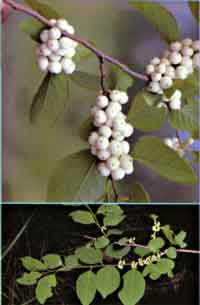
A small spreading shrub to 3m high, occurring in savannas across northern Australia.  The fruit are very sweet and tasty if collected when fully ripe.  If they are eaten prior to, or just after peak ripeness, they have an unpleasant aftertaste.

The small white fruit are often produced in large quantities in the early to mid wet season from November to March.

A leaf and water infusion may be drunk or applied externally to treat stomach pain, vomiting, itchiness, rashes and skin diseases.  This plant is also used extensively to make fire sticks.  For some Aboriginal groups, it is a calendar plant, and the production of fruit signals the beginning of the buildup weather.

<h2><i>Dioscorea transversa,</i> Long Yam</h2>

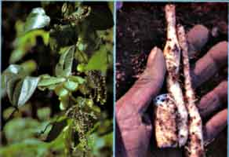

A climbing plant that produces new climbing stems each wet season, and survives the dry season as an undergound yam.  It is found in monsoon vine forest and thickets across northern Australia.  The yam can grow up to 1 metre long and 15 cm in diameter.  The flesh is almost white and very tasty, very much like a sweet potato.  It can be eaten raw or roasted in the ground oven, which is the traditional way of eating it.

The yams are usually dug up after the wet season growing period when they are fat and at their sweetest.  Generally, the neck is broken and they are replanted so the yam resource does not diminish.

In the past this yam and several others have formed a critical part of the traditional diet of many north Australian Aboriginal groups.  And, I think, in the desert area as well.  Yams are often the main source of food, or they have been.

<h2><i>Nymphaea violacea,</i>Waterlily</h2>

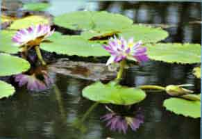
<i>Nymphaea violacea</i> is the commonly-occuring water lily that is found in swamps and billabongs and slow-moving creeks and rivers across northern Australia.  The fruit and seeds are eaten raw, lightly roasted or ground and roasted to make damper.  The seeds are very high in oils and have a pleasant oily taste.  The fibres can be stripped off the stems and you can eat the main stems, which is a little bit like celery.  It tastes good with dips, but it is not quite as crisp as celery.

The fruit are available from mid-wet to mid-dry, January to July.

The seeds are also used medicinally to treat blood disorders, and the tubers are used to treat diarrhoea.

<h2><i>Pouteria sericea,</i>Pouteria</h2>

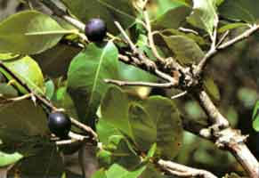
<i>Pouteria sericea,</i> a small bush tree to 8 m high, found in coastal areas and riparian monsoon vine thickets across northern Australia.  The dark purple fruit are about as big as a fresh date.  In some areas they are produced in good numbers, and in other areas, they are quite scarce.  The fruit are very sweet and tasty.

Fruit occur almost all year round, but the best supply is collected during the late wet and early dry seasons.

The timber is often used to make woomeras, spear throwers and axe handles.  It is also considered a very good firewood.

<h2><i>Terminalia ferdinandiana,</i>Billy Goat Plum or Kakadu Plum</h2>

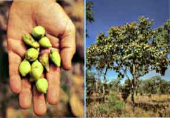
<i>Terminalia ferdinandiana,</i> Billy Goat Plum.  The name was changed for marketing purposes, because people associated the Billy Goat Plum with billy goats.  So the name was changed to Kakadu Plum.  A deciduous tree, spreading up to 10 m, very common in savannahs in the top end.  A pale green to yellow fruit, with a pleasant flavour and high content of Vitamin C, higher than oranges.

The fruit are produced in the late wet to early dry season, March to June.  They are used extensively in the Bush food industry, for jams and chutneys.  Fruit is generally sourced from uncontrolled wild harvest.  Some plantations have been established the Northern Territory.

This plant is also widely used medicinally.  The gum that exudes from the bark is also edible.  A preparation from the inner bark is used to treat sores, boils, backache, ringworm.  In the past it was used for leprosy.

The seed of this one is quite large.  It is quite stringy when you remove the seed from the fruit.  It is very tasty.  When not fully ripe, they can be bitter.

<h2><i>Cycas armstrongii,</i>Cycad</h2>

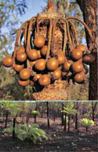
<i>Cycas armstrongii,</i> a deciduous palm-like shrub to 3 m high, common in open woodlands in the Darwin area.  It sometimes occurs in very large numbers.  In the past, the seeds were a major source of carbohydrate for many Aboriginal groups.  It was extensively used during ceremonies and large gatherings.  The seeds are very highly toxic in the raw state.  To reduce the toxicity levels is extremely important.

In the preparation process, they are normally cooked in a fire, then chipped into small pieces, which then are usually placed in a bag and left in a running stream of water for several days, to extract the toxicity.  Then the soggy dough is shaped into cylindrical cakes, wrapped in paperbark, roasted overnight.  Cooked loaves will last for up to six months.  The coarse bread  has a very unpleasant smell, but tastes good if you can cope with the smell of it.

The seeds are produced in the dry season, from April to September.  Again, as I mentioned, because of the toxicity, it may be quite an unsuitable product for the market.

<h2>In Conclusion:</h2>

Those were the twelve most widely used and commonly-occuring plants in the wet tropics of the Northern Territory.  Four hundred native plants have been recorded as being eaten by Aboriginal groups in the Top End.  It is likely that many of the edible plants have not yet been recorded, especially by Western scientists.  Only a few of the edible plants are currently utilised by the mainstream Bush food industry.  They include Kakadu Plum, Alawa Tea, which is<i>Ocimum tenuiflorum,</i> and Rosella, <i>Hibiscus sabdariffa,</i>but rosella is an introduced species.

It is important that we record this knowledge, because many people that my colleague worked with ten or fifteen years ago, have since passed away.  Knowledge is going with these people at a fast rate.

We are currently undertaking a RIRDC-funded project wich researches the feasibility of small-scale, sustainable harvests of native food plants by Aboriginal communities, with all value adding and marketing of product being controlled by the traditional owners of the knowledge.

Thank you.

Q.  Are any of these plants tolerant of salinity? 
A.  Phil talked about saltbush, which has an excellent tolerance.  It does have a small, edible fruit. 

Prosopis of various species, like Mesquite and Tamaruga, are salt-tolerant and have an edible pod which has been  used for human food in Chile for at least 14,000 years.

Q.  Is anyone making money out of the Bush food industry, and where is the industry going? 
A.  Currently the only produsts available in the Top End are products from the south.  Things like Kakudu Plum gets sent to the south where it gets processed by various bush food companies, and then is sent back. 

I am working on a project in the Top End which is looking at commercialising Bush foods for indigenous communities.  The main market that we have identified through consultation with outlets and various different tourist places, is the tourist market.  Recently Coles-Myer approached communities in the Top End because they want quantities of Kakadu Plum.  They are going to sell a range of Bush food products in their stores.  There are a few problems with that at the moment, because, realistically, the amounts that are required are not available from wild harvest.  There is a fund set up that is accessed by indigenous communities to set up nurseries.  But the reality of what is actually happening at the moment, I can't tell you.  At the moment we are just focusing on small, local markets.  We will take it one step at a time.

(END)

 
</body>
