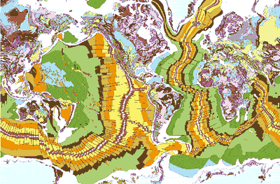
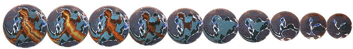
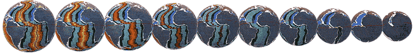
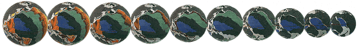
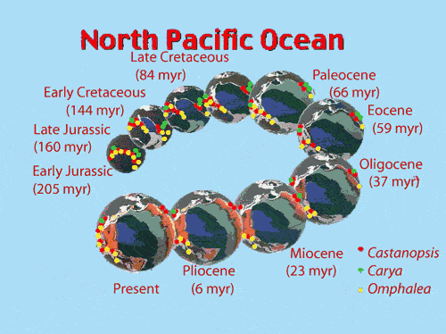
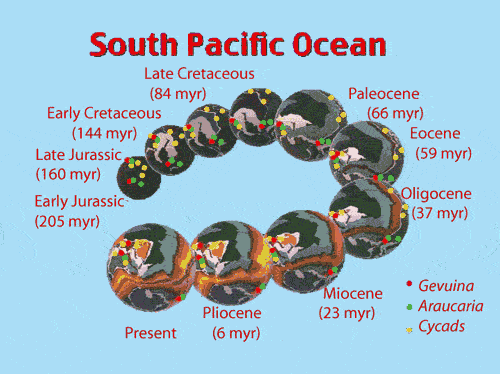
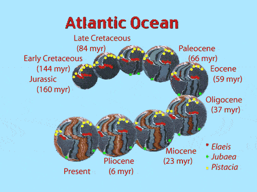
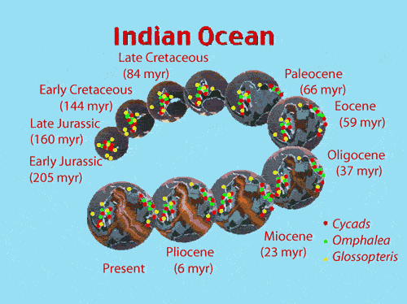

<body bgcolor="#ffffff">
 
<!----- Start of Author-n-Text below ...... ---->

<h2>
How Earth Expansion Gave Us Our Tree Resources
</h2>

  

<h3></h3>

James Maxlow  
E-mail: jmaxlow@enternet.com.au  
  
  
/

Terrella Consultants, Glen Forrest, Western Australia,
6071  
29 Cecil Street,  
Glen Forrest, Western Australia, 6071  
E-mail: jmaxlow@enternet.com.au  
ATCROS Reference:  
  
CGMW &amp; UNESCO 1990. *Geological Map of the World.*
Commission for the Geological Map of the World, Paris.  
  
  
  


<b>Abstract</b> 

The concept of an expanding Earth in relation to the distribution of nut and fruit trees through geological time was introduced in 1989 by David Noel in his book <i>NUTEERIAT -- Nut Trees, the Expanding Earth, Rottnest Island, and All That.</i> This paper will extend on the theme by introducing you to current research into Earth expansion and highlight this research by showing you the distribution and development of selected nut and fruit trees on spherical Earth models, ranging in age from the Permian (250 million years ago) to the present. What this new research demonstrates is that, knowledge of past movements of continents is well established and the concept of an expanding Earth far better explains the diverse range of geologic, biologic and geophysical phenomena now available from modern Earth studies. By viewing the distribution of nut and fruit trees on expanding Earth models for instance, you will gain a better appreciation of the genetic origins of tree crop species, and an understanding of the subsequent ecological pressures placed on species evolution, survival, adaptation or extinction.

<h2>Earth Expansion</h2>

Current research into Earth expansion is based on the published <a href="Author-n-Subs.htm#3" target="Subs"><i>Geological Map of the World</i> map (CGMW &amp; UNESCO, 1990)</a> (Figure 1). The geology shown in this map is time-based, which means that the continental geology is represent by the major geological Aeons (Archaean and Proterozoic) and Eras (Paleozoic, Mesozoic and Cenozoic), and the oceanic geology is represented by the geological Periods Cenozoic), and the oceanic geology is represented by the geological Periods (subdivisions of the Mesozoic and Cenozoic Eras) ranging in age from the Jurassic to Recent. 

<b>Figure 1</b> Bedrock geological map of the world showing continental and oceanic time-based geology. The map is shown to 80 degrees north and south latitude only. (After the <i>Geological Map of the World</i> map, published by CGMW &amp; UNESCO, 1990)

The distribution of oceanic geology demonstrates that each ocean contains a centrally located spreading axis, and the distribution of geology symmetrical about and parallel to the spreading axis demonstrates that all sea floor crust ages away from the mid-ocean spreading axes, with the oldest crust (Early Jurassic, about 160 million years old) located adjacent to the continents (Figure 1). More importantly, the oceanic geology demonstrates that all of the oceans are enlarging approximately normal to the axes, and all continents are now moving away from each other as the sea floor spreads. The current rate of sea floor spreading in each ocean varies between 1 to 10 centimetres per year.

 
Spherical models of an expanding Earth have been constructed by progressively removing sea floor volcanic rocks parallel to the mid-ocean spreading axes and refitting the crust along each mid-ocean axis at a reduced Earth radius. Each model shown in Figure 2, for the Indian Ocean, Figure 3 for the Atlantic Ocean, and Figure 4 for the Pacific Ocean demonstrates that all crustal plates assemble with a better than 99% fit-together and all plate locations are accurately constrained. This construction method can be continued back to the Early Jurassic Period, about 160 million years before the present, until all sea floor crust is removed. At this time all continents are refitted together like a spherical jig-saw along the continental margins on a primitive Earth with a radius of about 3540 kilometres (the present mean radius of the Earth is 6370.8 kilometres).

 
By removing all of the sediments deposited around the continental shelf margins, shown as white areas in Figures 2, 3 and 4, the remaining continents are then reunited as a single continental shell encompassing the entire Earth at a primitive radius of about 3,200 kilometres (50% of the present radius) during the Permian period, about 250 million years ago. By then progressively removing sediments from within continental sedimentary basins a primordial Earth of 1,700 kilometres radius is achieved during the Early Proterozoic, about 2,000 million years ago (not shown).

<b>Figure 2</b> Expanding Earth reconstructions of the Indian Ocean for the beginning of the: (a) Recent, (b) Pliocene, (c) Miocene, (d) Oligocene, (e) Eocene, (f) Paleocene, (g) Late Cretaceous, (h) Mid Cretaceous, (i) Early Cretaceous and, (j) Late Jurassic Periods. Each ancient Earth model was constructed by progressive removal of sea floor crust shown in Figure 1, and reuniting plates along each mid-ocean axis at a reduced Earth radius.

<b>Figure 3</b> Expanding Earth reconstructions of the Atlantic Ocean for the beginning of the: (a) Recent, (b) Pliocene, (c) Miocene, (d) Oligocene, (e) Eocene, (f) Paleocene, (g) Late Cretaceous, (h) Mid Cretaceous, (i) Early Cretaceous and, (j) Late Jurassic Periods.

<b>Figure 4</b>Expanding Earth reconstructions of the Pacific Ocean for the beginning of the: (a) Recent, (b) Pliocene, (c) Miocene, (d) Oligocene, (e) Eocene, (f) Paleocene, (g) Late Cretaceous, (h) Mid Cretaceous, (i) Early Cretaceous and, (j) Late Jurassic Periods.

<h2>Ancient Geography, Climate and Biogeography</h2>

On an expanding Earth all of the modern oceans were previously only a fraction of their present area, and prior to the Permian Period none of the modern deep oceans existed. Both the oceans and atmosphere were subsequently formed by degassing of volatile elements from the mantle during formation of sea-floor volcanic rocks and opening of the modern oceans.

Prior to the Permian Period all continental crust was united to form a single supercontinent called Pangaea, and geographical studies show that the ancient oceans were represented by a network of shallow continental seas, their former presence now preserved as continental sedimentary basins. These ancient continental seas, known as the Panthallassa, Iapetus and Tethys Seas, represent precursors to the modern Pacific and Atlantic Oceans and emergent Eurasian continent, respectively. Emergent land surfaces during the Precambrian and Palaeozoic Eras are known as the Rodinia, Gondwana, Laurentia and Pangaea supercontinents plus smaller subcontinents, and their development demonstrates a progressive and evolutionary Earth history.

The ancient magnetic poles and equators are located on expanding Earth models by using published palaeomagnetic data (ancient magnetism preserved in rocks). Plotting the magnetic data shows that poles cluster as diametrically opposed north and south magnetic poles for each expanding Earth model. The ancient north pole was located in eastern Mongolia-China throughout the Precambrian and Palaeozoic Eras and, as the continents slowly migrated south during expansion there was an apparent northward wander of the pole through Siberia to its present location within the Arctic Ocean. Similarly, the ancient Precambrian and Palaeozoic south pole was located in west-central Africa and, as the continents slowly migrated north there was an apparent southward wander of the pole along the South American and west African coastlines to its present location in Antarctica.

 
Geographical and biogeographical data, when applied to expanding Earth models, quantify the location of the ancient poles and equators determined from palaeomagnetic data. The distribution of latitude and climate dependent rocks such as glacials, carbonate reefs and coal, and faunal and floral species quantify precisely the established ancient poles and equators for all expanding Earth models. The climatic and biotic indicators show a distinct latitudinal zonation paralleling the established ancient equator and a distinct northward shift in climate zonation, suggesting that an inclined Earth rotational axis, inclined to the pole of the ecliptic, was well established during the Palaeozoic Era, persisting to the Recent.

The distribution of selected faunal and floral species on expanding Earth models is also consistent with the ancient geography and illustrates the ease and simplification of migration and biogeographical development. Cosmopolitan and provincial distributions and inter-relationships are maintained, without the need for conventional continental assemblage-dispersal requirements. During the Mesozoic Era, established Pangaean faunal and floral distributions were disrupted during continental break-up and opening of the modern oceans, enabling species endemic to the various regions to interact, migrate or extend their boundaries with time. The timing of both faunal and floral development is reflected in cyclical changes in sea-level, facilitating evolution, migration or extinction by extending or destroying migration routes and modifying climate.

<h2>Tree Crop Development</h2>

The distribution and development of nut and fruit trees on an expanding Earth is intimately linked to the break-up of continents during the Mesozoic Era, and subsequent rapid opening of the modern oceans and disruption of established climatic zones. For the tree crop industries, models of an expanding Earth demonstrate precisely a common genetic ancestory of each species, dating back to the pre-Permian when all continents were united. They also demonstrate precisely the ecological pressures placed on each species during subsequent continental break-up and dispersal of continents through the various climatic zones to the present.

 
As David Noel points out, movement of continents, in general terms, have been mainly northwards, away from the present equator, and opening of the modern oceans have separated continents in an east-west direction. This has resulted in migration of species into or out of the various subtropical and temperate climate zones. Through natural selection, these fugitive species either acquire characteristics that better suit them to their new surroundings, or become extinct. Surviving species then retain a common genetic ancestory across the imposed geographical boundaries.

Break-up of the continents during the Permian Period placed enormous ecological pressures on the ancient floral species. As well as continental break-up we also had rising sea levels during the Mesozoic Era, resulting from a destabilisation and melting of the Permo-Carboniferous ice-caps, plus generation of new juvenile water along the mid-ocean spreading axes. This rising sea level resulted in submergence of low-lying coastal and inland regions and an increase in surface area of continental seas. Floral species then had to migrate away from their existing habitats during inundation as well as rapidly adapt to change in climate zonation during continental break-up.

  
Figures 5A, 5B, and 5C show hypothetical examples of floral
species located on Early Jurassic in relation to the same locations on the Present expanding Earth models.  While simplistic, the examples have been selected to show the effects that continental dispersal and species migration can have on species development, survival or extinction. A number of typical species are given, however their overall distribution is not shown in the Figures. It must be realised that, while this research is new, break-up and dispersal of the continents is well established in geology and this research offers a better and far simpler solution to the problems of biotic development.

Figure 5A shows species located in north Queensland-New Guinea, adjacent to California in North America, eg. the evergreen chestnuts, <i>Castanopsis,</i> also found in Southeast Asia. From a low-northern Triassic latitude Australia and New Guinea migrate to a low-southern latitude, while California migrates to a mid-northern latitude during opening of the Pacific Ocean. The occurrences on opposite sides of the Pacific Ocean substantiates reconstructions of these two continents and, for this species to have survived the journey it must have been adaptable to both equatorial and temperate climates.

 
In the same Figure 5A species are shown located in Queensland, and Ecuador in South America eg. the <i>Cycads,</i> the zamia palms common to Gondwanaland and also occurring in Southeast Asia, South Africa and Western Australia. During opening of the south Pacific Ocean these continents maintained a low to mid-southern latitude and the species were not required to migrate out of their preferred climate zone. In contrast, species common to southern Australia, Tasmania, New Zealand, West Antarctica and South America originate in a Triassic mid-southern temperate belt. During opening of the South Pacific and Southern Oceans the southern regions of Australia and New Zealand remain in mid-southern latitudes and the various species survive. West Antarctica however, migrates to high-southern polar latitudes and the various species become extinct.

 

Figure 5B shows the classic faunal link between West Africa and Brazil, used to substantiate the assemblage of Gondwana and subsequent opening of the Atlantic Ocean. The species shown, eg. the distribution of the oil-palm <i>Elaeis,</i> while originating in a mid-southern temperate latitude during the Triassic, has had to very quickly adapt to low-southern and equatorial latitudes during the Mesozoic, prior to separation of Africa and South America during the Mid Cretaceous. Both regions now straddle the equator and the species is common to both continents.

Figure 5C is included to show the close genetic link between Africa, Madagascar and India. Opening of the Indian Ocean commenced during the Early Jurassic Period, initially separating Africa from Madagascar and India. A common link was retained between Madagascar and India until rifting and isolation of Madagascar from India during the Mid Cretaceous. Both South Africa and Madagascar have since maintained a mid- to high-southern latitude and species common to both countries include the edible nuts <i>Omphalea,</i> and the ancient <i>Cycads.</i> India in contrast, migrated north during opening of the Indian Ocean, travelling from a mid-southern temperate latitude through the equatorial zones and is presently located in a mid-northern latitude. While the common ancestory is evident from fossil species, in particular the ancient seed fern <i>Glossopteris,</i> few modern species common to Madagascar, Africa and India have survived the transit of India into and out of the equatorial zones.

<h2>Summary</h2>

Earth expansion through geological time is now able to be quantified using reconstructions based on modern sea floor geological mapping. These reconstructions are a valuable addition to science and allow us to visualise a diverse range of geological, geographical and climatic phenomena, all of which has direct application to tree crop development. This new knowledge is of particular benefit to the tree crop industry and has the potential to define the ecological pressures placed on each species during subsequent continental break-up and dispersal of continents through the various climate zones to the present. This new knowledge can be used to locate genetic material likely to be of value in the breeding and development of fruit and nut crops.

(END)

 
</body>
