<body bgcolor="#ffffff">
 
<!----- Start of Author-n-Text below ...... ---->

<h2>
Jujube Orchards
</h2>

  

<h3></h3>

Roger Meyer  
E-mail: exoticfruit@95net.com  
  
  
/

16531 Mt Shelly  
Fountain Valley CA 92708 USA  
Phone: +1 714-8390796  
Fax: +1 714-7524269  
E-mail: exoticfruit@95net.com  
ATCROS Reference:  
  
  
  


<b>Abstract</b> 
Jujubes are extremely popular fruit in many parts of the world.  Roger Meyer grows commercial crops of Jujubes in California. 

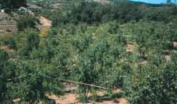
 <b>Jujube Orchard</b></img>

Jujubes are an extremely popular fruit in many parts of the world. The areas where it is cultivated begin in North Africa and go east, through the Middle East, to
India and Indochina, then northward to China and Korea. However, it is virtually unknown in Japan.

Jujubes have two basic problems: 
1.  Some cultivars are thorny, not as bad as the Kei Apple.  They have two types of thorn, either a hooked thorn or a very straight thorn.  Some are thornless. 
2.  The other problem is that they do send up root suckers throughout your field.  To me, there are dollar signs on every one of those.  Every winter I dig them up and they are the rootstock for next year's grafting.  If you don't want them, you can hoe them down in the winter, or mow them down.  

<table><tr><td>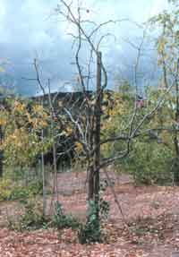</td><td>
This is the early branches in the spring time.  I have identified five different branch structures on Jujube.  The fruiting canes drop off every winter.  It is not something to worry about.  You haven't underwatered or overfertilised, you haven't done anything wrong when you see your plant having all these dead little twigs, it is just natural, and they just fall off.
</td></tr></table>
<table><tr><td>
This is what is called the pinecone.  It is a branch that only grows about one millimetre a year.  On the older trees, this is where many of the fruiting canes arise.  You can see the start of the flowers.  The flowers are fairly inconspicuous, little yellow-green flowers with not much smell.
 </td><td>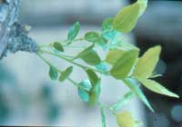</td></tr></table>
<table><tr><td>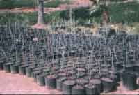</td><td>
If you are going to get into the business, you want to get nursery stock going.  You will be several years ahead of everybody else, you might as well make money by selling plants to somebody who is behind you.  These are my nursery stock plants that I will use and also sell.
</td></tr></table>
<table><tr><td>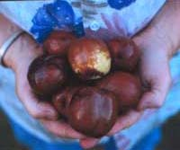</td><td>

This is the Li Jujube, one of the best.  There are probably a dozen different ones in China called Li, from different provinces.  They are all similar. They are one of the largest of the Jujube fruits, very crunchy, nice eating, and one of the earliest.  We begin harvesting in mid-August.  
</td></tr></table>
Our phone starts to ring off the hook in late June with people wanting to know when they are ready.  They go from green to a yellow-green to a deep mahogany red.  The red comes on in little spots like a banana gets black spots when it ripens.  The spots slowly coalesce and take over the fruit.  A totally ripe banana becomes jet black, and this Jujube becomes this deep red or brown colour.  

The time to pick depends on the cultivar.  You can pick Li in the yellow-green stage.  It lasts a few days longer on the shelf.  It is not quite as sweet, but it will become sweeter as the carbohydrates turn to sugars.  We pick them in this stage here.

<table><tr><td>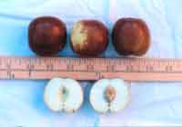</td><td>

Here is an example of a Jujube. This is one of the Chinese selections that one of your WA fellows has brought in through quarantine.  It is fairly large for a Jujube.  This would be what the customer wants, this size.  This is a crunchy one, very nice, sweet, and juicy.

</td></tr></table>

<table><tr><td>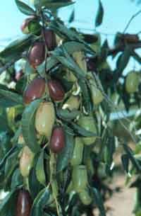</td><td>

Some jujubes have round fruits.  This one is elongated.  This is called the Silverhill, came out of America, and is a very late-ripening fruit.  Not the best eating one at all, however, since it is so late, in October, my customers are looking for anything to buy at the time and they will accept it at that point.  If it were competing with any of the other Jujubes, they wouldn't accept it.  You can see the differences in colour.  Here is a bit of the red starting, the Silverhill, you need to wait until it is completely red before it is very good.

</td></tr></table>

<table><tr><td>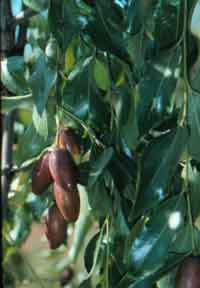</td><td>

This is probably what is called the GA866.  This came from the fruit introduction station in California where they named their sections and subsections and rows.  So this one was in section G, subsection A, the 866th plant in that row.  Very sweet, up to 45% sugar when it is fresh.  When it is dry, it goes to about 75% sugar.

</td></tr></table>

<table><tr><td>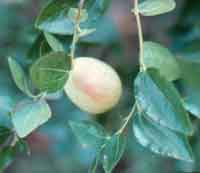</td><td>

Not sure which variety this is. It is not ready yet, but this is what it looks like hanging from the tree.

</td></tr></table>

The Lang, at least, what we call Lang in America,  is one of the drying ones. It's OK fresh. You would pick it in the dark red state if you wanted to eat it fresh. It has
the same sugar level, about 25-30% sugar, but it just doesn't come across as sweet as the Li. So this one you leave on the tree for drying..

<table><tr><td>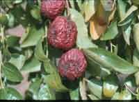</td><td>

This is what they look like when they start to dry.  They shrivel up.  These are readily available in your local markets: just  look in the Asian food section for Red Dates.  Often they are very small.  They are also used medicinally.  Some people make tea for sore throats.  When they are dried, they will go up to about 75% sugar, they will dry themselves on the tree, they don't need any sulfur to preserve them.  Once they are properly dried they need nothing else and they will last forever.
</td></tr></table>
<table><tr><td>
<td></td></td></tr>

It is what they look like open.  It is still a little bit yellow.  If it were on the tree one day more the yellow would be gone and it would be all deep red.  These are the larger fruit of the Li variety.  This is the size you want to see.  The customers just go crazy over this size.  It has a single pit inside.  The Li and Lang, the seeds are empty, you can't plant the seeds.  There are other cultivars that do have viable seeds.
</table>
<table><tr><td></td><td>
 There can be many fruit like this. The bigger one is about 2 inches wide and 3 inches long. The biggest one I ever grown was 90 grams, almost the size of a tennis ball.
</td></tr></table>
<table><tr><td>
This is the way we package them.  We get used banana boxes from the local market for 25 cents each, the cheapest possible packaging.  We tried prepackaging them in 500 gram sizes.  What happened was that customers would break them open to try them to see if they liked them.  So we just do this now.
</td><td>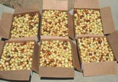</td></tr></table>

<b>
Responses to audience questions:
</b>

There was a fellow from India talking about different aspects of Jujube.  The Indian Jujube, <i>Zizyphus mauritiana,</i> is more tropical than the ones I have. The Indian fruit has a lower sugar content. It was almost like eating a coconut, in a way. Very nice, just lower sugar. They will not do well in my area because it is too cold. You would be borderline here in Perth for growing them. There are some problems with them being so thorny and getting out of hand. We have relatives of them in the Americas which don't have edible fruit. I have often wondered if I can graft on to them. 

There is a closely related species called <i>Hovenia dulcis,</i> the Chinese or Japanese raisin tree, but I have not been able to get them to cross-graft.  We would love to, because they do not send up root suckers.

I only sell locally. Our Vietnamese population is so big, that I could produce ten to twenty times the amount and not have to leave the local area. We started out at
$3 per pound. A few years later we were producing quite a bit more, so we put the price down to $1.59 per pound.

Fresh fruit is eaten out-of-hand. Dried fruit is used in cooking. Small dried fruits are used medicinally. There are hundreds of different medications that are made out
of the dried fruit. A fellow in Texas produces shredded leaves for tea, and shredded fruit that can be added to cereal.

We don't know how much fruit each tree produces, because they don't ripen all at once. My guess is that 50 to 100 kg is produced per tree. They can be absolutely
loaded. The trees are drought tolerant, but if you allow them to go through drought stress, they will drop their fruit. If there is no water available, let them go. They
will survive the summer but will drop their fruit and you will have to wait until next year.

You have to go through and hand pick the fruit. We may go through a given tree 6 or 8 times to pick the fruit. We wait for the right time to pick and then select-pick
in the yellow-green stage. Near the end of the season they start to ripen faster and faster. Right at the end of the season you are picking all red fruit. We pick at least
twice a week, sometimes three times a week

The fruit are susceptible to fruit fly.  You would have to worry about that, but we don't have them where I am.

Trees seem to be tolerant to waterlogging as long as it doesn't go on too long. They also are alkaline-tolerant and saline tolerant. We don't yet know how much
salinity they can tolerate. They were taken to west Texas in the 1920ís for farmers to grow. Their soil there is pH 8.3 and very salty. They did OK, but they had no
market for it. The trees are still there, but nobody has done anything about them. They don't market them. Now is an opportunity to market them because they have
a huge Vietnamese population in Houston and Corpus Christi. Our next marketing area, once we have done all we can in California, is to go to Texas. 

There has been a little bit of competition from other areas into my market. They have made downward pressure on the price. Other growers tend to get $1.10 to
$1.20 per pound, and that is used against me. I will say, "Have you tasted that fruit?" "Yes." "Well, is it good?" "No." That usually ends the question right there. I
presume it will eventually happen and there will be enough production, because I have gone around as much as I can preaching it. I think it is a marvelous crop, it has
a marvelous potential, especially in areas where nobody else is growing it at the moment and where you have the population that wants it. And believe me, they want
it. It's your opportunity.

The Italians know it, and call it something like 'Il Gigolo'. It is generally the older generation that know it, and they mainly know the little tiny ones, not the great big
Chinese cultivars. There is some debate: look in the older books, they will say that Jujube came from Syria or North Africa. You talk to the Chinese and they will
absolutely swear that they developed it. So we just don't know where it actually came from. There are the Spina-Christa types that are known to come out of Africa.
Those are much smaller fruit with a huge pit in relation to the flesh, and they are usually not very good. As with many things, the diversity is very wide. They can be
processed with honey to make them more like what we would call 'Persian Dates.'

I use a wedge graft. I use a grafter out of New Zealand called the 'Top Grafter.' It is a little cumbersome but does the job quickly. You can just use a sharp knife.
Do an arrow on the scion. Taking the same diameter as the rootstock, cut a slice down, put them together, tape them up and let them sit for a year. They will graft
fairly easily. We take the wood in the dead of winter. It can be stored for four to five months. Keep it refrigerated, in moist packaging, and it stays just fine.

The scion wood stores better than the fresh fruit. Fresh fruit has a very short shelf life. Mine only last about seven days from pickling until it is no longer salable.
Another fellow has exactly the same cultivar I have because I grafted the trees for him. However, his fruit will store for three weeks in refrigeration. He is organic and
I'm not truly organic, but I can't believe that is the whole reason. Most of the manure I use is chicken manure. I really don't know what the two of us are doing
differently. His fruit comes in later than mine, so we don't compete with each other. He brings down about a ton of fruit in his truck twice a week, and I sell them for
him. I take 13% commission, and I am very happy.

(END)

</body>
