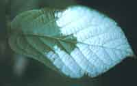
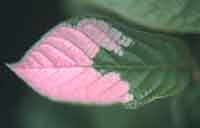

<body bgcolor="#ffffff">
 
<!----- Start of Author-n-Text below ...... ---->

<h2>
New Species of Kiwifruit for Commerce
</h2>

  

<h3></h3>

Roger Meyer  
E-mail: exoticfruit@95net.com  
  
  
/

16531 Mt Shelly  
Fountain Valley, CA 92708 USA  
Phone: +1 714-8390796  
Fax: +1 714-7524269  
E-mail: exoticfruit@95net.com  
ATCROS Reference: 11111.  
  
  
  


(Paper in preparation, some illustrations at end still to be positioned)

<b>Abstract</b>
 <i>
In the last twenty five years it has been realised that there are many species of Kiwifruit.  New Zealand has been the major breeder and developer of varieties, and guards its material and information well.  Roger Meyer has compiled much information and personal experience about many species other than the well-known green Kiwifruit.</i> 

<h3>
New Species of Kiwifruit for Commerce
</h3>

We didn't do much with Kiwifruit material in the US.  New Zealand took it and ran with it, made a worldwide crop out of it.  One thing I forgot to mention in my jujube talk: there is virtually no literature available except one book, and I edited that one.  I make no money in selling it.  David Noel has copies, so if you are interested in it, there is 250 pages there with material I have collected for many years.  Some of the material is 100 years old, some of it contradictory so you have to work through it.  The later material is probably a little more valid than the earlier.

There are two good sources of material to read about Kiwifruit.  One is a New Zealand book, <i>Kiwifruit Finance and Management,</i> a very thick book.  David does not have it.  The other one is <i>Kiwifruit Enthusiasts' Newsletter</i>.  It is put together by enthusiasts.  Again, it is not a pocket motive but for the sheer joy of doing it.  David has it available in his book store.

In the 1970s we knew Kiwifruit as <i>Actinidia chinensis.</i>  Before that, over one hundred or so years, it went by many different names.  We kind of settled on this until the mid-80s when they discovered that were some plants in China that really didn't fit the botanical description completely.  The green Kiwifruit.  They broke it down into three new species, and there was some question about what to call it.  They kept the green one that we know of as <i>Actinidia chinensis.</i>  Over a three year period they went back to the old literature and found that in the 1840s a Frenchman, Chevalier, had originally described Kiwifruit, and it was all forgotten.  He had described it as <i>Actinidia deliciosa.</i>  His name takes precedence, so the green Kiwifruit is now <i>Actinidia deliciosa.</i>

One of the two new ones is from Taiwan, <i>Actinidia cetosa.</i>  It is a very hairy fruit, much smaller, and we don't know if it has any potential.  But there is potential with the other new one, <i>Actinidia chinensis.</i> 

The new <i> chinensis</i>  comes in green forms and yellow forms and all intermediate shades.  The yellow forms have become very exciting, and there are also some red forms.  Most of those are yellow with bits of red, in varying amounts.

New Zealand has bred their own material, and they have now marketed it under the Zesprigold label.  I got my material from a separate source, out of China through Japan.  New Zealand is closely monitoring its scion material and will not let it out except to licensed growers.  My material is available.

This has a very  nice yellow colour.  There is nothing wrong with the green Kiwifruit, but this is a "Lets-move-on" situation.  It is a wonderful colour.  The taste is more tropical, smoother taste and texture.  I think it has wonderful potential for the world.

slide  A picture of the yellow form.  In the beginning, when they are beginning to size up, they are solid green inside.  In the last couple of weeks they become more and more yellow, the green goes toward the skin.  When they are ready to pick, there is just a little green layer left inside the skin.

slide  They are the same size as regular Kiwifruit.  Kiwifruit isn't the only one of these species that is edible.  This is called Arguta, or hardy Kiwifruit, because it will take such a cold temperature, down to about -25 degrees F.  They will tolerate some heat as long as they get plenty of water.  That is the key: water during the growing season.

<table><tr><td><td>These are the flower buds of <i>arguta.</i>  They are very precocious, a lot of fruit.  They are only grape size fruits, so they are much smaller than ordinary Kiwifruit.  They ripen two months ahead of time.  You can eat the skin and all, just pop them right in your mouth, and they are far sweeter than Kiwifruits.  Standard green Kiwifruit have a sugar level when ripe of about 15 to 17, and sometimes as low as 12.  The hardy Kiwifruit can go up to 28.  They are a very sweet fruit.</td></td></tr></table>

<table width="100%"><tr><td> Male Flower </img></td><td> Female Flowers </img></td></tr></table>

Apparently all the <i>Actinidias</i>will cross-pollinate with each other, interbreed, and the flowers all look the same.  You can tell the male because it has no central ovule, only anthers.  The anthers can be of different colours, it doesn't matter.

slide  A related species called <i>polygamma,</i> probably not a commercializable fruit.  It has two interesting traits: when the fruit ripens, it goes from green to bright yellow on the skin; and while it is green, many of the <i>Actinidias</i>are chilli pepper hot.  They lose that in just the two weeks before ripening.  It is very unusual.  In Japan, they make a medicinal drink from <i>polygamma,</i> they call it a health food drink.  It is actually 80 proof liquor.  It is an interesting drink.  It is not something I would be on all the time unless I was an alcoholic. 

slide   Baby <i>polygammas,</i> hard to see.  They have a little pointed end.  These are probably just two weeks after flowering.  They stay green until ripening time in the fall when they turn bright yellow.

slide  Another one that turns bright yellow orange is called <i>macrosperma.</i>  It also has a very hot-flavoured flesh when they are unripe.

<table width="50%"><tr><td></td><td>
Not all leaves are pure green.  This is a regular <i>deliciosa </i>Kiwifruit that has a beautiful variegated colouring.  We have a male and a female like that. 
</td></tr></table>

<table><tr><td> 
This is <i>kolomikta,</i> the most cold-hardy.  It comes out of Russia, Siberia, from Vladivostok north to Sakhalin Island.  It has great difficulty growing in my area because it is just too warm.  The leaves on the male start out bright green, then about a month later they get white.  Probably 25% of the leaves turn white like this.  Other genera do the same, usually the males only.
</td><td>

A week later this pink colour comes on top of the white.  They are just beautiful leaves on the vine, it looks like it is reblooming.
</td></tr></table>

slide  Now we are going into the actual hardy Kiwifruit fruit.  They grow in these massive clusters under the cover of the trees.  They are somewhat hard to see.  You have to lift up the vines to see in.  A small, grape-sized fruit.  This is the <i>cordifolia</i> variety, the sweetest one I have found, 28 Brix sugar. 

slide.  <i>Cordifolia</i>

slide  more <i>cordifolia.</i>  Regular Kiwifruit ripen in November, these ripen the first week in September.  So, two to two and one half months before regular Kiwifruit go on the market, you can be packing these fruit.  We pack them in little clamshell punnets and we put 160 g in a punnet.  We get about A$35 for 12 punnets in a tray, which is a little over 2 kilos.

slide  You see the massive clusters of these.  Each individual cluster doesn't weigh that much, but you get a lot of fruit overall in a given vine.

slide  This is a New Zealand cultivar, not quite as sweet but nice-eating. They have different aromas to them.  Some have a slightly bitter skin; you try to get away from those.   The trouble is, the ones that have a slightly bitter skin have a better aroma.

slide  We begin harvesting when the Brix is about 7, which is the same as Kiwifruit.  You just start pulling, and they all pull off at the same time.  And you hope that there isn't a single ripe one in the way, because they can have a single ripe one, and they squish, and it gets all over you.  But in general, probably 95% of the fruit are all rock-hard when you pick them.

slide  This is one called Anna, came out of Russia.  That was the story. But if you go to the original literature about Anna, it looks completely different than this one, so somebody screwed up.  If the fruit is exposed to the sun they turn a nice red on the skin, a nice blush to them.  They are harvested about a month later than Cordifolia.  So you can extend your season somewhat.

slide  This is a different species altogether.  It is probably <i>Actinidia rufa,</i> it could be <i>chrysantha.</i>  I don't think there is too much potential in that one because the skin is kind of leathery.  It has a fair flavour, but people want to be able to bite right in, skin and all.

slide  This is one called <i>eriantha.</i> We took the very first fruit to market this year.  We didn't ask for anything for it, it was just to see if people were interested in it.  Not a great flavour, but it has one tremendous advantage: it is one of the highest fruits in Vitamin C.  The fruit itself can have 1 to 4% of pure Vitamin C.  That is something health food stores might be looking for.  It is green inside, very velvety on the outside.  It is interesting to touch the leaves, the branches and the fruit.

slide  This is one called <i>purpurea.</i>  These were just starting to ripen.  They can be picked at this level if you want to wait a couple of days.

slide  They are starting to turn red now.  These come out of Manchuria and North Korea.

slide  Again, <i>purpurea</i> starting to turn red.  It has a much lower sugar content, about 14 Brix.  But they taste somewhat like cherries, so you don't mind the lower sugar levels.

<table width="70%"><tr><td></td><td>
There is one of our farmworkers, you can see how happy he was, that is my son.  That is the type of pack we put them into, we bring them out of the grove. Obviously you could get a mechanical thing if you were well into it, but for us it is not worthwhile.  You can see the punnets we put them into. You don't want great big thick boxes, because the fruit will start smashing itself.  We sort sizes, it is all hand work at the moment.
</td></tr></table> 

<table width="70%"><tr><td>

This is Shirley with the trays.  You can see the red colour of the Anna variety in there.
</td><td></td></tr></table> 

<table width="70%"><tr><td></td><td>
This is our truckload getting ready to go to market.  Our farm is about 80 miles from our marketing in either Orange County or into Bolesas, which is downtown Los Angeles.
</td></tr></table>

There are probably 60 to 70 known species of <i>Actinidia</i> in China.  We are slowly getting these out.  How many are going to be good for marketing, probably not that many, but there are some exciting ones there.  Plant explorers who go out and find these little gems make it real fun and give us a chance to market new and unusual crops.

Q.  What are the warmest climate varieties? 
A.  There are tropical Kiwifruit, indochinensis, some go down into Sumatra.  They are true tropicals.  The only trouble is that most of these have very tiny fruit.  They are edible, but you are not going to market them.  The hardy Kiwifruit that go down to 25 below zero, believe it or not, have very low chill requirements.  Maybe 200 hours is all, below 45 degrees F, 7 degrees C.  When I got my original plants, I saw them in the corner of a greenhouse.  I asked what it was and was told that I really didn't want that because it won't grow in our area, we are too warm.  I took it anyway, and it has turned out to be marvelous.  It is something that will fruit in low winter chill areas, that you wouldn't expect.  They will also fruit well in hot summer areas as long as they get water.  More plants are killed by California growers because they don't put enough water on them. 

Q.  Can you let them ripen on the vine? 
A.  No.  You have to pick them early while they are still hard, because in two weeks they will have softened on the tree.  It is fun while we are picking because we always find a few that have ripened early, so we get to feed our face.  By the end of the day you are kind of stuffed, but they were so sweet they were so much fun eating them while you were picking fruit.  You want to get them into the cooler as soon as they are picked.  They have a very short shelf life in relation to regular Kiwifruit.  Regular Kiwifruit can be stored under ideal conditions for 6 to 12 months.  These will only go 4 to 8 weeks.  New Zealand is working on crosses.  I have seen crosses that were 3 or 4 times the size of these fruit.  Some are cigars.  Those stored quite a bit longer, so there are potentials there.

Q.  How much work have the Italians done on these? 
A.  There is some work in Italy, and around the world, looking at things.  There was some work in Switzerland, but the pH of the soil was 8.5, and while mine stayed green all their lives, his turned bright red.  They couldn't get their nutrients at that high of a pH.  But they will grow at very low pH.  Some growers in New Zealand have pH of around 4 in their soil, and they do just wonderful there. 

(Paper in preparation, some illustrations at end still to be positioned)

<table><tr><td>1jpg</td><td>2.jpg</td><td>3.jpg</td></tr></table>

<table><tr><td>5.jpg</td><td>6.jpg</td><td>7.jpg"</td></tr></table>

<table><tr><td>8.jpg</td><td>9.jpg</td><td>10.jpg</td></tr></table>

<table><tr><td> </td><td>18.jpg</td><td>19.jpg</td></tr></table>

(END)

</body>
