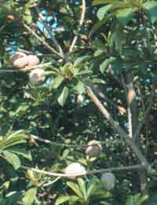

<body bgcolor="#ffffff">
 

<h2>
Fruits Called Sapotes
</h2>

  

<h3></h3>

Roger Meyer  
E-mail: exoticfruit@95net.com  
  
  
/

16531 Mt Shelly  
Fountain Valley CA 92708 USA  
Phone: +1 714-8390796  
Fax: +1 714-7524269  
E-mail: exoticfruit@95net.com  
ATCROS Reference:  
  
  
  


<b>Abstract</b>
 <i>
The name 'sapote' is used for many different fruits.  The true sapotes are described and discussed.</i> 

Aside from WANATCA, there are two other groups you can join to learn about tropical and subtropical fruits, which would complement what David is doing with WANATCA and the Quandong magazine.  This is the Tropical Fruit News from Florida, mostly tropical things in here.  Their emphasis is southern Florida.  They do a wonderful job, however, they are in turmoil right at the moment.  Whether we will see another publication--they swear they will--the first issue of the year was the addresses of everybody, which was easy for them to publish.  The next thing was a letter saying they had stopped, for the moment, trying to get reorganised.  It is a wonderful group to join.  If you have a chance to get down to Florida, go for it.

Here is the publication that the California group puts out: California Rare Fruit Growers.  Roberto talked about the akee fruit; here is a picture of akee, used in Jamaica.  It is one thing you want to watch out for. In this condition when it is nice and red but unopened, it is deadly poison.  It has to open up fully, and then you eat the arils inside.  Don't eat the seeds.  The cooked arils taste like omelet.  Until recently, cans of it were smuggled into the United States to be sold to the Haitian community.  They finally legalised it: they were worried that the canners might do a production run, find that they were five cans short, and go out and pick unripe fruits.  They are an interesting fruit.

I am going to talk about sapotes.  We have to be careful when we talk about sapotes, because there is a lot of mis-naming.  You might see Sapindaceae plants--that is not what we are talking about. That is lichees, longans and things like that.  Then there is Sapotaceae--this is what we are talking about.  Now there is another problem: within things that are called 'sapotes,' we have white sapote, black sapote, mamey sapote, and sometimes that is spelled 'mamey' or 'mammee.'

White sapote: it is a wonderful fruit, but it is not sapotaceous--it is a citrus relative, <i>Casimiroa spp. Rutaceae</i> family.  It is here in Western Australia, a very nice-eating fruit.  Black sapote, <i>Diospyros ebenaster, Ebenaceae</i> family,green on the outside, jet black on the inside when it is ripe, looks like road tar.  It is nice to eat when you get used to it, like chocolate pudding, but it is actually a tropical persimmon.  So we are not talking about those fruits.  What I call a true mamey is sapotaceous.  Other mameys are tropical-apricot-tasting, the size of a softball.

<table><tr><td></td><td>The first one is canistel, or egg yolk fruit, a marvelous fruit.  Many of these sapotaceous fruits are dry, and this is one of them.  There is not a lot of moisture to it.  It is like eating yellow powdered sugar, very sweet.  The fruit stains your hands.  You are licking your hands all morning because the sweetness is still there.  The fruits are fairly large, larger than a normal peach.</td></tr></table>

These are <i>Pouteria sapota,</i> what I call the true mameys, or colorado.  It takes two years for this fruit to ripen, and you will see two different crops on the tree.  The larger ones are the crop from two years ago, and the smaller ones are the upcoming fruits.  It is very popular in Cuba, called the Cuban national fruit.  They are about the size of a coconut, brilliant orange inside, and they taste like a cooked sweet potato.  The seeds are big, avocado-sized, usually two seeds inside, but the fruits are big, so there is plenty to eat.  It is a very expensive fruit in Florida and Puerto Rico, about US$4 per pound, approximately A$16 per kilo.  The mamey tree is very open.  They are slow-growing, and are damaged by hurricanes.

This is the green sapote, <i>Pouteria virida</i>.  When ripe, the skin is green and inside it looks very similar to the mamey, and it tastes like the mamey.  I have a lot of interest and hope in this one, that it will tolerate more cold.  I'm not talking down to minus 7 or 8 degrees, but more like minus 2 or 3 degrees, hopefully.  That is what southern California can get to at times in the area of my farm.  We tend to think of southern California as being idyllic all the time, but we do get cold in the winter and at night.  This has some real good potential that nobody has really tried.  It is available in Queensland as plants.

<table><tr><td></td><td>This is the chiku, or chiku sapote or sapodilla, <i>Manilkara zapota.</i>  These are smaller fruits, I would call them baseball size.  I don't know if you would call them cricket ball size.  They come in various shapes, from round to elongated to pointed.  They are cream-coloured to a light brown inside, and they taste like brown sugar.  It is a marvelous eating fruit.  They can take some cold.  The plant at my house has survived down to minus four degrees.</td></tr></table>

<table><tr><td>This is caimito, or star apple, <i>Chrysophyllum cainito.</i>  It has beautifully-coloured leaves, green on the top and copper-colour underneath.  The fruits are very nice eating, rather like a plum.</td><td></td></tr></table>

This is about all I can do on sapotes.  They are not my specialty, but a great interest of mine.  It is a Central American, South American native.  They are also in Africa, different ones.  The most common African one would be the miracle fruit, that Roberto talked about.  They are very small fruit, not much to them, but you only need one.  Let the juices roll in your mouth for a few minutes, then you can cut open a lime or lemon and eat it straight.  Your taste buds are completely blocked from sensing the acidity, and the fruit tastes like the sweetest lemon or lime you have every eaten.  (Cautionary note from P. Scott: the lemons and limes taste wonderful, but the acid can still make your lips and mouth very sore--you don't realise that until later!)  The effect lasts about half an hour.  We had a supplier of the plants.  They are very tropical, but the supplier was in Michigan, a very cold state.  He airmailed the plants out until one morning his heating unit went out and he had a frozen mother plant and he lost his little niche in the market.

Another fruit is abiu, <i>Pouteria caimito.</i>  A marvelous fruit, the size of a large peach and just as sweet and juicy as can be.  If you are in an area that doesn't get cold, that is a marvelous crop to grow.  I am looking to try to grow some, somehow.  I probably can't do it in my climate, but there is a chance along the coastline.  There are places in southern California that probably can grow it with perfection.  They are available occasionally here in your market.  A few years ago when I was here we found them in a market that is no longer in existence.  Redevelopment has taken care of that problem.  So, you want to go to the Oriental or Vietnamese markets to try to find them.  I know mamey is in Queensland, but apparently was not liked.  There are some beautiful trees at the research station in Cairns.  Outside of that, it is just not being grown.  But if you are in a warm area, it is worth a try.  One thing they do with these fruit, because they are so dry, they will make milkshakes from the fruit.  Milk, some ice cream, fruit stirred up in a blender and you get the marvelous taste of those fruits.  In Cuba they are called 'battidas.'  Those are readily available in the Miami area.  Little ice cream shops make it up fresh for you.

Another one of the species that has possibilities is called lucuma or lucmo, <i>Pouteria obovata,</i> from Peru and that area.  Again, a very dry fruit.  It is perfectly edible out-of-hand, but they are so much better in a milkshake.

I understand that there are actually sapotes here in Australia.  I don't know how edible they are.  The thing to do is make hunting expeditions to find these things.  There is going to be one out there that is going to be good and worth keeping.  It is just finding it.  Go to other areas where they might grow, maybe islands north of here.  Search around.  Someone has a wonderful one in their back yard where it is so common that nobody cares about it.  The rest of the world wants to know.

This is a bible that I go by, a marvelous amount of data.  If you want to know about tropical fruits, or just generally fruits around the world and different cultivars, this is the thing to have.  It has more information than you can believe.  (Q.  Is he talking about <i>Cornucopia?</i>)

South Florida is the only state that does anything commercial with these fruits, especially the chiku sapote and the mameys.  Mameys because of the large Cuban population.  The Mexicans don't know it very much.  Black sapote is known very well in Mexico, but not well-known in the north because it is a tropical fruit.  You would have to go about 1500 km south to get into the tropical area.  It is an acquired taste.  You can make a dessert by blending it with cream.  A common name for it is 'chocolate pudding fruit.'  It is very popular in the resort cities of Mexico.  All the markets have it, and they can be very large.  You want the very softest ones you can find.

We did an experiment of putting 4 different black sapotes onto regular persimmon root stock.  Two survived a year or two, then keeled over.  But I hadn't removed the rest of the persimmon tree, so we don't know how acceptable that type of graft would be.  In our area, the fruit ripens in late spring.

Until two years ago, mameys were banned from coming into California because Florida has a number of different kinds of fruit flies.  They go through a hot dip.  They have a hard, thick, avocado-like skin to them, almost like shoe leather, very resilient.  They should ship well.  As far as exports go, the only market is to the Americas, where people don't have a lot of money, anyway.

Sapodilla is a Central American fruit that the early Portuguese explorers took to India, where it has become very popular.

<table><tr><td></td><td>Photos of unknown sapotes</td><td></td></tr></table>

</body>
