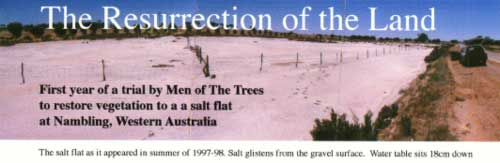
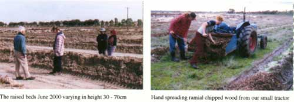
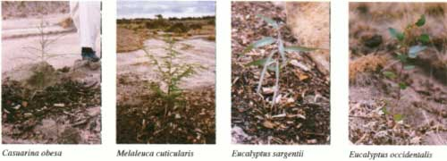
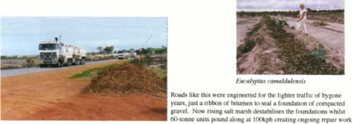

<body bgcolor="#ffffff">
 
<!----- Start of Author-n-Text below ...... ---->

<h2>
The Resurrection of the Land</h2> 
<h3></h3>

Barrie Oldfield  
President, Men of the Trees  
Phone:  
+61 8-92916619  
  
  
/

Men of the Trees  
Western Australian Branch  
PO Box 103  
Guildford, WA 6935  
+61 (08) 9250 1888  
Fax +61 (08) 9250 2735  
www.iinet.net.au/~treeswa/  
E-mail:treeswa@iinet.net.au  
ATCROS Reference: A3009.  
  
  
  


<h3><b>
<a href="Author-n-Subs.htm#1" target="Subs">Barrie Oldfield</a>
 
 
<a href="Author-n-Subs.htm#2" target="Subs">Men of the Trees</a>
</b>
</h3>

<b>Abstract</b>

<i>Dry land salinity is claiming agricultural land in the South West land division of Western Australia at the rate of 100,000 hectares every year.  This is four times the rate of the mid 80s.  However salinity is only one of a number of adverse factors that give problems for managers of WA soils under broad acre farming.  This paper looks at a trial that was begun in June 2000 to test microdrainage and ramial chipped wood, two techniques that might help restore perennial vegetation to a salt flat.  It takes into account a number of restraints, environmental, economic, social, political, that beset landowners facing such a problem.</i>

<h2>Salinisation in Agricultural Western Australia</h2>

Salt arrives in the landscape through precipitation.  It is a fact of the planetary water cycle that water vapour in the upper atmosphere condenses on dust particles or salt spray aerosols from the oceans to form rain drops.  It has done this for millions of year and it happens all over the world.

Western Australia's topography and climate combine to exacerbate conditions likely to give rise to salinisation.  1.  There are no significant mountain ranges and therefore only a few sluggish rivers with obscure drainage paths to the oceans.  2.  The hot arid summers present an evaporation effect five times that of the annual rainfall.  Thus water near the surface is evaporated leaving the salt behind.

The clearing of land for production of annual winter crops has hastened this ancient process and has led to a vast increase in the rate of salinisation.  The problem can be simply stated as a matter of underutilisation of rainfall.  The rising ground water is bringing salt to the surface, causing scalding and necrosis over ever greater areas of land.

<h2>Tackling salinity</h2>

There are a number of tools for dealing with salinity; among them: 
<b>Drainage</b>, often considered the most important, the most dramatic and the most costly.  It includes grade banks, trenching, underground piping, pumping from bores into drainage channels, the 'training' of existing creek lines and the control of salt laden run-off to minimise harm to riparian environments and river life.  Drainage works should be planned from the bottom of the catchment up.

<b>Tree planting,</b> as a means to control ground water movement from upper catchments into hillside seeps and valley floors.  Trees do their best work in intercepting rainfall at ground level.  However, a well planned stand of trees can act as 'sluice gates' to control cross flow in shallow aquifers.  Tree planting works are planned from the top of the catchment down.

<b>Perennial pastures,</b> most likely with a salt tolerance phase.  It has been demonstrated that, provided stock have access to potable water, they can get considerable nourishment from grazing halophytes.

<b>Summer crops</b>, an extension of the concept that to have living roots in the ground all the year round is the best way to minimise recharge.

<b>Surface drainage</b> of fresh or brackish water into high level dams for stock watering or the raising of crustaceans.

<h2>How Salty is 'Saline?'</h2>

Whilst it is fair to say that most ground water in the wheatbelt carries a salt burden it would be quite inaccurate to equate the salinity of underground water courses or perched water tables with the hyper-saline level of a salt lake in late summer.

What must be considered also is the poverty of our agricultural soils <i>vis a vis </i>the soils of Europe where we learnt our agriculture a thousand years ago.  Ours are ancient, non-glacial soils lacking in most plant nutrients and trace elements.  They contain very little organic matter, tend towards acidity, and are highly compacted.  Our farming hinges upon growing winter crops, successive annual rotations of cereals and legumes with perhaps a two-year pasture phase.  Each season's crop is chosen to provide the best possible economic return so far as one can forecast these things.  It is the very fact that the soils are so weak that the wrong choice of plants can lead so quickly to a complete breakdown in their viability.  The rise of salinity, preceded by water logging and slumping, is the final evidence that we got it wrong.

Crop rotations under these extreme conditions must include a perennial phase.  In my view the land must go back under trees, an open woodland, for a considerable period after ten or fifteen years of cropping.  Only trees their litter and their root systems can restore a measure of life to the soil.

Measurements made in Canada show that there is five times more life under a forest floor than under open farmland.  And remember that Canada has the benefit of glacial soils that were formed around 15,000 years ago.  Soil life is absolutely essential to healthy crops and ongoing fertility of the land.  It is also an excellent indicator of soil stability and resilience.

<h2>Why Use Trees at all in Salt Land Reclamation?</h2>

Trees are perennial plants.  Their roots remain alive and receptive in the upper soil profiles the year round.  When the 'break' comes in early winter they quickly swell to absorb available water.  Even if an unseasonal downpour occurs, for instance resulting from a rain bearing depression following a tropical cyclone, the trees are ready to take opportunistic advantage.  (Whenever Men of the Trees carry out a winter planting we pray for that one summer rain that farmers would rather not have.  It does our young seedlings a power of good!)

So trees minimise the percolation of water into the subsoil thereby reducing recharge of aquifers and ground water systems.

But trees are not planted for one reason only.  They provide a large number of benefits to the health of the land, many of which directly affect the salinity of soil and ground water.  Well planned trees generally make a more comfortable landscape within which to live and to farm.

<ol>
<li>  Trees lead to a reduction of albedo.  They act like air conditioners and convert radiant solar energy into something useful.  This process is the counter to entropy in the planetary life systems.</li>

<li>Trees reduce wind speeds close to the ground.  This reduces desiccation of crops, seedlings and soil and prevents wind erosion.  It can also considerably increase crop yields.</li>

<li>  Trees moderate diurnal flux in temperature and humidity.  This fact alone makes the habitat of soil organisms tolerable.</li>

<li>  Trees fix CO2, give us carbon credits and put a check on the global greenhouse.</li>

<li>  Trees protect the soil from pulverising rain.  Rain is in fact the major cause of soil compaction.  It smashes soil aggregates, it reduces the air spaces, if it doesn't actually cause sheet erosion it flattens and compacts the surface layers in much the same way as a builder compacts a sand pad with a water sprinkler.</li>

<li>  Trees build soil.  That is fact; not only through the litter that falls, which is consumed and incorporated into the top centimetres, but also in the immense root hair mat which decomposes just as soon as it has scavenged all the nutrient of its particular space.</li>

<li>  Trees provide habitat and food for a wide range of creatures.  We cannot live alone on this planet and we must recognise the links of the chain, the web of life, which supports our very existence.</li>

<li>Trees ameliorate the micro climate.  See how the farm dog sits down in the merest scrap of shade.  He's no fool.  Sheep, horses, cows, human beings are all more comfortable - and productive, when the climate is just right.</li>

<li>Trees can produce an amazing amount of commodity, not just timber or biomass but fruit, nuts, essential oils, pharmaceuticals and animal fodder to name only five economic and non-sacrificial products.</li>
</ol>

But trees breathe through their roots.  The establishment of trees in land which has a high water table, or is subject to long periods of inundation, presents serious problems.

<h2>The Principle of Micro Drainage </h2>

All would agree that WA lacks a decent mountain range and a good free flowing river system that would take salt-burdened water back to the ocean.  We may as well wish for the Moon! But if the problem in reclaiming salt deserts is simply to lower the water table enough to allow air and roots to penetrate the soil then the alternative might be to create a system of raised beds to achieve much the same result.  In effect 'micro-drainage'.  Such a system can be set up within a few hectares, it does not require extensive surveys, nor trenching equipment.  Nor does it need the approval of various overriding authorities with the consequent costs and delays.

The trial I'm going to describe was set up at Nambling, a district just West of Dowerin in the central wheat belt.  The land had lain flat, forlorn and salt laden for many years.  I first saw this 11 hectares in 1981.  The landowner had planted a single row of trees <i>Eucalyptus spathulata </i>around the outer edge and on the contour in 1974.  It always struck me as a significant and hopeful sign that all these trees continue to flourish.  In 1997 Men of the Trees planted a further 4,000 seedlings in twelve rows around the outer bounds of this site.  These trees flourish and today present a welcome canopy averaging 2 to 3 m high.

Turning our attention to the inner, partly salt-scalded site in June 2000 we drew up a plan combining raised bed and Ramial Chipped Wood technology.  The raised beds were constructed using a standard road-making grader such as every shire council would own.  The grader first puts in a single rip line below the centre line of the surveyed raised bed.  This is absolutely necessary because waterlogged land slumps and the resulting compaction creates an impenetrable barrier to tree roots.

The beds were spaced  6 - 8 metres apart, the soil between the centre lines being graded up to form the beds.  Various heights were formed, the highest bed at about 70cm, others at 50 or 35cm.  Two piezometers installed at the SE corner of the site continue to register a ground water level within 18cm of the surface, winter and summer.

At Nambling we put the beds in on a radial pattern pointing towards the lowest part of the flat.  This would minimise ponding even though the flat has no constructed drainage outlet other than culverts under the road and railway leading to another flat to the South.  Indeed, it was a consideration of the whole operation that we disturb the ground-water flow as little as possible due to the presence of a living wetlands system within the lower catchment.

A further advantage of the raised beds is the fact that the scraped up soil is thereby aerated providing a better environment for the development of aerobic soil organisms.  (Anyone who has worked over salt flat lands is aware of the pervading smell of hydrogen sulphide, the telltale gas associated with anaerobic conditions.)  The aeration also improves drainage and allows winter rains to flush out the salt.

Where the land showed sign of bearing some vegetation, mostly Salt Bush, Puccinella and Samphire, we put in mounded rip lines using a farm tractor.  It was also interesting to note that these patches of existing vegetation had themselves trapped blowing soil in the dust storms that are a frequent occurrence; an example of Nature creating her own raised beds!

Land which has lain flat, barren and impregnated with salty water for many years is decidedly short of beneficial soil organisms.  Attention to restoring the living component of such soils is imperative if a successful revegetation is to be achieved.

<h2>The Role of Ramial Chipped Wood</h2>

At Nambling we spread Ramial Chipped Wood (RCW) to a depth of 4cm over the surface of the raised beds on the east end of the site.  The west end was left without RCW as control, (and also due to other logistic factors in year one).  It was obvious from spring 2000, three months after the seedlings had been planted, that they were not going to survive in the unmulched soil.  However the plants were looking reasonable in the mulched area and by late summer, February 2001, these seedlings had put on significant growth.  Moreover their form and leaf colour indicated that they were sufficiently well-nourished to ride out the stress of summer and make it through to the coming rains.

Now I have explained the principle of 'micro-drainage', a key element in this trial.  Let me now describe the object of Ramial Chipped Wood technology.  I am indebted to Professor Gilles Lemieux of Laval University, Quebec, Canada, for the extent of his research and documentation and his readiness to correspond and comment on our work.

Briefly, when a deciduous tree is about to shed its leaves, it withdraws from the leaf all nutrient and carbohydrate and stores this in its outermost stems in readiness for the spring bud burst.  His work has demonstrated that if you prune the smaller branches, those of diameter under 7cm, after leaf fall, and put this ramial material through a chipper, you will have an ideal mulch to encourage the growth of mycorrhizæ. 

Though Western Australia does not have deciduous trees to exactly replicate this technology Lemieux was able to assure us that eucalypt mulch containing leaf material was in fact better for us otherwise we could run into a zinc deficiency.

Now mycorrhizal association is absolutely essential for the health of woodlands in Western Australia.  It has been shown that mycorrhizal hyphæ extend the soil nutrient scavenging capacity of the tree by up to four times that of its roots alone. 

The mycorrhizae belong to the family of fungi known as <i>Basidiomycetes.</i> I will use the more general term, 'Mushrooms'.  They can be likened to plants without chlorophyll.  In return for the soil nutrients they pass to the trees they 'take a wage' in carbohydrate from the tree roots.

To encourage the proliferation of <i>Basidiomycetes</i> the mulch of RCW is applied rather more thinly than is often done in Perth gardens (where the principal reason for mulching is to conserve water and to smother weeds.)  Lemieux recommends a layer no more than 4cm thick and this should be only very lightly raked to form intimate contact with the soil.  It must not be cultivated.  Under these conditions it can be seen that we have set up a soil improvement system in which the diurnal flux can be felt at soil surface level.  This boundary is most important in the pedogenesis which is to follow, for it is where light and dark, warmth and chill, moisture and air, organic debris and soil minerals have their meeting place and are potentially most ready to support a population explosion within the community of soil micro-organisms and meso fauna.  It is also the most critical zone of the rhizosphere and the place most eagerly to be explored by the feeder roots of young seedlings.

These photographs of our seedlings demonstrate that young as they are the plants are getting all they need from the site.  Their form and their leaf colour demonstrate no lack of nutrients.  Their growth is indicative of an adequate reserve of soil moisture in which the level of salinity is tolerated.

The seedlings shown here are all known salt tolerant trees native to semi-arid regions of Western Australia:  <i>Eucalyptus sargentii, E. spathulata, E. occidentalis, E. camaldulensis, Melaleuca cuticularis, Casuarina obesa.</i>  Some salt tolerant poplars were also planted, 'Euphratica' and 'Maagreb', but these showed early signs of failure.

<h2>Plans for the Coming Season</h2>

We are giving this trial three years during which time we will gladly share experiences with other workers and researchers.

For the winter of 2001 it is intended to spread ramial wood chips to the remainder of the raised beds and mounded rip lines.  In addition soil from under scrubland nearby will be sprinkled through the mulch to help spread beneficial soil fungi.

Further salt tolerant seedlings have been raised, principally <i>E. spathulata</i> and <i>M. cuticularis</i> and will be planted out together with Salt Bush <i>Atriplex numularia </i>and Date palms <i>Phoenix dactylifera.</i>

This latter species will be of interest to visitors to ACOTANC although its viability has yet to be proven under these testing conditions.
<h2>Conclusion</h2>

The trial at Nambling will be continued through to 2003 with periodic reports on progress and observations.  Whilst it presents its own unique set of circumstances it offers a window of hope in a wilderness of despair.  Men of the Trees encourage other groups and volunteer organisations to seize any opportunity they can to help towards the understanding and improvement of our wheatbelt landscape.  It is the one part of the planet we can call our own, and the land upon which our time as its stewards will be judged.

<h2>Acknowledgements</h2>

I am deeply grateful to the following people for their personal encouragement and for providing information:
<b>Lyn Abbott</b>, Soil Science, UWA.  <b>Ed Barrett-Lennard</b>, Agriculture W A.  <b>David Bellamy</b>, Botanist and educator.  <b>Dowerin Shire Counci,</b><b>Chris Ferreira,</b> Men of the Trees. <b>John Fox,</b> Curtin University <b>Bob Gilkes,</b> Soil Science, UWA.  <b>Lawrence Hills,</b> Henry Doubleday Research Association. <b>Mike Irvine,</b> Farmer.  <b>David Jasper,</b> Soil Science UWA.  <b>Ted Lefroy,</b> CSIRO.  <b>Gilles Lemieux,</b> Faculté de Foresterie et de Géomatique, Université Laval.  <b>Dean Melvin,</b> Farmer. <b>John Raff,</b> ACOTANC 1984. <b> Yvonne Swindell,</b> Organic Growers Association.  <b>Inez Tommerup,</b> CSIRO

Other sources of information include:  Department of Agriculture Annual Reports, and
'Salinity, a Situation Statement for Western Australia.

<h2>GLOSSARY - to the paper <i>The Resurrection of the Land</i></h2>

<b>Aggregates:</b> particles linked to one another by a biological cement, the basis of soil structure. It also provides basic food for the microbiological life of soil.

<b>Albedo:</b> the fraction of incident light or energy reflected from a surface.  That component of solar radiation reflected back to space due to lack of vegetative cover

<b>Basidiomycetes:</b>a family of fungi known as mushrooms mostly growing in forests.  They are mainly responsible for depolymerizing lignin without breaking benzene rings 

<b>Benzene (rings):</b> a basic organic molecule highly energetic related to benzene C6H6. The term aromatic is also commonly used to describe organic compounds built from them.

<b>Biodiversity:</b> concept where life forms are numerous, diverse and living in harmony. 

<b>Biota</b> the totality of plant and animal life found within a zone.

<b>Chelation: </b>natural or artificial phenomenon in which a molecule becomes static (inert), being locked in a complex inhibiting system.

<b>Climax:</b>term relating to self-perpetuating plant societies in equilibria with all environmental factors.

<b>Clay-humus:</b> complex of both clay and humus, the building blocks of soil aggregates, the very basis for soil fertility.

<b>Compost:</b> organic matter of various origins transformed mainly by bacterial breakdown with heat production, making nutrients available for plant growth.

<b>Cryptogamic lichen: </b> a complex algal/fungal life form that covers and binds the surface soil of arid regions where plant cover is sparse.

<b>Deciduous: </b>usually applied to those phanerogam dicotyledon trees that shed their entire foliage at about the same time annually. 

<b>Degradation: </b>the loss of integrity, both of the material and energy components, of soil constituencies.

<b>Depolymerization: </b>where organic molecules break down into their basic elements.

<b>Desertification: </b>natural or man made interventions in plant ecosystems leading to a reduction in the biota, often related to unavailability of suitable water.

<b>Diurnal flux: </b> the change in temperature and humidity between day and night.

<b>Ecosystem: </b>biological system allowing all its life forms to live more or less in harmony within cycles or in full continuity.

<b>Entropy:</b>the tendancy of a system to run down over time.  Within our context entropy is largely counteracted by the incoming solar energy and the ability of plants to use this in endothermic reactions.

<b>Enzyme:</b> complex structure protein molecule which promotes difficult biological reactions, otherwise impossible.

<b>Fertilisers: </b>chemical or organic nutrients applied to increase soil fertility and consequently crop yields.

<b>Flora:</b> plants characteristic of a region or a topographic feature of a region or a country. Example: the Jarrah forest, the Tamma scrub, etc.

<b>Halophytes: </b> plants that can tolerate high levels of salts.

<b>Humification:</b> natural processes where organic debris is changed into humus.

<b>Laterite:</b>red coloured soil of warmer latitudes where iron, aluminium and silicon are not linked to one another and where biological agents play an important role in maintaining its integrity.

<b>Microbial biomass: </b>the whole mass of microscopic living organisms in the soil.

<b>Micro-drainage:</b>  a lowering of water table principally through the raising of the soil horizon sufficient for the establishment of perennial vegetation in a locality.

<b>Mineralisation:</b> natural soil degrading process making available the nutrients found in organic debris and transformed by microorganisms.

<b>Monomers:</b> simple organic molecules which can form other complex ones through polymerization processes, where new links may contribute to form additional groups of the same nature.

<b>Morphology (soil):</b> the form and colour of soil due to its structure and texture giving specific physical and biological properties.

<b>Mycorrhiza: </b>symbiotic fungus that invades plant roots from which it obtains sugars and which scavenges the litter layer for nutrients that are used by the plant.

<b>Nematodes:</b> small worms, mostly microscopic, belonging to the class <i>Nematoidea </i>living as parasites on plants and animals.

<b>Nutrients:</b> elements, in ionised form, used by the plants.

<b>Organic (matter)</b> a most ambiguous term in reference to organic debris in soil but not to humus or humification processes.

<b>Pedogenesis:</b> the formation of soil.  Natural processes by which soil is built up and maintains itself through dynamic phenomena.  It implies nutrient flow regulation for plant growth as well as epigeous and hypogeous equilibrium in ecosystems.

<b>Physical-chemistry:</b> science relevant to both chemistry and physical sciences with specific properties and consequences. Example: pH measures the balance of hydrogen ions in a solution.

<b>Piezometer:</b>  instrument for measuring hydrological pressure at a locality in the landscape.  A porous tube surrounded by blue metal is placed in a bore hole.  Static water level can be determined by float and rod, dip stick or fox whistle.

<b>Polyphenols:</b> phenolic compounds derived from benzene rings.

<b>RCW:</b> Ramial Chipped Wood.  Branches of less than 7 cm in diameter with a high nutrient content.  They have little polymerised young lignin linked to highly complex biochemical systems and in a transitory status toward stem wood.

<b>Regeneration:</b> natural processes in which a forest can regenerate through seeding.

<b>Remineralisation: </b>the application of hard rock quarry fines to replenish severely leached, non-glacial soils.

<b>Rhizosphere:</b>the root zone of the soil of the planet.

<b>Riparian:</b> concerning the topography and vegetation of water courses in flood and dry states.

(END)

</body>
