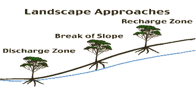

<body>

<h2>
Can Tree Crops Solve Salinity Problems?
</h2>

  
<h3></h3>

Peter J. Taylor  
E-mail:  
  
  
/

AgWest  
organization address  
E-mail:  
ATCROS Reference: 11111.  
  
1. Clarke, Chris et al.  
  
  
  


<b>Abstract</b> 
Computer modeling of catchments can guide farmers to the best options for improving the salinity situation on their land.

(image, Water balance changes) 
Salinity is generally accepted to be a change in water balance.  In the actual environment, (a in the image), in areas before the vegetation is cleared, rainfall is approximately equal to evaporation and transpiration, so there is no drainage down below the root zone, and the watertable stays reasonably deep and static.  After clearance for agriculture, the deep-rooted vegetation is replaced by shallow-rooted annual crops and pastures.  The transpiration and evaporation components are much less than the rainfall, so there is an excess of water that passes through the root zone, the drainage component to the watertable, which then rises, bringing accumulated salts with it to the surface.  This causes the all-too-familiar scenes where the watertable is visible at the surface and most of the low-lying vegetation has died.

(map of high-risk salinity areas in Australia) 
The extent of risk of salinisation in Australia has been mapped by the Land and Water Resources Research and Development Corporation.  As you can see, the risk is in every state, bar the Northern Territory, and there is a huge slab of it in WA, which is most of the wheat and wool belts.  WA has a bit of a monopoly on salinity.

(image, Agricultural Areas of WA) 
Focusing particularly on WA in the South West Agricultural Zone: this runs between Geraldton in the north over to Esperance in the east.  The total area is about 26 million hectares and roughly 75% of this has been cleared for agriculture.

(map, Groundwater Trend) 
This shows the trend in groundwater in the South West Agricultural Zone.  The areas in orange are where the groundwater table has been shown to be rising by at least 3 cm per year.  The blue areas are where there has been no trend measured, which either means they are under forest or they have already reached equilibrium: the watertable has reached the surface and is not moving any more.  This was a report done for the National Land and Water Resource Audit last year.

In 2000 the Audit estimated:
16% (4.3M ha) of the SW region is subject to shallow watertables and potential salinity.  The prognosis for: 2020  is that 20% or 5.2M ha of the SW region will be subject to shallow watertables and potential salinity, and in 2050  the figure will be 33% or 8.8M ha of the SW region.

(drawing of trees on slope) 
So if we are going to put trees in the landscape to try to control these watertables, there are a number of approaches we can use.  We can look first at the higher areas which are not at risk of salinity at all, the recharge zone.  Here the trees have no access to the watertable, they are much higher than the watertable itself.  Alternatively, we can look at the low-lying areas, the discharge zone.  There is no shortage of water: it is quite often right at the surface.  The third approach is to look at the area in between, just up from around the break of slope, where the trees do have access to the watertable though they are not actually in it.

Firstly we will look at the recharge zones.  There are a few points to consider here.  Probably the best form of recharge control is by deep-rooted woody perennials, in other words, trees.  The major benefit is their high impact on watertables, and because they are treating the cause, they are using a lot more water <i>in situ</i> and preventing the problems from occurring further downstream.  Disadvantages: because they are in the higher areas, they don't have access to the watertable in summer, and in a particularly low-rainfall year you can have drought deaths, especially in younger plantations.  At the farming scale, there is also difficulty with long rotations and cash flows.  For woodchips, we are talking about a 7-year rotation.  That can cause cause problems on the farm, and that is assuming that there are markets for the products at the end of that time, as well.

<table><tr><th>Recharge Zone</th><th>Benefits</th><th>Disadvantages</th></tr>
<tr><td width="33%">Deep-Rooted Woody Perennials</td><td width="33%">High Impact</td><td width="33%">Summer Droughts</td></tr>
<tr><td> (Trees)</td><td>Treating the Cause</td><td>Long Rotations</td></tr>
<tr><td> </td><td> </td><td>Cash Flows</td></tr>
</table>

(graph, Typical Western Wheatbelt Catchment) 
What I would like to do now, is highlight some of differences in the impact of putting trees into recharge zones as we move from a high rainfall zone to a low rainfall zone.  This particular work was a <a href="Author-n-Subs.htm#3" target="Subs">report</a> by Chris Clarke and others to the State Salinity Council, presented last year.  They used a model called Flowtube.  The Flowtube model simulates watertables along a complete catchment in a thin strip.  It considers a thin flowline from the top of the catchment right down to the bottom, and simulates the changes in the water level, in this case, over 100 years.  This particular catchment is typical of the western wheatbelt with rainfall of 600 mm.  The catchment length is 6 km from end to end, and about 100 m in relief from top to bottom, so it is reasonably well-incised.

After 100 years of simulation, you can see the watertable is still rising.  If we leave things as they are in the base case, crops and pastures, 72% of the flow tube will develop a shallow watertable.  If you now look at the effect of a particular treatment, in this case, commercial farming of eucalyptus in blocks, over 30% of the upper slopes plus a phase farming system over the remaining 70% (5 years lucerne, 5 years cropping and pasture).  It is quite promising that the watertable actually falls, and no more of the catchment becomes wet. The wet length reduces to 57% of the base case.  If the simulation is extended to 300 years, there is an additional gain of 16% (41% of the base case).

We now move to the Eastern Wheatbelt Catchment, 330 mm rainfall.  You can see a similar response in the watertable with no changes in management; the watertable rises up to the surface quite significantly.  In this case we look at a treatment where all  of the sandplain soils (typically 10% of the catchment) is planted to tagasaste, a forage shrub.  The rest of the catchment is planted with double rows of oil mallees (2 x 1.5 m), 50 m apart with traditional annuals in between.  The response here is not as great.  As you can see, the watertable is still rising.  The Flowtube model of the base case, simulated over 100 years shows that 89% of the catchment will develop a shallow watertable with the current management.  With the treatment, this reduces to 58%.  It is a lot less than if we do nothing, but in this case, if we extend the simulation to 300 years, all the gains of the treatment are lost, as the watertable continues to rise.  The point where equilibrium is reached is some 25-60 years down the track.  This can buy time in which to come up with alternative options.

Planting in the discharge zone. 
Salt tolerant trees and shrubs must be used, such as <i>Acacia saligna</i> and saltbush.  On the benefit side, there are some watertable controls, to a minor degree.  There is fodder production for stock, and there is aesthetic benefit from masking the saline scalds.  Unfortunately, there are more disadvantages.  Establishment can be difficult, particularly in waterlogged, saline conditions.  And because it is not treating the cause of the problem, it is quite possible the plantings may still fail because of rising watertables until a new equilibrium of the water balance is reached.

<table><tr><th>Discharge Zone</th><th>Benefits</th><th>Disadvantages</th></tr>
<tr><td width="33%">Salt Tolerant Trees and</td><td width="33%">Some Watertable Control</td><td width="33%">Establishment</td></tr>
<tr><td>Shrubs, e.g.<i>A. saligna,</i> Saltbush</td><td>Fodder Production</td><td>Not Treating Cause</td></tr>
<tr><td> </td><td>Aesthetics</td><td>May Still Fail When Equilibrium Not Reached</td></tr>
</table>

Break of slope.   In this case, we are talking about interception belts of high-water-use trees, generally salt-tolerant trees.  The benefits are quite extensive, in that it minimises the amount of land taken out of production for farming.  Because they are high-water-use trees, they have high impact in a small area.  They use more than the rainfall available, by using groundwater.  They can do this up to six months of the year.

<table><tr><th>Break of Slope</th><th>Benefits</th><th>Disadvantages</th></tr>
<tr><td width="33%">Interception Belts of High-Water-Use Trees</td><td width="33%">Minimum Land Taken out of Production</td><td width="33%">Inconvenience of Strategic Placement</td></tr>
<tr><td> </td><td>High Impact <ul><li>Can use more than Rainfall</li><li>Can Directly Use Groundwater</li></ul></td><td>Strict Requirements:<ul><li>Steep Hydraulic Gradient</li><li>Duplex Soil</li><li>Accessible Watertable But Not Waterlogged</li></ul></td></tr>
</table>

On the negative side, because they are a strategic planting, there is the inconvenience to farming practices, in that they have to be put into specific places.  There are very strict requirements for them to work at their peak.  They need a steep hydraulic gradient; the water needs to be able to flow laterally below the plantation.  This requires a duplex soil, a texture-change soil of sand over clay, which is fairly common in saline areas, fortunately.  They have to have access to a watertable but not be waterlogged in it.

(Interception belts of trees, image) 
This complex-looking picture is from some work I did in South Australia.  A belt of <i>Eucalyptus camaldulensis,</i> River Red Gums, the site here is on a duplex soil, about 70 cm of sand over clay with a saline watertable about 1.5 to 2 m down.  400 mm of rain fell during the year, but the trees themselves used 1000 mm, two and one-half times the amount that fell.  For six months of the year, saline groundwater mixed with any lateral flow of water.  Under the trees themselves, the amount of salt that was accumulated in the root zone on the upslope side was much less than was predicted by the transpiration and salt flow, whereas, on the downslope side, the salt accumulation was much higher than we expected.  Which suggested that lateral flow of water was taking salt from under the plantation and depositing it further downslope.  This means that the trees could continue to use the saline water from beneath the plantation.  Also during that time, there was evidence that the watertable was dropping.  In this case, the interception belt of trees was quite efficient.

This brings me back to my original question: So, can tree crops solve salinity problems?  The answer, of course, is yes, if they are planted extensively and in the right places.  So we need to plant lots of the catchment, and we need to do it in the right place.  But there is a proviso to that, of course.  They will only be planted by farmers or by industry if they are economically viable.  At this stage the (?) Valley is looking particularly viable, according to the Minister.

The trees also must have access to extra water (above rainfall) for them to be efficient.  And they will only use this extra water if it is of a suitable quality and there is some way of stopping the salt accumulating under the plantation.

</body>
