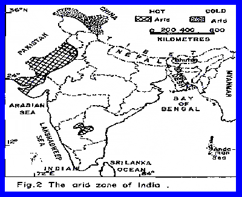
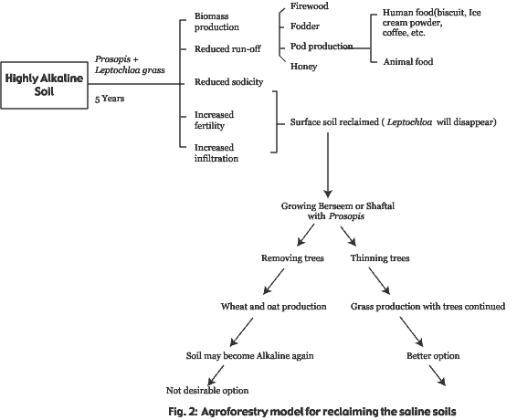
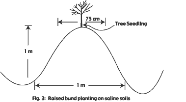

<body bgcolor="#ffffff">
 
<!----- Start of Author-n-Text below ...... ---->

<h2>
Plantation Forestry and Success of Various Tree Species in Arid Tropics: Indian Experience
</h2>

  

<h3></h3>

J. C. Tewari  
Central Arid Zone Research Institute, Jodhpur  
E-mail:jctewari@cazri.raj.nic.in  
  
  
  
Central Arid Zone Research Institute, Jodhpur  
E-mail:jctewari@cazri.raj.nic.in  
  
ATCROS Reference: ?.  
  
Anonymous 1987. *Rajasthan Forests at a Glance.* State
Forest Department, Jaipur, 28 p.  
  
Anonymous 1994. *Rajasthan Forests at a Glance.* State
Forest Department, Jaipur, 36 p.  
  
Anonymous 1997. *Vision 2020 : CAZRI: Perspective Plan.*
CAZRI (ICAR), Jodhpur, India, 62 p.  
  
Baumer MC and Ben Salem B 1995. Role of forestry in control
of desertification. In: *Sand Dune Stabiliztion, Shelterbelts and
Afforestation in Dry Zones.* FAO Conservation Guide 10, FAO, Rome, pp.
9-15.  
  
Bhandari MM 1978. *Flora of Indian Desert.* Scientific
Publishers, Jodhpur, India, 471 p.  
  
Bhimaya CP, Kaul RN, Ganguli BN, Tyagi IS, Choudari MD and
Subbayyan R 1964. Species suitable for afforestation of different
habitats of Rajasthan. *Annals of Arid Zone.*2 (2): 162-168.  
  
Champion HG and Seth SK 1968. *A Revised Survey of Forest
Types of India.* Manager of Publications, Govt. of India, New Delhi, 404
p.  
  
Dhir RP 1984. Soils of arid regions, their characteristics
and properties. In: *Agroforestry for Arid and Semi-Arid Zones* (ed.)
K.A. Shankarnarayan, CAZRI, Jodhpur, pp. 20-29.  
  
Eren T 1985. Agroforestry in arid and semi-arid zones. In:
*Sand Dune Stabilization, Shelterbelts and Afforestation in Dry Zones.*
FAO Conservation Guide 10, FAO, Rome, pp. 169. 174.  
  
Faroda AS 1997. Silvi-pastoral approach for arid and
semi-arid areas : Issues and strategies. In: *Silvi-pastoral System in
Arid and Semi-Arid Ecosystems* (eds) M.S.Yadav, M. Singh, S.K.Sharma,
J.C.Tewari and U. Burman, (UNESCO : ICAR), CAZRI, Jodhpur, pp.
1-10.  
  
Harsh LN and Tewari JC 1993. Sand dune stabilization,
shelterbelts and silvi-pastoral plantation in dry zones. In:
*Desertification in Thar, Sahara and Sahel Regions* (eds.) A.K.Sen and
Amal Kar, Scientific Publishers, Jodhpur, pp. 269-279.  
  
Hocking Drake 1993. *Trees for Drylands.* Oxford and IBH
Publishing Co., Pvt., Ltd., New Delhi - Bombay-Calcutta, 370 p.  
  
Kalla JC 1977. Economic evaluation of arid land management
technology. In: *Desert Ecosystem and Its Improvement* (ed.) H.S.Mann,
CAZRI, Jodhpur, India, pp. 285-295.  
  
Kaul RN and Ganguli BN 1964. Afforestation studies in the
arid zone of India. In: *Proceedings of Symposium on Problems of Indian
Arid Zone.* Ministry of Education, Govt. of India, New Delhi, pp.
183-187.  
  
Kaushik RC, Kaul RN and Subrahmanyam VP 1969. Homoclimes
and introduction of trees and shrub species with special reference to
the arid and semi-arid zones of India. *Indian Forester* 95
(5):284-292.  
  
Kumar Suresh 1998. Vegetation resources in the Indian arid
zone. In: *Fifty Years of Arid Zone Research in India* (eds) A.S.Faroda
and Manjit Singh, Central Arid Zone Research Institute, Jodhpur, India,
pp. 89-119.  
  
Mann HS and Muthana KD 1984. *Arid Zone Forestry.* CAZRI
Monograph No. 23, CAZRI, Jodhpur, 48 p.  
  
Rode KP 1964. Geomorphology and evolution of Rajasthan
desert. *Proceedings of the Symposium on Problems of Indian Arid Zone.*
Ministry of Education, Govt. of India, New Delhi, pp. 69-75.  
  
Satyanarayan Y 1964. Habitats and plant communities of the
Indian desert. In: *Proceedings of the Symposium on Problem of Indian
Arid Zone.* Govt. of India, Ministry of Education, New Delhi, pp.
59-67.  
  
Saxena SK 1997. Traditional agroforestry systems of
western Rajasthan. In: *Agroforestry for Sustained Production in Arid
Regions*(eds) J.P.Gupta abd B.M.Sharma, Scientific Publishers, India,
pp. 21-30.  
  
Sharma AK and Tewari JC 2001. Arid zone forestry with
special reference to Indian hot arid zone. In: *Encyclopaedia of Life
Support System* (ELOSS), UNESCO, Paris (in press).  
  
Singh G, Singh NT and Abrol IP 1994. Agroforestry
techniques for rehabilitation of salt-affected soils in India. *Land
Degradation and Rehabilitation* 5 : 223-242.  
  
Singh G 1996. The role of *Prosopis* in reclaiming high pH
soils and in meeting firewood and forage needs of small farmers. In:
*Prosopis : Semiarid Fuelwood and Forage Tree : Building Consensus for
the Disenfranchised.*(eds). P. Felker and J. Moss, Centre for Semi-arid
Forest Resources, Texas A &amp; M University, Kingsville, Texas, pp 1/3 -
1/27.  
  
Singh G 1998. Practice for raising *Prosopis* plantations
in saline soils. In: *Prosopis species in the Arid and Semi-Arid Zones
of India* (eds.)  
  
Singh S 1997. *Geomorphological Investigations of
Rajasthan Desert,* CAZRI Monograph No. 7, CAZRI, Jodhpur 44 p.  
  
Tewari JC 1997. Important fodder trees of arid zone and
their management. In: *Agroforestry for Sustained productivity in Arid
Regions* (eds) J.P.Gupta and B.M.Sharma, Scientific Publishers, Jodhpur,
India, pp. 147-153.  
  
Tewari JC, Bohra MD and Harsh LN 1999. Structure and
production function of traditional extensive agroforestry systems and
scope of agoroforestry in Thar desert. *Indian Journal of Agroforestry*1
(1): 81-94.  
  
Tewari JC and Harsh LN 1998. Forestry research in arid
tract of India. In: *Fifty Years of Arid Zone Research in India* (eds)
A.S.Faroda and Manjit Singh, Central Arid Zone Research Institute,
Jodhpur, India, pp. 307-322.  
  
Tewari JC, Harsh LN and Venkateshwarlu J. 1989.
Agroforestry research in arid regions - A review. In: *Agroforestry
Systems in India : Research and Development* (eds.) R.P. Singh, I.P.S
Ahlawat and Ganga Saran, Indian Society of Agroforestry, IARI, New
Delhi, pp. 3-17.  
  
Tewari JC, Harsh LN and Venkateshwarlu J.1993. Some
aspects of plantation forestry research in western Rajasthan. In:
*Afforestation of Arid Lands* (eds.) A.P.Dwivedi and G.N.Gupta,
Scientific Publishers, Jodhpur, India, pp.62-72.  
  
Tewari JC, Harris PJC, Harsh LN, Cadoret K and Pasiecznik
NM 2000. *Managing *Prosopis juliflora* (Vilayati babul) - A Technical
Manual.* CAZRI, Jodhpur, India and Coventry, U.K. 96 p.  
  
UNEP 1992. *World Atlas of Desertification.* UNEP, Edward
Arnold (A Division of Hodder &amp; Stoughton), London - New York - Melbourne
- Auckland, 69 p.  
  
Yadav JSP and Singh GB (ed) 2000. *Natural Resource
Management for Agricultural Production in India.* Secretary General,
International Conference on Managing Natural Resources for Sustainable
Agricultural Production in 21st Century, Indian Society of Soil Science,
New Delhi, 1022 p.  
  


<b>Abstract</b> 

Arid environments are extremely diverse in terms of land forms, fauna, flora, water balance and human activities. The binding element of all arid environments is aridity. Of the total land area of the world, arid zones account for 18.8 percent. The hot arid regions of India are spread over seven states viz., Rajasthan, Gujrat, Punjab and Haryana, Andhra Pradesh, Karnataka and Maharastra covering an area of 31.70 million ha. The arid areas of Rajasthan, Gujrat, Punjab and Haryana together constitute the great Indian desert, better known as <i>Thar</i>, which accounts for 89.6 percent of total arid regions of the country. Slightly more than 10 per cent of arid regions are located in Andhra Pradesh, Karnataka and Gujrat, which is referred as peninsular  hot arid regions in the text of the present paper. In general, climatic and edaphic conditions of arid regions of India are very inhospitable, however, this is the most populated arid tract of the world with density of human population as high as 101 persons / km2 against the world average for arid zones, 6-8 persons / km2.

	Farmers in Indian hot arid regions have grown arable crops in association with tree species for a very long time. In fact, such integration of arable crops with trees in farming systems are a unique form of combined protective-productive systems which work on principles of ecology, productivity, economics and sustainability. These systems are now generally referred to as "agroforestry." In hot arid regions the Indian concept of forestry is all together different from commercial forestry practised in other parts of the world. In fact, it is basically concerned with the management of trees for conservation and limited production objectives like wood for fuel, poles and fencing material, leaves for livestock fodder and pod/seeds  for the use in human diet. 

	Different strategies are required for tree plantation in arid land forms. With long term evaluation trial, CAZRI has successfully screened a number of tree species for plantation on different land forms in arid regions of the country. Besides native tree species, a number of promising tree species have been identified from the iso-climatic regions of the world and also from other drylands for plantation forestry on sand dunes, sandy plains, shallow soils areas, rocky gravelly terrain and salt affected soils. The present paper describes the plantation techniques of tree species on different arid land forms and the success of various tree species, both native and introduced ones.

<h2>
Introduction</h2>

According to conservative estimates, arid zones and their advances affect around 600 million people directly <a href="Author-n-Subs.htm#30" target="Subs">(Tewari and Harsh 1998).</a> Desertification or land degradation processes represent a struggle in which man and land are engaged. At the world scale GLASSOD data base indicates that 349.6 million ha of land in arid zones are affected by light to moderate degree of soil degradation and 42.9 million ha by strong to extreme. It must be admitted that man himself or the increase of his population and of his livestock contributes to the expansion of desertification or land degradation processes. And yet, he suffers the worst consequence of such processes, by having to be satisfied with leftover land. Of the total land area of the world, arid zones cover 18.8 per cent. Arid zones are located on almost all the continents of the world. Of the total area of arid zones of the world, Africa accounts for 46.1 per cent followed by Asia (35.5 %) (UNEP 1992). The majority of the rest of the 19.4 per cent of arid zones are spread over  Australia, North America (Mexico and southern part of USA) and South America. Europe has a very small area under arid zones (< 0.5 per cent of total arid zones of world).

In the arid zones of USA, Arabian peninsula, some central Asian and middle - east countries, Australia and other petroleum rich countries, domestic energy needs are met through petroleum products and natural gas.   Contrary to this in arid regions of India, woody vegetation resources forms the chief sources of fuel, contributing to the requirement of small timber and fencing material <a href="Author-n-Subs.htm#31" target="Subs">(Tewari et. al; 1998).</a> <a href="Author-n-Subs.htm#6" target="Subs">Baumer and Ben Salem (1995)</a> while discussing the role of forestry in controlling desertification in arid zones emphasised that forest trees and perennial vegetation have a definite and positive role to play in such development. Though the overall situation of tree cover in arid regions of India is very gloomy, it is heartening to note that tree cover in this part, according to 1993-94 survey registered an increase of 16 per cent over the cover estimated in 1984-85 <a href="Author-n-Subs.htm#3" target="Subs">(Anonymous 1987, </a><a href="Author-n-Subs.htm#4" target="Subs">1994).</a>The present paper summarises the plantation forestry efforts being carried out in different landforms of Indian arid tropics and success of various native and introduced tree species.

<h2>2. About Indian Arid Tropics</h2>
<h2>2.1 Location and Distribution</h2>

The arid tropics or hot arid regions of India lie between 24o - 29o N latitude and 70o - 76o E longitude covering an area 31.70 million ha involving seven states viz., Rajasthan, Gujrat, Punjab, Haryana, Andhra Pradesh, Karnataka, and Maharastra (Fig. 1).

Area-wise break up of hot arid regions in said state is given in Table.1. The arid region of Rajasthan, Gujrat, Punjab and Haryana together constitute the great Indian desert, better known as <i>Thar</i>. Thus <i>Thar</i> accounts for 89.6 % of total arid regions of India and forms the principal hot arid zone of the country <a href="Author-n-Subs.htm#29" target="Subs">(Tewari et. al., 1999).</a> The arid areas of Andhra Pradesh, Karnataka, Maharastra located in peninsular India and have relatively better rainfall regime and experience less severe extremes of temperatures as compared to <i>Thar</i>, which in general has typical arid to hyper arid environment.

<h3>Table 1.</h3><b>Distribution of arid regions in different states of India.</b>
<table border="1">
<tr><td>
State (s)</td> <td>Area (Million hectares)</td> <td>Percent of Total</td></tr>
<tr>
<td>Rajasthan</td> <td>19.61</td> <td>61.00</td></tr>
<tr>
<td>Gujrat</td> <td>06.22</td> <td>19.60</td></tr>
<tr>
<td>Punjab &amp; Haryana</td> <td>02.73</td> <td>09.00</td></tr>
<tr>
<td>Andhra Pradesh</td> <td>02.15</td> <td>07.00</td></tr>
<tr>
<td>Karnataka</td> <td>00.86</td> <td>03.00</td></tr>
<tr>
<td>Maharastra</td> <td>00.13</td> <td>00.40</td></tr>
<tr>
<td> </td><td>Total	31.70</td> <td>(11.8 % of India)</td></tr>
</table>

<h2>
2.2. Physiography</h2>

<i>Thar</i> is spread over twelve districts of western Rajasthan, Kutchh and Saurashtra region of Gujrat, and south western parts of Harayana and Punjab states. Major part of it occurs between Aravalli ranges on the east and south-east and <i>Thal</i> desert of Pakistan (<i>Thar</i> desert is simply the western extension of <i>Thal</i>, only the name has been changed) which is spread up to Sulaiman Kirthar ranges in extreme west <a href="Author-n-Subs.htm#20" target="Subs">(Rode 1964). </a><i>Thar</i> extends for 640 km from north-west to south-east with an average width of 300 Km from east to west. This desert in the east of Jaisalmer, forms a lowly elevated plateau, 150-325 m above mean sea level with numerous rock masses jutting out of the desert sand. Kutchh region in Gujrat is surrounded in the north, east and south by an extensive almost level marshy land separating this huge landmass from the main land of the sub-continent and popularly known as ÔRann of KutchhÕ. The arid areas of peninsular India are mostly sandy plains and small rocky-gravelly hilly terrain is found in a few pockets. In general, five major landforms viz., (1) sand dunes and sheet deposit, (2) comparatively dune-free area, commonly known as sandy plains, (3) shallow soil areas, (4) rocky-gravelly terrain, and (5) saline soils and brackish water areas. 

<h2>
2.3. Climate and Soils</h2>

 
The entire area stretching from <i>Sahara </i>to <i>Thar</i> appears to be a meteorologically homogenous one and this evidence supports the view that <i>Thar</i> is not an isolated desert. The production and life support in this part of the hot Indian arid zone are constrained by climatic limitations such as low annual precipitation (100-300 mm / year); very high temperature during summer season (mean maximum temperature = 41o C) touching a maximum of 48oC to 50o C and short (December to mid- February) cool and dry winters (the mean winter season temperature varies from 10o to 14o C); high wind speed (30-40 Km/ hour); high evapo-transpiration; and general low humidity regime (aridity index 0.045 - 0.19). The arid areas of peninsular India, which accounts for about 10% of the total hot Indian arid zone receive total annual rainfall between 300 and 350 mm, with a mean maximum summer temperature not more than 38oC. Winters are mild with average temperature ranging between 15o and 19oC and minimum temperatures never go below 6-8o C. Contrary to this in <i>Thar</i>, frosts are common in winter season in hyper arid areas lying in extreme western fringes (4 to 7 days in a season) and often in other parts (1 to 3 days in a season). More over, arid areas of Andhra Pradesh, Karnataka and Maharastra have a relatively high humidity regime as compared to <i>Thar</i>. In general, three droughts in a decade are common in hot arid regions of India but human and livestock population are worst affected when droughts occur successively for two to three years.

Sand dunes are the dominant land formation of hot arid regions. More than 64 percent of the areas is sandy and intensities of dune vary from place to place. In general soils contain 1.8-4.5 percent clay, 0.4-1.3 percent silt, 63.7-87.3 percent fine sand and 11.3-30.3 percent coarse sand. They are poor in organic matter (0.04-0.12%) and low to medium in phosphorus content (0.05-0.10%) (Dhir 1984). The nitrogen content is mostly low ranging between 0.20 and 0.07 %. The infiltration rate is very high 7 to 15 cm/hours. Due to complete absence of any aggregation, the soils are highly erodible. In Kutchh area, the soils are moderate to highly saline in nature. More over, in the IGNP (formerly Rajasthan canal) command areas and in many other parts there are also problems of soil salinity from light to acute nature. The red soils are common in the arid areas of peninsular India. Such soils are derived mainly from granite rocks. They are highly variable in depth and exhibit well-developed profile characters. The percentage of clay increases markedly from the top soils to sub-surface soil. Often a murrum layer, which is gravely disintegrated rock, is found beneath the red soils. 

<h2>
2.4.  The Population and Livelihood Resources</h2>

From the analysis of available authentic records the population of the <i>Thar</i> desert region registered an increase of 490% from 1901 to 1991. The present population of <i>Thar</i> is about 22 million. Deccennial variation in population from 1901-1991 in <i>Thar</i> showed a growth rate of 186 % (between 1901 and 1971) as compared to 132% for whole country. The population growth rate for the decade 1971-1981 and 1981-1991 was 36.7 and 30.7 %, respectively. The changes that occurred in the density of population in <i>Thar</i> between 1971 and 2000 is as below :  

<table border="1">
<tr>
<td>Year</td> <td>Density of Population</td></tr>
<tr>
<td>1971</td> <td>48 persons/ Km2</td></tr>
<tr>
<td>1981</td> <td>69 persons/ Km2</td></tr>
<tr>
<td>1991</td> <td>89 persons/ Km2</td></tr>
<tr>
<td>2000</td> <td>101 persons/ Km2</td></tr>
</table>

The population density is quite high as compared to a global average of 6-8 persons/ Km2 for arid zones. The major factor responsible for such phenomenal growth of population in <i>Thar</i> is the wide gap between birth and death rates. Moreover, social values are pre-disposed for having more children and a positive sanction for fertility outnumbers negative ones. The population of arid regions of Andhra Pradesh, Karnataka and Maharastra is about 2 million.

In spite of erratic and unevenly distributed rainfall, agriculture is the main-stay of the rural population and mixed crop-livestock farming, mixed livestock-crop farming and livestock farming from the spectrum of economic activities. The distribution of agricultural land holding by size are fairly large, the average size of an agricultural land holding with a cultivator being 4 to 6 ha.  Next to land, livestock constitute the most important asset of the cultivator. The number of livestock in Thar is estimated to be 30 million in year 2000, which mainly includes cattle, sheep, goats, camels and buffaloes. On an average a household has 1.32 buffaloes, 2.28 cows, 1.48 young cow stock, 0.62 buffaloes, 0.32 buffaloes young stock, 6.48 sheep, 6.50 goats and 0.49 camels. The other sources of rural livelihood are caste occupations like carpentry, blacksmithing, oil pressing, pottery making, tanning, leather work, dyeing, gold smithy, etc.

<h2>
2.5. Vegetation</h2>

From the floristic studies carried out since 1952 to date, it emerges that hot Indian arid regions have 682 species belonging to 352 genera and 87 families of flowering plants <a href="Author-n-Subs.htm#7" target="Subs">(Bhandari 1978,</a><a href="Author-n-Subs.htm#18" target="Subs"> Kumar 1998),</a> of these 9 families, 37 genera and 63 species are introduced. The majority of introduced species are woody ones. Phytogeographically, 37 per cent of the plants species represent African elements, 20.0 per cent oriental elements, 14 per cent species being tropical and 10.3 per cent cosmopolitan, and 9.3 per cent Australian. Nearly 9.4 per cent species are endemic to the regions. Besides, a large number of species show polymorphism, which is more pronounced in herbaceous plants.

Classified broadly under Tropical Thorn Forests <a href="Author-n-Subs.htm#8" target="Subs">(Champion and Seth 1968),</a> the vegetation of the hot Indian arid zone has been categorised into six major formations by <a href="Author-n-Subs.htm#21" target="Subs">Satyanarayan (1964).</a> These formation are : mixed xeromorphic thorn forests, mixed xeromorphic woodlands, mixed xeromorphic riverine thorn forest, lithophytic scrub desert, psammophytic scrub desert and halophytic scrub desert. This categorization still continues to be widely accepted.

<h2>
3.Trees for Life Support : A Unique Feature</h2>

The image of desert one has of  less vegetation, dense unbroken stretches of sand and inaccessible terrain conditions is however, shattered upon entering the <i>Thar</i>, the principal hot arid region of India, in most of the parts barring the extreme western fringes. Sparsely distributed trees with underneath growth of arable crops (especially, during Kharif season, as agriculture is pre-dominantly rainfed) and/or grasses and other herbaceous flora in long stretches interspersed with distantly distributed village settlements and "Dhanis" (a unique settlement pattern of <i>Thar</i> meant for housing of  agriculturists' families during active cropping periods away from the village but near to their crop fields) are actual features of the region. In fact, <i>Thar</i> is the most vegetated desert, having a very rich floral diversity of about 682 species, out of which 131 are known for their economic uses (<a href="Author-n-Subs.htm#23" target="Subs">Sharma and Tewari 2000</a>). The situation in the context of this rich floral diversity is not much different in hot arid areas of peninsular India.

	Farmers in hot Indian arid regions have grown arable crops in association of tree species for ages. In fact, such integration of arable crops with trees in farming systems are a unique form of combined protective-productive system, which works in the principle of ecology, productivity, economics and sustainability. These systems are now generally referred as "agroforestry".  Because most of trees are drought resistant, they are still able to provide fuel, fodder, fruits and other products when the crops fail, as frequent droughts are a common phenomenon in the hot arid region. Thus trees have a very important place in the life of man in arid regions of India, as they are directly related to the livelihood of inhabitants and also provide the important service of climate moderation in many forms in an inhospitable environment. These extensive agroforestry systems of arid regions of India are living systems, evolved through interaction of so many environmental, biological, social, economic, and cultural factors and have adapted specific sites and climates, as are the plants, animals and human beings functioning as an element within them. Agri-silvicultural, silvi-pastoral, horti-pastoral and agri-silvi-pastoral systems are most common forms of agroforestry systems of hot arid region of the country (<a href="Author-n-Subs.htm#29" target="Subs">Tewari et al., 1999</a>. Woody components (i.e., trees or shrubs) in the agroforestry systems supply a considerable amount of subsidy for the sustainable operation of specific systems in the form of  fuel wood, fodder, minor timber, fruits and many other edibles. The pattern of integration of native woody species with arable crops/grasses are given in Table. 2. 

<h3>Table 2. </h3><b>Main woody component and associated crop/ grass species in combined productive-protective systems (extensive agroforestry 
              systems) of the hot Indian arid zone.</b>
<table border="1">
<tr><td>
Tree/ Shrub Species association</td> <td>Annual Rainfall
       (mm)</td> <td>Habitats</td> <td>Associated of crops/ grass species</td></tr>
<tr>
<td><i>Calligonum - Haloxylon - Leptadenia</i></td> <td>100-150</td> <td>Sand dunes, interdunes</td> <td>Pearl millet, Cluster bean, <i>Lasiurus sindicus</i></td></tr>
<tr>
<td><i>Ziziphus - Capparis</i> </td><td>150-200</td> <td>Rocky, gravelly pediments</td> <td>Pearl millet Green gram, Moth bean, Cluster bean/ <i>Cymbopogon jwarancousa, Aristida sp., Cenchrus ciliaris</i></td></tr>
<tr>
<td><i>Calotropis - Calligonum -Clerodendrum</i></td> <td>200-250</td> <td>Sandy undulating plains</td> <td>Pearl millet, Green gram, Moth bean, Sesame, <i>Cenchrus ciliaris</i></td></tr>
<tr>
<td><i>Prosopis - Ziziphus - Capparis</i></td> <td>250-300</td> <td>Alluvial plains, soils often with "Kankar pans" at 80-150 cm soil depth</td> <td>Pearl millet, Cluster bean, Green gram, Moth bean Sesame, <i>Cenchrus ciliaris</i> with<i> C. setigerus</i></td></tr>
<tr>
<td><i>Salvandora-Prosopis-Capparis</i></td> <td>250-300</td> <td>Alluvial plains but soils are moderately saline</td> <td>Cluster bean, Pearl millet and Sesame and Wheat (irrigated areas) with <i>Cenchrus setigerus,  Sprobolus sp</i>.</td></tr>
<tr>
<td><i>Prosopis - Tecomella</i></td> <td>275-325</td> <td>Sandy undulating plains</td> <td>Pearl millet, Cluster bean, Green gram, Moth bean/ <i>Cenchrus ciliaris</i></td></tr>
<tr>
<td><i>Prosopis</i></td> <td>300-350</td> <td>Alluvial plains (rainfed)</td> <td>Pearl millet, Cluster bean, Green gram, Moth bean/ <i>Cenchrus ciliaris</i></td></tr>
<tr>
<td><i>Prosopis - Acacia</i></td> <td>300-350</td> <td>Alluvial plains (irrigated)</td> <td>Sorghum, Cumin,  Pearl millet, Mustard, Wheat</td></tr>
</table>

*All the crops are grown in rain-fed conditions, except otherwise indicated.

	The current rate of deforestation by the over-exploitation of already sparse woody vegetation in hot arid regions of the country is largely the outcome of continuing pressure of ever - increasing human and livestock population, and this state of affairs is putting a question mark of sustainability on these combined protective-productive systems. In spite of all these drawbacks, one thing which is still enjoyed in the same spirit and has the same value as in the past is the intricate and harmonious relations between trees and people of hot arid regions. 

<h2>4. Concept of Forestry in Indian Hot Arid Regions</h2>

In general, throughout the hot Indian arid regions native tree species are very few in number and are very slow-growing, and moreover, inhospitable environmental conditions do not support the much-required natural regeneration of trees (<a href="Author-n-Subs.htm#32" target="Subs">Tewari et.al. 1993</a>). The problem of hot arid regions of the country attracted the attention of planners, policy makers and even thinking politicians soon after independence, and realising the importance of plantation forestry for such areas, a Desert Afforestation Station was established at Jodhpur in 1952 and this station was elevated to a fully fledged multi- disciplinary institute, named Central Arid Zone Research Institute (CAZRI) in the year 1959. Thus, this marked the beginning of R &amp; D efforts in the frontiers of arid zone forestry in India. Introduction of fast growing species from isoclimatic regions of the world and also from other drier regions for different land forms of arid tract was given priority, and in the process, the  evaluation and screening of more than 200 tree species have been accomplished so far, and most adaptable ones have been identified (<a href="Author-n-Subs.htm#30" target="Subs">Tewari and Harsh 1998</a>).

For hot arid regions, the  concept of forestry is altogether different, as it differs in many ways from commercial forestry practised in moist temperate, other temperate, moist tropical and humid areas (<a href="Author-n-Subs.htm#23" target="Subs">Sharma and Tewari 2001</a>). In fact, it is basically concerned with the management of trees for conservation and for limited production objectives like wood for fuel, poles and fencing material; leaves for livestock fodder; and pod/ seeds for the use in human diet. Therefore, forestry in hot arid zone should be defined more broadly as management of trees to improve livelihood and quality of rural folk. In the hostile environmental conditions of the hot arid zone, each tree has its own, but very important role, because trees here are directly associated with life support. The role of trees to conserve the fragile ecosystems of hot arid regions has been well recognised (<a href="Author-n-Subs.htm#19" target="Subs">Mann and Muthana 1984</a>). The trees also provided so many services to mankind, which make them an intricate part of man - livestock - agriculture continuum, the life line of hot arid regions (<a href="Author-n-Subs.htm#22" target="Subs">Saxena 1997</a>).

<h2>
5. Choice of species and Their Plantation Strategies in Arid Landforms </h2>

 
 As mentioned earlier there are five major landforms in hot arid regions of India:     (1) sand dunes and hummocky terrain (2) sandy Plains, (3) shallow soil areas, (4) rock - gravelly terrain and (5) salt affected soils areas are most common. Each of these landforms has unique problems. The native plant communities on these landforms are found in several stages of degradation (<a href="Author-n-Subs.htm#16" target="Subs">Kaul and Ganguli 1964</a>). Therefore, it is rare to find optimal proportions of different components of natural plant communities on different landforms. Due to very slow growth of native plants species, especially those of tree species, it becomes necessary to introduce the species of relatively higher growth rate and at the same time tolerant to drought, frost and salanity (up to a certain level) (<a href="Author-n-Subs.htm#28" target="Subs">Tewari 1997</a>). Efforts in this direction were initiated in early 1960s for different arid landforms (<a href="Author-n-Subs.htm#8" target="Subs">Bhimaya et. al., 1964</a>; <a href="Author-n-Subs.htm#17" target="Subs">Kaushik et. al., 1969</a>; <a href="Author-n-Subs.htm#19" target="Subs">Mann and Muthana 1984</a>) and the process is still continued (<a href="Author-n-Subs.htm#31" target="Subs">Tewari et. al., 1989</a>; <a href="Author-n-Subs.htm#30" target="Subs">Tewari and Harsh 1998</a>). Over 500 accessions of 200 tree species from isoclimatic regions of the world and other drier parts have been evaluated through long term screening trials to assess their adaptability and growth performance on different arid landforms of the hot Indian arid zone. The following discussion summarises Indian experience and the success of various tree species on different arid landforms from plantation forestry and agroforestry angles.

<h2>
5.1.  Sand Dunes</h2>

More than 34 per cent (11 million ha) of the total area of the Indian hot arid region is covered by drifting or semi - stabilised sand dunes, sometimes up to 100 m in height; however their intensities vary from place to place. <a href="Author-n-Subs.htm#27" target="Subs">Singh (1997)</a> has identified seven types of sand dunes on the basis of their shape. These are parabolic, coalesced parabolic, longitudinal, transverse, burchan, obstacles and shrub coppice. Some of them are highly active and a menace to inhabitants of arid regions. Some of the dunes are semi - stabilised but their crests and flanks remain active because of  cultivation on them and mismanagement.

CAZRI, Jodhpur started R &amp; D efforts of sand dune stabilisation since its inception in 1952 and within ten years i.e., by early 1960s, successfully developed the technological package for their fixation. In brief, the following steps are involved in the sand dune stabilisation process (<a href="Author-n-Subs.htm#13" target="Subs">Harsh and Tewari 1993</a>) : 
·	Protection against biotic interference, 
·	Treating the affected dunes by fixing micro-wind break across the wind direction in parallel strips or chequer board design and  
·	Tree plantation on treated dunes   

A number of tree species have been tried on sand dunes and the process of evaluation and screening of tree species for sand dune afforestation is still continuing. Table 3 incorporates the important features of tree species that perform well on sand dunes. In general, all these species are drought resistant both at seedling and mature stage.

<h3>Table 3.</h3> <b>Tree species for sand dune stabilization. </b>
In case of growth rate and uses, the  higher the    number (range 1 to10), the better it is in growth and higher is the quality for that use, respectively, related to others.

<table border="1">
<tr>
<td>Species</td> <td>Origin*</td><td colspan="2">Growth Rate  Early   Late</td><td>Utilization Age (yrs</td><td>Uses (s)**</td></tr>
<tr>
<td><i>Acacia tortilis</i></td> <td>I</td> <td>7</td> <td>10</td> <td>8-35</td> <td>F (7), Fd (4), T (5), G (4)</td></tr>
<tr>
<td><i>A. senegal</i></td> <td>N</td> <td>3</td> <td>6</td> <td>5-20</td> <td>F (3), Fd (5), T(6), G (8)</td></tr>
<tr>
<td><i>A. bivenosa</i></td> <td>I	</td><td>7</td> <td>7</td> <td>5-12</td> <td>F (2), Fd (1)</td></tr>
<tr>
<td><i>Colophospermum mopane</i></td>
<td>I	</td><td>8</td> <td>7</td> <td>5-20</td> <td>F (8), Fd (9)</td></tr>
<tr>
<td><i>Dichrostachus nutans</i></td>
<td>I</td> <td>5</td> <td>6</td> <td>3-25</td> <td>F (2), Fd (7)</td></tr>
<tr>
<td><i>Prosopis alba</i></td> <td>I</td> <td>6</td> <td>7</td> <td>8-40</td> <td>F (7), Fd (8), T (6)</td></tr>
<tr>
<td><i>P. chilensis</i></td> <td>I</td><td>6	</td><td>8</td> <td>5-40</td> <td>F (7), Fd (7),  T (4)</td></tr>
<tr>
<td><i>P. cineraria</i></td> <td>N</td> <td>2</td> <td>5</td> <td>15-80	</td><td>F (8),  Fd (8), Ft (8),  G (5)</td></tr>
<tr>
<td><i>P. pallida</i></td> <td>I	</td><td>5</td> <td>8</td> <td>5-45</td> <td>F (7), Fd (7),  T (7)</td></tr>
<tr>
<td><i>P. juliflora</i></td> <td>I</td> <td>8</td> <td>9</td> <td>8-50</td> <td>F (8), Fd (5), T (6)</td></tr>
<tr>
<td><i>Hardwickia binata</i> </td><td>O</td> <td>3</td> <td>7</td> <td>15-45</td> <td>F (4),  Fd (9), T (8)</td></tr>
<tr>
<td><i>Z. nummularia</i></td> <td>N</td> <td>7</td> <td>6</td> <td>4-20</td> <td>F (3), Fd (9),  Ft (5)</td></tr>
<tr>
<td><i>Z. rotundifolia</i></td> <td>N</td> <td>5</td> <td>7</td> <td>6-25</td> <td>F (4), Fd (9), Ft (6)</td></tr>
</table>

*N = Native; I = Introduced from isoclimatic regions; O = introduced from other drier regions 
**F = Fuel; Fd = Fodder; Ft = Fruits; T = Timber; G = gum

By adopting CAZRI developed technology, the state government of Rajasthan has stabilised more than 125,000 ha of duny areas in arid western Rajasthan, the principal hot region of the country. Many times, native perennial grass species like <i>Cenchrus ciliaris, C. setigerous</i> and <i>Lasiurus sindicus</i> are introduced on spaces between the tree species after 2 or 3 year of the initial field out-planting of tree seedlings. This provides vegetation cover on blank spaces, which further helps in better stabilisation of active surfaces of sand dunes and also provides nutritious fodder for livestock. An overall economic analysis of stabilized sand dunes revealed that return from per Indian rupee investment ranged from 1.83 to 3.58 depending upon the localities (<a href="Author-n-Subs.htm#15" target="Subs">Kalla 1977</a>). 

<h2>
5.2.  Sandy plains</h2>

 
This type of landform is characterised by deep sandy soils with varying depth (70-150 cm), below which a "Kankar pan" is found some times. Majority of agricultural activities in hot arid regions are practised on this land form.  Sandy plains are spread over the entire hot arid regions and cover more than 30 per cent of land area. In this land form, not much land preparation is required for out-planting tree seedlings. For planting out tree seedlings a 50 x 50 x 50 cm pit is excavated and a saucer shape basin of one metre diameter around pits is made so that more rain water could be available to growing seedlings. 

	This type of land form occurs throughout the hot arid regions in a rainfall gradient of 150 mm to 350 mm. The important features of tree species which have been found suitable for this landform under varying rainfall situation are given in Table 4. The species for such landform must have good drought tolerance ability, especially during the first two to three years growth. Some of these species are being used successfully in intensive agroforestry systems of hot arid regions (<a href="Author-n-Subs.htm#14" target="Subs">Hocking 1993</a>).

<h3>Table 4.</h3> <b>Tree species for sandy plains.</b> In case of growth rate and drought resistance, the higher number (range 1 to 10) better it is in growth and the more resistance to drought.
<table border="1">
<tr>
<td>Species</td> <td>Origin</td> <td colspan="2">Annual Rainfall Requirement (mm)</td>
<td colspan="2">Growth Rate</td>
<td colspan="2">Drought Resistance</td>
<td>Main use</td></tr>
<tr>
<td> </td><td> </td> <td>Min.</td> <td>Max.</td> <td>Early</td> <td>Late</td> <td>Young tree</td> <td>Mature tree</td><td> </td></tr>
<tr>
<td><i>Prosopis cineraria</i></td> <td>N</td> <td>75</td> <td>700</td> <td>2</td> <td>5</td> <td>8</td> <td>10</td> <td>MP</td></tr>
<tr>
<td><i>Capparis decidua</i></td> <td>N</td> <td>100</td> <td>1000</td> <td>3</td> <td>6</td> <td>9</td> <td>10</td> <td>Ft</td></tr>
<tr>
<td><i>Tamarix aphylla</i></td> <td>I	</td><td>100</td> <td>400</td> <td>3</td> <td>6</td> <td>8</td> <td>10</td> <td>F,Fd</td></tr>
<tr>
<td><i>Acacia tortilis</i></td> <td>I	</td><td>100</td> <td>700</td> <td>10</td> <td>10</td> <td>7</td> <td>10</td> <td>MP</td></tr>
<tr>
<td><i>A. salicina</i></td> <td>I</td> <td>125</td> <td>550</td> <td>5</td> <td>8</td> <td>8</td> <td>8</td> <td>T</td></tr>
<tr>
<td><i>Ziziphus nummularia</i></td> <td>N</td> <td>125</td> <td>1000</td> <td>5</td> <td>7</td> <td>9</td> <td>10</td> <td>MP</td></tr>
<tr>
<td><i>Z. rotundifolia</i></td> <td>N</td> <td>125</td> <td>1000</td> <td>5</td> <td>8</td> <td>8</td> <td>10</td> <td>MP</td></tr>
<tr>
<td><i>Z. mauritiana</i></td> <td>N</td> <td>150</td> <td>2000</td> <td>4</td> <td>6</td> <td>7</td> <td>9</td> <td>MP</td></tr>
<tr>
<td><i>Prosopis juliflora</i></td> <td>I	</td><td>150</td> <td>700</td> <td>8</td> <td>9</td> <td>10</td> <td>10</td> <td>F,Fd</td></tr>
<tr>
<td><i>P. chilensis</i></td> <td>I</td><td>150</td> <td>700</td> <td>6</td> <td>8</td> <td>10</td> <td>10</td> <td>F,Fd</td></tr>
<tr>
<td><i>P. pallida</i></td> <td>I	</td><td>150</td> <td>750</td> <td>5</td> <td>8</td> <td>9</td> <td>9</td> <td>MP</td></tr>
<tr>
<td><i>Acacia senegal</i></td> <td>N</td> <td>200</td> <td>600</td> <td>3</td> <td>6</td> <td>8</td> <td>10</td> <td>MP</td></tr>
<tr>
<td><i>Dichrostachys nutans</i></td> <td>I	</td><td>200</td> <td>700</td> <td>5</td> <td>6</td> <td>7</td> <td>9</td> <td>Fd</td></tr>
<tr>
<td><i>Acacia holosericea</i> </td><td>I</td><td>200</td> <td>1500</td> <td>5</td> <td>8</td> <td>8</td> <td>8</td> <td>F,Fd</td></tr>
<tr>
<td><i>Grewia tenax</i> </td><td>N</td> <td>200</td> <td>800</td> <td>4</td> <td>7</td> <td>5</td> <td>7</td> <td>Fd</td></tr>
<tr>
<td><i>Eucalyptus camaldulensis</i></td> <td>I	</td><td>250</td> <td>2000</td> <td>4</td> <td>8</td> <td>7</td> <td>8</td> <td>F,Pw</td></tr>
<tr>
<td><i>Hardwickia binata</i></td> <td>O</td> <td>250</td> <td>1500</td> <td>3</td> <td>7</td> <td>7</td> <td>8</td> <td>MP</td></tr>
<tr>
<td><i>Faidherbia  albida</i></td> <td>I	</td><td>300</td> <td>1500</td> <td>2</td> <td>6</td> <td>8</td> <td>10</td> <td>Fd</td></tr>
<tr>
<td><i>Albizia lebbeck</i></td> <td>N</td> <td>300</td> <td>2250</td> <td>7</td> <td>9</td> <td>8</td> <td>8</td> <td>MP</td></tr>
<tr>
<td><i>Azadirachta indica</i></td> <td>N</td> <td>300</td> <td>1100</td> <td>5</td> <td>8</td> <td>7</td> <td>8</td> <td>MP</td></tr>
<tr>
<td><i>Cassia siamea</i></td> <td>N</td> <td>300</td> <td>700</td> <td>5</td> <td>9</td> <td>6</td> <td>7</td> <td>MP</td></tr>
<tr>
<td><i>Ailanthus excelsa</i></td><td>N	</td><td>350</td> <td>800</td> <td>4</td> <td>8</td> <td>7</td> <td>8</td> <td>Fd,T</td></tr>
<tr>
<td><i>Emblica officinalis</i></td> <td>N</td> <td>350</td> <td>2500</td> <td>3</td> <td>6</td> <td>6</td> <td>8</td> <td>Ft</td></tr>
</table>

N = Native; I = Introduced from isoclimatic regions; O= Introduced from other drier region; MP = Multipurpose; Ft = Fruits; F = Fuel; Fd = Fodder; T = Timber

<h2>
5.3. Shallow Soil Areas</h2>

 
Such sites are generally found in the eastern and south-eastern part of the arid western Rajasthan and Kutchh area. They generally consist of a shallow sandy loam soil having a depth of 30-45 cm. Below this depth often a layer of calcareous nodules and/or "Kankar pan" is found. In such sites planting is done in 60 cm pits. The hard calcareous layer is first broken by crowbar to facilitate optimum root growth of tree species. If this operation is not  done, the roots of growing tree are coiled once they reach to the depth of the "Kankar pan" and in turn their growth is retarded, ultimately resulting in drying of growing plants. 

	The shallow soil areas are also found in many pockets of Gujrat, Punjab and Haryana. Through the introduction, evaluation and screening of number of tree species for such landforms, some adaptable and promising tree species have been identified. The choice of tree species for shallow soil areas is very limited; only a very few tree species do well in such soils. MPTs (multipurpose tree species) which are found to grow satisfactorily are as below : 

<table border="1">
<tr>
<td>
Category I</td><td>Category II</td></tr>
<tr><td>
(< 250 mm rainfall zone)</td><td>	
( > 250 mm rainfall zone)</td></tr>
<tr><td>
<i>Acacia nilotica var. cupressiformis</i>(N)</td><td>
<i>Azadirachta indica</i>     (N)</td></tr>
<tr><td><i>Hardwickia binata</i>  (O)</td><td><i>Dichrostachys  nutans</i>  (I)</td></tr>
<td><i>Prosopis juliflora</i>  (I)</td>
<td><i>Hardwickia binata</i>      (O)</td>

<tr><td><i>Prosopis alba</i>(I)</td>
<td><i>Prosopis juliflora</i>   (I)</td></tr>
<tr><td><i>Grewia tenax</i>   (N)</td><td><i>Acacia nilotica</i>  (N)</td></tr>
<tr><td><i>Ziziphus nummularia</i>  (N)</td><td><i>Acacia senegal</i>  (N)</td></tr>
<tr><td><i>Cordia rothi</i>    (I)</td><td><i>Ziziphus nummularia</i> (I)</td></tr>
<tr><td><i>Capparis decidua</i>   ( N)</td><td><i>Holoptelia integrifolia</i> (O)</td></tr>
<tr><td> </td><td> <i>Eucalyptus camaldulensis</i> (I)</td></tr>
<tr><td> </td><td><i>Pongamia pinnata</i> (N)</td></tr>
</table>

       N= Native; I = Introduced from isoclimatic regions; O = introduced  from other drier regions. 

<h2>
5.4.  Rocky-Gravelly Terrain</h2>

 
Such areas are scattered in pockets thoughout the hot arid regions with exception in the east of Jaisalmer, when a large tract of lowly elevated plateau 150-325 m above mean sea level exists with numerous rocky masses jutting out of the desert sand. In general, such areas consist of barren rock out-crops, which form small hills.  However at the foot hills, shallow soils formed of finer particles and rock fragments are met with. For any plantation activity in such sites land preparation is  pre-requisite. Generally staggered counter trenches with cross-section of 60 x 40 cm to minimise water erosion are constructed. Pits of 60 x 60 x 60 cm are dug out for out-planting the seedlings. Good soil imported from other sites is used to refill the pits after out-planting the seedlings of desired species. Farmyard manure at 5 kg per pit is mixed with soil used for refilling the pits. 

	The selection of tree species for such rocky gravelly terrain is of paramount importance  for successful establishment of plantation. Over 40 years of R &amp; D efforts at CAZRI revealed that choice of tree species is very limited for rocky-gravelly sites. <i>Acacia senegal, Prosopis juliflora, P. chilensis</i> and <i>Wrightia tinctoria</i> perform best in such sites.  However, species like <i>Ziziphus nummularia, Capparis decidua,</i> and <i>Grewia tenax</i> could also be planted successfully with better protection and management.

<h2>
5.5. Salt affected soils </h2>

About 2.4 million ha area in hot arid regions of India suffer from soil salinity  problems. In such areas upper layers of soils often contain mainly silt and clay. The reclamation of such sites is a costly proposition but not impossible (<a href="Author-n-Subs.htm#13" target="Subs">Tewari and Harsh 1993</a>). The soils containing soluble salts in the root zone in quantities large enough to adversely affect plant growth are called salt affected. Visually they are recognised by the presence of a white or greyish-white efflorescence of salts on the surface during dry months. Commonly, they are devoid of good natural vegetation cover. Broadly, such salts affected soils are classified into two groups: alkali soils and saline soils (<a href="Author-n-Subs.htm#35" target="Subs">Yadav and Singh 2000</a>). 

	In alkali soils soluble salt comprises measurable amounts of carbonates and bi-carbonates of sodium. The exchangeable sodium percentage (ESP) of these soils often exceeds 15 per cent. The presence of sodium carbonate and hydrolysis of exchangeable Na increases the soil pH, which, in highly degraded soils, may be as high as 10.5. The high pH throughout the soil profile, presence of hard calcareous layer "Kankar pan" at about 75 cm to  1 m depth, and poor water transmission which lead to water stagnation and reduce aeration inhibit tree growth in alkali soil. 

The saline soils contain excess natural soluble salts, generally chlorides and sulphates of sodium, calcium and magnesium. Such soils are rich in divalent cations, have low ESP and pH and good physical condition. Factors inhibiting tree growth in saline soils include, salinity-induced high osmotic pressure of soil waters, toxic effects of specific ions, nutritive disorders due to competitive uptake of ions and often poor quality of ground water. The promising multipurpose tree species (MPTs) for salty lands which have been identified through long term evaluation and screening are as below :

<table border="1">
<tr>
<td>Alkali Soils</td> <td>Saline Soils</td> <td>Bio - drainage species</td></tr>
<tr><td><i>Prosopis juliflora</i> (I)</td> <td><i>Prosopis juliflora</i>(I)</td> <td><i>Eucalyptus camaldulensis</i> (I)</td></tr>
<tr>
<td><i>P. alba</i> (I)</td> <td><i>Prosopis chilensis</i> (I)</td> <td><i>E. teriticornis</i> (I)</td></tr>
<tr>
<td><i>Terminalia arjuna</i> (N)</td> <td><i>Azadirachta indica</i> (I)</td> <td><i>Acacia auriculiformis</i> (I)</td></tr>
<tr>
<td><i>Dalbergia sissoo</i> (N)</td> <td><i>Pitheclobium dulce</i> (I)</td> <td><i>Syzigium cumini</i> (N)</td></tr>
<tr>
<td><i>Pongamia pinnata</i> (N)</td> <td><i>Acacia nilotica</i> (N)</td> <td><i>Albizia lebbeck</i> (N)</td></tr>
<tr>
<td><i>Acacia nilotica </i>(I)</td> <td><i>Acacia tortilis</i> (I)</td> <td><i>Dalbergia sissoo</i> (N)</td></tr></table>

N = Native; I = Introduced from isoclimatic regions.

<h2>
5.5. 1. Plantation Techniques for Alkali Soils</h2>

Special planting techniques have been developed for raising MPTs in alkali and saline soils (<a href="Author-n-Subs.htm#26" target="Subs">Singh 1998</a>). The planting technique for alkali soils involves digging pits of 30 cm diameter and 100 - 140 cm deep with the help of a tractor-mounted post - hole digger. The pits are refilled with a mixture of 8 Kg gypsum and 8 Kg FYM before planting out 5-month-old seedlings of selected species. Approximately 5 g Zinc sulphate and 10 g B.H.C. powder are also mixed in the filling mixture. Four irrigation are given after planting out the seedling, at weekly intervals during the first month. By this technique >80 per cent survival of out-planted species is obtained in highly alkaline soils where nothing else could be produced. Early growth behaviour of selected MPTs on alkali soils is given in Table 5. The growth and biomass production of tested species at the stage of 28 months of growth in the soils of pH 10 were in order of : <i>Prosopis juliflora juliflora > Acacia nilotica > P. alba > Terminalia arjuna > Pongamia pinnata > Dalbergia sissoo</i>. The results of study indicated that if soil pH is more than 9.7, the choice of species become limited to <i>P. juliflora, A. nilotica</i> and <i>P.alba</i>.

 <h2>Table 5.</h2> <b>Effect of soil pH levels on early growth of selected MPTs (28 months after planting).</b>
<table border="1">
<tr>
<td align="center" colspan="13">	pH levels</td></tr>
<tr>
<td> </td> <td align="center" colspan="3">8.7</td> <td align="center" colspan="3">9.3</td> <td align="center" colspan="3">9.7</td>
<td align="center" colspan="3">10.0</td></tr>
<tr>
<td>Tree species	</td><td>Height (m)</td> <td>Cd (cm)</td> <td>Biomass Kg/ tree</td> <td>Height (m)</td> <td>Cd (cm)</td> <td>Biomass Kg/ tree</td> <td>Height (m)</td> <td>Cd (cm)</td> <td>Biomass Kg/ tree</td> <td>Height (m)</td> <td>Cd (cm)</td> <td>Biomass Kg/ tree</td></tr>
<tr>
<td><i>Prosopis alba</i></td> <td>3.7</td> <td>4.3</td> <td>9.5</td> <td>3.3</td> <td>3.8</td> <td>29.0</td> <td>3.4</td> <td>4.1</td> <td>3.2</td> <td>3.4</td> <td>3.9</td> <td>2.6</td></tr>
<tr>
<td><i>P. juliflora</i></td> <td>4.1</td> <td>3.4</td> <td>3.9</td> <td>6.2</td> <td>6.5</td> <td>15.9</td> <td>5.4</td> <td>6.0</td> <td>13.9</td> <td>6.1</td> <td>7.0</td> <td>28.1</td></tr>
<tr>
<td><i>Terminalia arjuna</i></td> <td>4.7</td> <td>7.0</td> <td>10.1</td> <td>3.7</td> <td>6.8</td> <td>9.6</td> <td>3.8</td> <td>6.9</td> <td>8.3</td> <td>3.1</td> <td>4.7</td> <td>1.6</td></tr>
<tr>
<td><i>Dalbergia sissoo</i></td> <td>5.1</td> <td>7.2</td> <td>17.1</td> <td>3.5</td> <td>5.6</td> <td>5.4</td> <td>2.8</td> <td>4.0</td> <td>3.0</td> <td>1.9</td> <td>2.6</td> <td>0.4</td></tr>
<tr>
<td><i>Pongamia pinnata</i></td> <td>5.4</td> <td>4.2</td> <td>4.9</td> <td>3.2</td> <td>4.1</td> <td>2.6</td> <td>2.3</td> <td>3.3</td> <td>1.2</td> <td>1.9</td> <td>2.9</td> <td>0.9</td></tr>
<tr>
<td><i>Acacia nilotica</i></td> <td>3.0</td> <td>6.2</td> <td>26.1</td> <td>5.3	<td>6.2	<td>36.0	<td>4.4	<td>5.7	<td>20.6</td> <td>4.8</td> <td>5.7</td> <td>8.6</td></td></td></td></td></td></tr>
</table>

Source : (<a href="Author-n-Subs.htm#25" target="Subs">Singh (1996)</a>

Comparative growth performance of 10 years old <i>P. juliflora</i>and <i>A. nilotica</i> plantation in highly alkaline soil indicated both the species perform excellently in such soils (Table 6). However, over-all survival was better in case of <i>P. juliflora</i>. The amounts of amendment used is determined by the volume of soil extracted from the auger hole and the chemical status of the soil. Gypsum, farmyard manure, molasses, sulphuric acid and even rice husk have been mixed with alkali soil before refilling. When the <i>P. juliflora</i> is used as test species, the best growth was obtained when 3 Kg of gypsum and 8 Kg of farmyard manure per pit were used. 

<h2>Table 6.</h2> <b>Relative performance of  <i>P. juliflora </i>and <i>A. nilotica</i>on alkali soils.</b>
<table border="1">
<tr>
<td>Parameters</td> <td><i>P. juliflora</i></td> <td><i>A. 	nilotica</i></td></tr>
<tr>
<td>Plantation age (yra)</td> <td>10</td> <td>10</td></tr>
<tr>
<td>Survival (per cent)</td><td>88</td> <td>71</td></tr>
<tr>
<td colspan="3"><b>Height</b></td></tr>
<tr>
<td>Range (m)</td> <td>11.7-13.8</td> <td>10.7-11.9</td></tr>
<tr>
<td>Mean (m)</td> <td>12.9</td> <td>11.6</td></tr>
<tr>
<td colspan="3"><b>dbh</b></td></tr>
<tr>
<td>Range (cm)</td> <td>13.7-19.6</td> <td>14.0-16.9</td></tr>
<tr>
<td>Mean (cm)</td> <td>15.9</td> <td>15.4</td></tr>
<tr>
<td colspan="3"><b>Bole Weight</b></td></tr>
<tr>
<td>Range (Kg/ plant)</td> <td>69.0-142.0</td> <td>61.0-102.0</td></tr>
<tr>
<td>Mean (Kg/ plant)</td> <td>112.6</td> <td>85.4</td></tr>
<tr>
<td colspan="3"><b>Branch &amp; Leaves Weight</b></td></tr>
<tr>
<td>Range (Kg/ plant)</td> <td>28.0-76.0</td> <td>32.0-64.0</td></tr>
<tr>
<td>Mean (Kg/ plant)</td> <td>43.2</td> <td>43.8</td></tr>
</table>

Source: Modified from Singh et.al., (1994)

<h2>
5.5. 2. Efficient Agroforestry Model to Reclaim Alkali Soils</h2>

A silvi - pastoral model comprising <i>P. juliflora</i>as tree component and <i>Leptachloa fusca</i> as grass component has been developed by Central Soil Salinity Research Institute (CSSRI), Karnal, India for reclaiming alkali soils. In this model, <i>P. juliflora</i> and <i>Leptachloa fusca</i> are grown for about five years without fertilisers and soil amendments. The maximum <i>Leptochloa</i> grass yield was obtained in 4 x 4 m spacing. Maximum fuelwood is also obtained under the same spacing. The production details are as below :

<table border="1">
<tr align="center"><td>
Spacing (m)</td> <td colspan="5"> Biomass</td></tr>
<tr align="center"><td> </td><td colspan="3"><i>Prosopis juliflora</i></td><td> <i>Leptochloa grass</i></td></tr>
<tr align="center">
<td> </td> <td>Lopped (t/ ha)</td> <td>Harvested (t/ ha)</td> <td>Total (t/ ha)</td> <td>(t/ ha)</td></tr>
<tr align="center">
<td>2 x 2</td> <td>49.1</td><td>112.2</td> <td>161.3</td> <td>55.6</td></tr>
<tr align="center">
<td>3 x 3</td> <td>31.6</td> <td>55.2</td> <td>86.8</td> <td>68.7</td></tr>
<tr align="center">
<td>4 x 4</td> <td>25.0</td> <td>36.1	<td>61.1</td> <td>80.9</td></td></tr></table>

This silvi - pastoral system improved the top soil to such an extent that it was possible to plough under the Leptochloa grass after 4 years and grow less tolerant, but more palatable fodder like <i>Trifolium resupinatum, Trifolium alexandrium</i> and <i>Melilotus parviflora</i>. Various components of this model is given in Figure 2.

 Ameliorating effects on soil through this agroforestry model is set in Table 7.

<h2>Table 7.</h2><b> Effect of <i>Prosopis juliflora- Leptochloa fusca</i>system on certain characteristics of alkali soils.</b>
<table border="1">
<tr>
<td>Soil character</td> <td>Original</td> <td align="center" colspan="2">After 6 years</td></tr>
<tr>
<td colspan="2"> </td><td><i>P. juliflora</i></td> <td><i>P. juliflora</i> + grass</td></tr>
<tr>
<td>pH</td> <td>10.30</td> <td>9.30</td> <td>8.90</td></tr>
<tr>
<td>EC (ds/m)</td> <td>2.20</td> <td>0.46</td> <td>0.36</td></tr>
<tr>
<td>Organic carbon (%)</td> <td>0.18</td> <td>0.43</td> <td>0.58</td></tr>
<tr>
<td>Available N(Kg/ha)</td> <td>79.00</td> <td>133.00</td> <td>165.00</td></tr>
<tr>
<td>Available P(Kg/ha)</td> <td>35.00</td> <td>36.00</td> <td>30.00</td></tr>
<tr>
<td>Available K(Kg/ha)</td> <td>543.00</td> <td>555.00</td> <td>486.00</td></tr>
</table>

Source: Singh (1996)

<h2>
5.5. 3. Plantation Technique for Saline Soils</h2>

Unlike alkali soils, there is no need to apply any amendments and make deep auger holes for raising tree seedling in saline soils. In such lands planting is done on the raised bunds. The widths of bunds is 1 m at the base and 75 cm at the top. If the terrain is flat at the planting site, the site is ploughed two to three times using a tractor and then bunds are constructed manually (Fig. 3). The whole operation is labour intensive.

Once bunds are constructed, 45 x 45 x 45 cm pits are dug out at the top of the bunds, approximately in the centre. About 4 Kg of farmyard manure is mixed in excavated soil in each pit before back filling. If the salinity level is quite high, the quantity of FYM is often doubled. Many times good soil is imported from nearby areas for back filling the pit after out-planting the seedlings. If the better quality water could be available, the plantations are irrigated as and when possible, at least for the first three years. Irrigations with good quality water are highly beneficial, as these provide a low salinity environment to young roots. <i>P. juliflora</i> and <i>P. chilensis</i>can be raised in the soils having electrical conductivity as high as 15 ds/m. <i>Salvadora persica</i> and <i>Tamarix</i>species can be raised even in soils having electrical conductivity > 15 ds/ m. <i>Azadirachta indica</i> performs well in the soils having electrical conductivity < 10 sd/ m. 

<h2>
5.6. Towards Sustainable Forestry In the Indian Hot Arid Zone</h2>

Most of the lands in arid regions have been under constant cultivation since last three decades regardless of its marginality. In many cases the farmer can hardly get back his seed from the field where he cultivates. In fact, in arid regions of India continuous cultivation and irrational utilisation of resources under unbalanced man/ resources ratios on the one hand and their inherently fragile nature on the other, have given rise to a critical deterioration of environment. Therefore, in arid tracts combined protective - productivity system and indirectly integrated system will be most suitable for enhancing tree cover in the landscapes. Sand dune stabilisation around cultivated sandy plains and silvipastoral system in village community lands, with proper management practices are the best example of combined protective-productivity systems. In fact, combined protective-productive systems become much more important in critical areas, where they act as buffer strips to protect fringes of good lands from encroachment of desertic conditions (<a href="Author-n-Subs.htm#11" target="Subs">Eren 1995</a>). Increasing tree cover through farm boundary plantation of MPTs, plantation along roads, railway lines and canals, home gardens are some of the examples of indirectly integrated systems. The above discussion clearly indicated that only integrated landuse systems could be a remedy to reverse the ruthless exploitation of woody biomass on one hand and will be helpful to restore the much required tree cover on the other.

Plantation forestry can not be considered as the user of "residual land" and this is particularly true for the arid land situation of western Rajasthan where even more than 70 per cent of sand dunes are farmer-owned. <a href="Author-n-Subs.htm#12" target="Subs">Faroda (1997)</a>rightly pointed out that land tenure giving security to land owners would encourage long term investment by the farmers. For sustainable growth of forestry sector, the national and provincial rules of tree tenure and their relationship with land tenure is critical. In any kind of plantation forestry programme, a component of tree tenure (i.e., right to own or inherit the trees, the right to use trees and tree products and right to dispose of tree) if included and followed in true spirit for the larger interest of rural masses, the tree cover could be improved substantially even in inhospitable environmental conditions of hot arid zone.

<h2>
5.7. Epilogue</h2>

The hot arid regions of India are in economically and environmentally disadvantaged parts of the country with unique problems. In fact, ecosystems in this parts of the country are highly fragile and large liabilities causing severe impediments in development programmes. However, despite hostile climate and edaphic conditions, hot arid regions of India are  highly vegetated and tree species diversity perhaps much higher in comparison to hot arid zones of other parts of world. The tree species which have been introduced successfully in hot arid regions of the country from isoclimatic regions of the world or from other drier parts were thoroughly evaluated on the basis of information available on climatic homologous, potential inherent plasticity and genetic variability before recommending them for plantation programmes. In this part of the country rural folk need tree produce daily. However, in the economic balance of tree use, the cost of tree products is closely related to their availability.

In hot arid regions, trees are organisms with an ecological investment strategy. Matter and energy are immobilised in long-lived woody structures and this accumulated production is harvested in longer intervals. The majority of tree species which are found in hot Indian arid zone, are multipurpose and they have the ability to satisfy the expectations and aspirations of rural folk regarding their basic needs i.e., fuel, fodder, timber, food (fruits/pods/seeds) and other products like exuded gum, products of medicinal value, etc.

Combined productive-protective systems or agroforestry systems are not a well-defined part of landuse, however. In a true sense, the entire Indian hot arid regions represent the vegetation complex in the form of agroforests. The tree components play a vital role in both productivity and sustainability of these agroforests. The characteristics of trees which are generally considered to be environmentally beneficial are: ability to utilise incoming solar radiation throughout the year, which otherwise would be lost as arable crops are sown only during the monsoon period; the capacity to enrich micro-sites by depositing litter in the soil, which can then be exploited by more shallowly rooted species; and a capacity to modify the micro-climate, which can bring about favourable effects on the soil and associated plants species.

(END)

 
</body>
