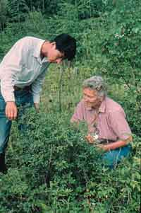

<body bgcolor="#ffffff">
 
<!----- Start of Author-n-Text below ...... ---->

<h2>
Blue Honeysuckle (<i>Lonicera caerulea</i> L. ) -- a Potential New Berry Crop
</h2>

  

<h3></h3>

Maxine M. Thompson,  
Professor Emerita, Department of Horticulture  
E-mail: thompson@ucs.orst.edu  
  
  
/

Oregon State University, Corvallis, OR, 97330, U.S.A.  
Phone: 541-7457266  
E-mail:thompson@ucs.orst.edu  
ATCROS Reference: ?.  
  
1. Oszmianski, J. , A. Kucharska, and E. Gasiewicz. 1999.
Usefulness of honeysuckle fruits for juice production. In: Michalczuk,
Lech and Witold  
  
2. Plocharski (eds.). Proceedings of the International
Symposium, Fruit and Vegetable Juices and Drinks-Today and in the XXI
Century. October 20-22, l999, Rytro, Poland

3. Plekanova, Maria N. l995. Blue honeysuckle: a new berry
crop in Russia. Balsgaard *Annual Report for l992-1994,* Dept. Hort.
Plant Breeding, Swedish University of Agricultural Sciences, Balsgaard,
Sweden. pp. 180-182.

4. Plekanova, Maria N. 2000. blue honeysuckle (*Lonicera
caerulea* L.)- a new commercial berry crop for temperate climate:
genetic resources and breeding. *Acta Horticulturae* 538,
pp159-163.

5. Plekanova, M.N and S.A. Streltsyna. l993. Fruit chemical
composition of *Lonicera* subsect. *Caeruleae (Caprifoliaceae)* species.
*Rastitelnye resursy.*29 (2);16-25. (In Russian).

6. Tanaka, S., M. Kakizaki, H. Watanabe, T. Minegishi, F.
Matsui, H. Muramatsu, R. Ogano, H. Narita, and A. Iwasaki. l994. New
blue honeysuckle (*Lonicera caerulea*L. var. *emphyllocalyx* Nakai)
cultivar "Yufutsu". *Bull. Hokkaido Pref.* Agric. Expt. Sta. No. 67. (In
Japanese with English summary)  
  


	Blue honeysuckle is a popular berry in regions of the world where the edible-fruited subspecies are native; that is, in Siberia (mainly subsp. <i>edulis, kamtchatica, boczkarnikovae,</i> and <i>altai</i>), in northern China (ssp. <i>edulis</i>), and in Hokkaido, the northern island of Japan (ssp. <i>emphyllocalyx</i>).   Traditionally, and into present times, large amounts of berries have been collected from wild plants by local people.  It was not until the 1950's that research on selection and cultivation began in the former Soviet Union.  Several research Institutions became involved with efforts to develop a commercially important berry crop and by 1998  60 cultivars had been released for home and commercial production in Russia <a href="Author-n-Subs.htm#6" target="Subs">(Plekanova, M.N., 2000).</a>   About 20 years ago, the Japanese began a  research program to identify superior forms of their local subspecies, and one cultivar, 'Yufutsu', and several selections were released to growers <a href="Author-n-Subs.htm#8" target="Subs">(Tanaka, S. et al.,1994).</a>  However, due to poor economic conditions in both these countries, research is much curtailed in Russia and was discontinued a few years ago in Japan. 

 
	Blue honeysuckle species are long-lived shrubs that reach 1.5 to 2 m tall.  Their attractive yellow  flowers in early spring and bright yellow leaves in fall make them a desirable ornamental shrub as well as a much esteemed berry crop.   Berries are dark blue with a white waxy covering (or "bloom"), similar to blueberries.  Fruit shape is, however, much more variable- from round, oval, ovate, pear-shaped, jug-shaped, to long and thin.</img>

In Russia, where fresh fruits are not readily available throughout the winter months, the very early maturity of blue honeysuckle fruits is much appreciated.  These berries are the first fruits to ripen: they are harvested about 2 weeks before strawberry.  Plants are easy to propagate (by seeds, cuttings, or layers) and to grow.  Shrubs are very cold-hardy (down to minus 45 degrees C).  They are precocious in bearing and will bear a few fruits at one year.   Mature plants are said to produce up to 6-7 kg.  Although the Russians report that plants are free of fungus diseases, in Japan it is often necessary to control <i>Botrytis</i>.   In Russia, the main insect pest is an <i>Aphis</i> sp.  However, in Japan sprays are often necessary for the celery aphid (<i>Semiaphis heraclei</i>Takahashi), several species of Tortricids, scale insects (<i>Leucanium</i>sp.)  and yellowish elongate chafer (<i>Heptophylla picea</i>) <a href="Author-n-Subs.htm#8" target="Subs">(Tanaka, et al., l994).</a> 

	The medicinal values of fruits have long been appreciated for their therapeutic effect on cardiovascular diseases; they are known to reduce blood pressure and there are claims of curative effects for malaria and gastrointestinal diseases.  <a href="Author-n-Subs.htm#7" target="Subs">Plekanova and Streltsyna (1993)</a> report exceptionally high vitamin C content, ranging from 50-70 mg/100 gm fresh weight.  Fruits are also high in anthocyanins and phenolic compounds which provide the health benefits due to antioxidant properties.  Due to the high stability of the dark-red pigments when processed, these fruits are very suitable for making juice as well as providing a good source of food coloring for other products <a href="Author-n-Subs.htm#3" target="Subs">(Oszmianski et al., 1999).</a> Fruits are eaten fresh and are used in a great number of processed products.  The Japanese have developed an amazing array of products, such as assorted candies, jam, jelly, gelatin, ice cream, yogurt, fruit cake, tarts, juice, juice-concentrate, soda pop, wine, berry bars, canned fruit, frozen fruit, chewing gum, tea, and even berry-flavored noodles.  These are presented in attractive packages and are very high-priced.

	Blue honeysuckle berry is virtually unknown in North America and there has been no previous research with this species in the United States.  Until recently, the only plants available in North American nurseries were descendants of some seedling selections made many years ago at Beaver Lodge Experiment Station in Alberta, Canada.  Seeds had been introduced to Canada in the 1920's, the two best seedlings were selected, named, and distributed to nurseries who currently sell seedlings of these selections. These plants, however,  do not bear good quality fruits because they are probably of another subspecies that is used in Russia as an ornamental shrub rather than for its fruits.  As these inferior quality fruits have been the only representatives of  blue honeysuckle in North America, this berry has never attracted the attention of fruit researchers or consumers there.

	My first introduction to this plant was during a visit to the Pavlovsky Experiment Station of the Vavilov Institute for Plant Industry (VIR) near St. Petersburg, Russia in l990.  There I met Maria Plekanova, a specialist on blue honeysuckle and author of numerous research articles (mostly in Russian).  Berries had been harvested earlier, but she showed us some stored fruits that looked interesting, but I did not collect  seeds at that time.  Six years later, I encountered blue honeysuckle fruits again, this time from wild plants while on a plant exploration trip for wild berries in Heilongjiang, the northeastern province of China.  Then, I became interested in evaluating this species for adaptation in Oregon,  so collected some seeds and subsequently, made my first field planting of these seedlings.  The next year, a chance meeting with a Russian horticulturist who was visiting Oregon, led to an invitation to visit her in Irkutsk, in Siberia

Thus, in l996 I went to Irkutsk, observed many blue honeysuckle bushes in people's dacha gardens and at an Agricultural Experiment Station.  There, and at the VIR Far East Station in Vladivostok, where I met another honeysuckle researcher, Andrei Sabitov, I collected many honeysuckle cuttings and seeds of Russian cultivars that are now growing in my field plot.  After the first year's evaluations, I discovered that the Russian and Chinese forms are all too early blooming for our climate so, in 2000,  I decided to go to Japan  because the subspecies growing there is reported to be 2-3 weeks later blooming.   Currently, I have about 1,600 seedlings and 28 Russian cultivars/selections in the field and over 3,000 seedlings just starting in the greenhouse. These will be field-planted this Fall.   Plant materials have been obtained from Russian sources (Irkutsk, Vladivostok, Khabarovsk and Magadan), Chinese sources (Heilongjiang and Jilin Provinces), northern Japan (Hokkaido), and U.S. nurseries.

  
	Today, I will discuss my first 2 year's experiences growing these plants in Oregon.  Because seeds are soft, mechanical methods of extraction used for other berries are not satisfactory for blue honeysuckle.  Extraction from ripe fruits can be done efficiently by placing fruits for a few hours in a small polyethylene bag in an aqueous solution containing several drops of the enzyme, pectinase. Then, massage the softened fruits in the bag until they are well disintegrated, followed by decanting the solution containing the mashed fruits.  A second or third rinsing and decanting may be necessary and then, as the seeds are heavier, they drop to the bottom of the container and are completely free of fruit tissues.    In contrast to most deciduous trees and shrubs, the seeds require no stratification.  Seeds stratified for 3 months, for 6 weeks, and no stratification had virtually the same germination percentages.  This year, without stratification, there was 90% germination of the Japanese seeds and 65-100% germination for Russian sources.  Plants are easily propagated by softwood cuttings, somewhat more difficultly by hardwood cuttings, and easily by layering or division of plants.

	 Precocity in bearing fruit is a great advantage for both production and for breeding programs.  The short generation time offers excellent prospects for rapid selection improvement.  In woody plant species, precocity in flowering and fruiting is generally associated with larger-sized plants.  Thus, it is desirable to gain as much size as possible in the first year of growth.   Therefore, two different times of field-planting were tried with young plants that had been seeded in the greenhouse in early spring.  One group, consisting of the larger plants (1-1.2 m tall), were transplanted to the field in fall.  In our mild fall weather, planting at that time allows roots to become well established before plants enter dormancy.  Then normal growth and flowering proceeds in early spring.  Of 500 fall-planted shrubs, 58% bore from one to 64 fruits the first year in the field.  In this, their second year, virtually all plants, except a few runts, have abundant flowers, and with the perfect pollination weather we are experiencing this year, there should be many fruits to harvest in May-June.  It will be a good test of the genetic potential for yielding ability.  The second group, consisting of the smaller plants (0.3-0.8 m tall) were allowed to go dormant for a few months outside before being brought back into the heated greenhouse for a few months to gain additional size before transplanting to the field in spring.  Surprisingly, in spite of continual moist, cool weather following planting, these plants lost their leaves within a few weeks, appeared dormant, and did not resume growth for 2-3 months; that is, until early summer.   Consequently,  these plants were smaller and fewer (only 36%) had fruits the first year.  Clearly, fall is the most efficient time to plant in Oregon.  Efforts are now being directed toward producing larger plants in the greenhouse during their first year. 

 
	As is characteristic of most plants from high latitudes, blue honeysuckle has a very short chilling requirement and a low heat requirement for plants to commence growth after dormancy.   There is no information about the number of chilling hours required but, under our conditions of a relatively cool maritime climate, leaf buds of Siberian forms begin to push in mid-winter (late January-February) and full bloom occurs throughout the month of March, 4-6 weeks before plums and apples.    Regardless of the mid-winter dates of bud burst, young shootlets are not damaged even to minus 18 degrees C, according to a nurseryman in New York State.  (This low  temperature in our region is an historic event.).  Also, flowers are not harmed by spring frosts; the Russians report that flowers withstand  minus 8 degrees C and the Japanese observed minus 10 degrees C at full bloom without subsequent decline in fruit production.  The problem with the early bloom in Oregon is not spring frost damage,  but that it is too wet and cool for bees to fly, and cross-pollination is essential for optimum production of seeded, full sized fruits.  Some parthenocarpy occurs and there is limited self-pollination in some forms, but fruits are fewer and much smaller in size.   To assess the level of cross-pollination that occurred in a field where bees were not introduced last year and to determine the relationship between seed number and size of fruit,  I counted the number of seeds and weighed 395 individual fruits.  Only 22% of fruits had 10 or more seeds, a number adequate for good fruit size. There was a considerable amount of parthenocarpy as 21% of fruits had no seeds, and 41 % had 0, l, or 2 seeds, a condition associated with smaller fruits.  This year both honey bees and mason bees (<i>Osmia lignaria</i>) were introduced, and wild bumble bees were also noticed visiting the flowers.  Because mason bees are active at a lower temperature than honey bees, this species offers promise for pollination of earlier blooming plants in our normally cool, wet spring weather.  It was interesting to observe that a Japanese farmer was also using mason bees, although a different species, one native to Japan.

	Regarding cultural practices, I am using methods appropriate for blueberries.  Shrubs not only appear similar to those of that crop, they are also adapted to acid soils (pH 5-7), and they require good soil moisture throughout the growing season for optimum growth.  Last summer during a particularly hot period (when I was gone to Japan for 4 weeks), the plants suffered from inadequate irrigation.  Plants became very stressed: leaves turned brownish, there was some shoot die-back, and growth ceased until the frequency of irrigation was increased.  Then, there was a new spurt of growth before dormancy set in with the shortening days of late August.   In order to avoid this problem the next growing season, last fall I applied about 10-12 cm sawdust mulch down the rows to help maintain good soil moisture.  As with blueberries, young honeysuckle plants are subject to leaf burn from application of ammonium sulphate fertilizer.  Fish meal or calcium nitrate was more suitable for this crop, at least in the early years.

	Fruit evaluations were made on first-year plants last May-June.  Fruit weight ranged from unpollinated, seedless fruits of 0.2 gm (11 x 6 mm)  to 1.9 gms (16 x 16 mm)  with 15-20 seeds).  <a href="Author-n-Subs.htm#5" target="Subs">Plekanova (l995)</a> reports that fruits can be up to 2.0 gm and 3-4 cm long.  Seeds are very small and unobjectionable to consumers.  Fruit shapes varied from almost spherical to long and thin (26 x 9 mm), pear-shaped, oval, ovate, jug-shaped, to short or long spindle-shaped.  Flavor varied from somewhat bitter, varying degrees of sour, to pleasantly tart-sweet, or bland. 

 
	During the past few years, I have assembled a considerable amount of genetic diversity in blue honeysuckle germplasm.  Because of the extraordinary wide range of variation for all horticultural traits of interest among the edible forms of<i>Lonicera caerulea</i>, there is a high probability that, with sufficient efforts directed towards selection and breeding, there is good potential for creation of successful blue honeysuckle cultivars especially adapted to our region.

(END)

</body>
