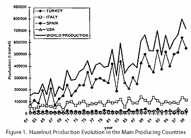

<body bgcolor="#ffffff">
 
<!----- Start of Author-n-Text below ...... ---->

<h2>
World Hazelnut Production
</h2>

  

<h3></h3>

Dr. Joan TOUS MARTI  
E-mail: Joan.Tous@irta.es  
  
  
/

Institut de Recerca i Tecnologia Agroalimentàries (IRTA)  
Departament d'Arboricultura Mediterránia. Centre de Mas Bové  
Apartat 415. 43280-Reus (Tarragona). Spain  
Phone: +34 977-344055  
Fax +34 977-344055  
ATCROS Reference:  
  

SELECTED REFERENCES

Alvisi, F., 1994. Situazione attuale e prospettive per la nocciola. III
International Congress on Hazelnut. Alba (Itàlia). *Acta Horticulturae,*
351 (1): 131-157.

Baldwin, B., 1997. A review of Australian hazelnut production.*Acta
Horticulturae,* 445: 359-367.

Cámara de Comercio de Tarragona, 1994. El sector de la avellana.
*Problemática europea y análisis general de mercados.* Ed. COCIN de
Tarragona y D.G. de Agricultura de la Comisión de la Unión Europea (3
tomos).

CIHEAM-FAO, 1999. Economics of nuts in the Mediterranean Basin. Ed. L.M.
Albisu. *Options Méditerréennes.* Serie A, no 37. 135 pp.

Germain, E., 1990. *Hazelnut production and industry in
Europe, North Africa and Middle East.*Ed. FAO. Yalova (Turkey):
107-118.

INC (Intenational Nut Council). *The Craker.* Several numbers.

Külünkoglu, O., 1997. Turkish hazelnut and Fiskobirlik. *Acta
Horticulturae,* 445: 347-354.

Mehlenbacher, S.A., 1991. Hazelnuts (*Corylus*). In: J.N. Moore and J.R.
Ballington (eds.). Genetic resources of temperate fruit and nut crops 2.
*Acta Horticulturae,* 290: 789-836.

Mehlenbacher, S.A.; Olsen , J., 1997. The hazelnut industry in Oregon,
USA. *Acta Horticulturae,* 445: 337-345.

Tasias, J., 1990. *Tree nut production in South Europe, Near East and
North Africa isssues related to production and improvement.* Ed. FAO.
Yalova (Turkey): 21-46.

Tous, J.; Girona, J.; Tasias, J., 1994. Cultural practices and costs in
hazelnut production. III International Congress on Hazelnut. Alba
(Itàlia). *Acta Horticulturae,*351 (1): 395-418.

Tous, J.; Romero, A., 1997. Situació mundial de la
producció i comerç de l'avellana. In: J. Santos, J. Santacana, J.F. Gil,
F.J. Vargas (eds.).*"El conreu de l'avellaner".* pp. 9-24.
DARP-Generalitat de Catalunya. Barcelona.

U.S.D.A. (United States Department of Agriculture), 1992. *Horticultural
Products Review*(Hazelnut situation and outlook), March and October
1992.

Vargas, F.J., 1990. *Nuts tree in Spain: almond, hazelnut, walnut and
pistachio.* Ed. FAO. Yalova (Turkey): 255-280.

Yalcin, I.; Briz, J.; Albisu, L.M., 1991. Turkish and Spanish hazelnut
export sectors developments. *Acta Horticulturae,* 351: 189-192.

Tous, J.; Romero, A., 1997. Situació mundial de la
producció i comerç de l'avellana. In: J. Santos, J. Santacana, J.F. Gil,
F.J. Vargas (eds.).*"El conreu de l'avellaner".* pp. 9-24.
DARP-Generalitat de Catalunya. Barcelona.  
  
Germain, E., 1990. *Hazelnut production and industry in
Europe, North Africa and Middle East.*Ed. FAO. Yalova (Turkey):
107-118.  
  


<b>Abstract</b> 

The main world hazelnut producing countries are Turkey with around 500,000 t inshell, Italy 105,000 t, USA 25,000 t and Spain 15,000 t. Since 1995, world production seems to be stabilized between 600-700.000 t inshell. It seems that in coming years Turkish production could become higher, although cultivation expansion has been restricted, while other productions could remain stable. Major production countries, regions, and important cultivars for each are described.

<h2>1.  PRODUCTION AND MARKET</h2>

World hazelnut production in 1995-1999 period was 667,379 t inshell. Turkey is the world's largest producer (79 %) and exporter, followed by Italy (15 %), USA (4 %) and Spain (1.8 %). Although hazelnuts are also produced in Greece (6,000 t), France (4,000 t), Portugal (2,000 t), former Soviet Union, Iran, Croatia and Romania, these countries do not have a major input in the world hazelnut trade. In the last years, in other countries such as Australia, New Zealand, Chile, Poland, etc., hazelnuts are considered a new crop. This world production doubled between the years 1965 and 1980, and it increased gradually in the course of the last decades, mainly the Turkish and Italian production (Table 1).

<h3>Table 1. Hazelnut world production evolution (1961-2000), metric tons unshelled nuts.</h3>

<table width="600">
<tr><th colspan="6">Main producing countries</th></tr>

<tr><th>Reference Periods </th><th>	TURKEY</th><th>	ITALY</th><th>	SPAIN</th><th>USA</th><th>	World 
		Production </th></tr>

<tr align="right"><td>1961-65</td><td>106.600</td><td>50.600</td><td>16.400</td><td>7.640</td><td>181.240</td></tr>

<tr align="right">><td>1966-70</td><td>159.400</td><td>63.500</td><td>15.000</td><td>7.940</td><td>245.840</td></tr>

<tr align="right"><td>1971-75</td><td>234.200</td><td>87.000</td><td>18.800</td><td>9.900</td><td>349.900</td></tr>

<tr align="right"><td>1976-80</td><td>268.000</td><td>88.400</td><td>21.200</td><td>11.100</td><td>388.700</td></tr>

<tr align="right"><td>1981-85</td><td>304.000</td><td>99.000</td><td>20.600</td><td>14.300</td><td>437.900</td></tr>

<tr align="right"><td>1986-90</td><td>376.000</td><td>104.000</td><td>27.200</td><td>16.000</td><td>523.200</td></tr>

<tr align="right"><td>1991-93</td><td>418.300</td><td>108.300</td><td>25.000</td><td>21.600</td><td>573.333</td></tr>

<tr align="right"><td>1994-95</td><td>460.000</td><td>95.000</td><td>22.000</td><td>22.750</td><td>607.000</td></tr>

<tr align="right"><td>1995-99</td><td>527.500</td><td>100.500</td><td>12.050</td><td>27.329</td><td>667.379</td></tr></table>

<b>Font: Gill and Duffus; SOMERCON and INC sources.</b>

The world hazelnut production shows fluctuations depending on the climatic conditions from year to year. Overall, world production has increased in parallel with Turkey's production (Fig. 1). While Turkey's average inshell production is 350-400,000 t; this value has reached up to 500,000 t in recent years (Table 1). The production of Italy and Spain, additional important producing countries, varies between 100-115,000 and 10-20,000 t respectively. The USA consumes most of its own hazelnut production and also imports hazelnut kernel for the industry to meet its home demand. However, it has become a table hazelnut exporting country by increasing its production in recent years (25,000 t).

The total hazelnut exports show fluctuations according to world hazelnut production. The exports are around 460,000 t of hazelnut shell (equivalent to 207,000 t of kernels). Turkey controls 80 % of the commercial trade (Table 2). The world supply of table hazelnut in shell does not overcome the 15,000 t, and this market is saturated enough. The 95 % of the exports are carried out in kernel. Germany is the most important hazelnut importing country in the world and covers approximately 36 % of the total world import (Table 3). Around 75 % of total exports goes to European countries. 

<h3>Table 2. Hazelnut exports and domestic consumption by the main producing countries (in tons, unshelled equivalent).</h3>

<table width="600">
<tr align="right"><th align="center" colspan="4">Exports</th><th align="center" colspan="3">Domestic consumption</th></tr>

<tr align="right"><th>Country</th><th>Average  
1983-86 </th><th>Average 
1989-92</th><th>Average 
1995-99</th><th>Average 
1983-86</th><th>Average 
1989-92</th><th>Average  1995-99</th></tr>

<tr align="right"><td align="left">Turkey</td><td>268.450</td><td>298.376</td><td>380.750</td><td>77.300</td><td>63.000</td><td>	88.000</td></tr>

<tr align="right"><td align="left">Italy</td><td>67.520</td><td>73.880</td><td>53.860</td><td>38.600</td><td>63.000</td><td>110.714</td></tr>

<tr align="right"><td align="left">Spain</td><td>12.630</td><td>11.125</td><td>7.825</td><td>9.100</td><td>14.000</td><td>16.825</td></tr>

<tr align="right"><td align="left">USA</td><td>5.500</td><td>6.794</td><td>18.474</td><td>10.000</td><td>16.000</td><td>21.821</td></tr>

<tr align="right"><td align="left">Total</td><td>354.100</td><td>390.175</td><td>460.910</td><td>135.000</td><td>156.000</td><td>	237.360</td></tr>
</table>

<b>Sources: <a href="Author-n-Subs.htm#4" target="Subs">Germain, 1990</a>; <a href="Author-n-Subs.htm#3" target="Subs">Tous and Romero, 1997</a>; INC</b>

<h3>Table 3. Main hazelnut importing countries (in tons). Average for 1987 - 1992.</h3>

<table border="" fram="box" width="600">
<tr align="right"><th colspan="4">
	I m p o r t s
</th></tr>

<tr align="right"><th>Country</th><th>Shelled  (kernels)</th><th>Unshelled</th><th>			TOTAL 
 (unshelled equivalent)</th></tr>

<tr align="right"><td align="left">UE*:</td><td>108.690</td><td>8.775</td><td>229.416</td></tr>

<tr align="right"><td align="left">. Germany</td><td>66.423</td><td>	4.183</td><td>139.022</td></tr>

<tr align="right"><td align="left">. France	</td><td>15.529</td><td>1.143</td><td>32.667</td></tr>

<tr align="right"><td align="left">. Belgium</td><td>7.767</td><td>196</td><td>15.963</td></tr>

<tr align="right"><td align="left">. United Kingdom	</td><td>5.868</td><td>1.608</td><td>13.520</td></tr>

<tr align="right"><td align="left">. Netherland</td><td>5.917</td><td>250</td><td>		12.261</td></tr>

<tr align="right"><td align="left">. Denmark</td><td>	1.186</td><td>395</td><td>2.802</td></tr>

<tr><td colspan="4"> </td></tr>
<tr align="right"><td align="left">Ex URSS</td><td>12.881</td><td>-</td><td>26.148</td></tr>

<tr align="right"><td align="left">Switzerland</td><td>12.482</td><td>103</td><td>25.441</td></tr>

<tr align="right"><td align="left">Austria</td><td>	8.904</td><td>71</td><td>18.146</td></tr>

<tr align="right"><td align="left">USA</td><td>3.247</td><td>163</td><td>6.754</td></tr>

<tr align="right"><td align="left">Others</td><td>35.883</td><td>2.775</td><td>75.617</td></tr>

<tr align="right"><td align="left">Total</td><td>182.087</td><td>11.887</td><td>381.524</td></tr>

<tr align="right"><td align="left"> %</td><td>96,8</td><td> 3,2</td><td> </td></tr>
</table>

*   This data also adding the Italy and Spanish imports average.
Source: <a href="Author-n-Subs.htm#3" target="Subs">Tous and Romero</a> (1997)

Hazelnut consumption has increased in the last decades. It is considered that in-shell consumption accounts for only 10 %. The rest is shelled (kernel), but around 90 % are for industrial purposes and another 10 % for direct human consumption. Among the producing countries, hazelnut consumption per person and year is highest in Italy (0.52 kg kernel/person), followed by Greece (0.37 kg) and Turkey (0.25 kg). Worldwide, the highest hazelnut consumption per person and year is reached in Switzerland (2 kg kernel/person), followed by Germany (over 1 kg), Austria, Belgium, and Luxembourg.

When the supply overcomes the demand, the world market spreads to the drop, in spite of regulating prices practised by Turkey, sending a great part of its stocks toward industrial applications (obtaining of oil, hazelnut paste, etc.) and institutions (army, schools, etc.). It is also necessary to point out that the market of the hazelnut is influenced by the volume of the almond world crop, because these two nuts can be substituted the one by the othet, in certain industrial uses.

<h2>2. CHARACTERISTICS OF PRODUCING COUNTRIES</h2>
<b>
2.1. Turkey</b> 

Turkey is the world's leading hazelnut producer and exporter of 550.000 t and 380.000 t in shell respectively. Hazelnut is grown in both the eastern and western regions of Turkey along the Black Sea, in areas where the soil is unsuitable for other crops and on sharply sloping soils (slopes higher than 20 percent). An additional benefit for hazelnut growing areas with high rainfall, is the crop's ability to prevent soil erosion. Approximately two to three million growers (5 percent of the nation's population) depend on hazelnut growing for their income and it is therefore easy to understand the strategic value of hazelnut production in the social and economic structure of this region.

Hazelnuts are grown in two regions located on the coast of the Black Sea. The main extension (350,000 ha), traditional growing area, is the NE of the country in mountainous regions (Trabzon, Giresun, Ordu, and Samsun). The new orchards are located in flatter regions (Akçakoca, Bolu and Zonguldak), with some 100,000 ha, located in fertile lands and obtaining higher yields. The main cultivars are 'Tombul' (Giresun), with 34 % of the total surface, followed by 'Palaz' (Ordu), 'Foça' (Trabzon), 'Karafindik' and 'Mincane' (Akçakoca).

The traditional orchards are very small (0,4-1 ha), placed in areas with good environmental conditions for the hazelnuts, acid pH, high rainfall (1.250 mm) and well distributed, moderate summer temperatures, etc., although most are in areas of great slopes that make it difficult for the mechanization. The cultivation is in unirrigated conditions, with trees trained in bush, high plantation densities (600-700 trees/ha), with low mechanization level and low yields between 600 and 1000 kg/ha. The manpower necessities in the traditional orchards are high, around 400-700 hours/year, and of which most is dedicated directly to the harvest hazelnuts.

Regarding the organitzation of the sector, a big co-operative, denominated Fiskobirlik (F.B.K.), guided by the state, is outstanding and almost channels 20 % of the Turkish hazelnut trade. The private Hazelnut Exporters Union controls the rest of production. Overall, they classify the fruits in three types: round, oval and longer. The first are the best of which are outstanding two commercial denominations: "Giresun" (or 'Karasunda'), constituted basically by the cultivar 'Tombul' (good industrial quality and high kernel yield) and "Llevant" that includes a mixture of other varieties, as the 'Palaz', 'Foa', 'Karafindik' and 'Mincane.'

Concerning the commercial distribution of the production, 80 % is dedicated to export (380.000 t, in shell basis), 98 % in kernel and 2 % in shell, and the rest towards the domestic market. Europe is the major market for Turkish hazelnuts.

<b>2.2. Italy</b> 

Hazelnut growing in Italy occupies a surface of 70,000 ha and the average production, in the period 1995-99, was 105,000 t in shell. The orchards are concentrated, basically, in four different regions: Campania (provinces of Avellino, Napoles and Salerno) that produce 60 % of the total, followed by Lazio (Viterbo, 28 %), Sicily (Messina and Catania, 12 %) and Piemonte (Alba and Cuneo, 10 %). 

There are a lot of Italian varieties, although the most important are the 'Tonda Gentile delle Langhe' (TGDL) in the Piemonte; 'Tonda Romana' in the Lazio; 'Tonda Giffoni', 'San Giovanni' and 'Mortarella' in the Campania; and 'Santa Mar’a del Gesu' in Sicily. The TGDL is worldwide renowned because of the quality of its nuts that are very good for processing: round shape, kernel caliber between 12 and 14 mm, kernel percent 46-48 % regular shape of kernel, good pellicle removal, excellent flavour after roasting.

The main commercial hazelnut areas (Piemonte, Campania and Lazio) are characterized for having better edaphoclimatic conditions, with good soils and rainfall (800-1,500 mm). Only in some areas of Viterbo the culture is irrigated, due to the drought conditions in summer. The hazelnut farms usually have small or medium surface (5-10 ha), placed on the slopes of the hills and flat areas (Viterbo province). The traditional orchards are trained in a bush form and, the modern, in a short stem vase. The potential yields are very variable, and the good productions obtained in the regions of Campania and the Lazio (2,000-3,000 kg/ha) are outstanding.

Regarding the organization of the sector, the private type is the most important, with a commercialization volume around 70 %; at associative level, some co-operative of the area of Viterbo (Lazio) is only outstanding. Also the private international company called Ferrero (Turín) is outstanding and characterized by the quality of its products made with hazelnut.

The commercial distribution of the production (period 1995-1999) is based on the export (54,000 t, equivalent in shell), 85% in kernel and 15% in shell, as well as on the interior market (110,000 t inshell). Simultaneously Italy imports, in the last years, ranging from amounts 5,000 to 10,000 t of kernel from Turkey, because this country offers more competitive prices on the international market. 

<b>2.3. United States</b>

The annual production of this country oscillates around 25,000-30,000 t of hazelnut in shell. Hazelnuts are grown mainly in the state of Oregon (Willamette Valley), and the total surface is about 12,000 ha. The main cultivars are 'Barcelona' (synonyms of 'Castanyera' that occupies 80 % of the plantations, followed by 'Ennis' (11 %), 'Casina' (3 %) and 'Willamette' (2 %). However, in recent years, two new cultivars, 'Lewis' and 'Clark' have been widely used. The commercial production has always been guided toward a market of big table hazelnuts. Lately the world trade of table hazelnut is saturated enough and, for this reason, the new orchards choose cultivars with industrial aptitude for consumption.

The hazelnut orchards should grow in good, plain, fertile, deep soils with a high rainfall (1,000 mm). The farms usually have large surfaces (15-30 ha), with a high mechanization level and with low manpower requirement (35-40 hours/year). The cultivation technique that is practiced is the most advanced, with outstanding trees trained at single stem, densities of plantation range from 260 to 400 trees/ha, triennial pruning, chemical suckers control, mechanical harvesting, etc. The yield, in unirrigated conditions, ranges from 1,700-2,500 kg/ha; this low productivity contrasts with the good technology of these orchards, and the main reasons are the lack of light of the mature trees with high densities under good edaphoclimatic conditions and vigorous varieties ('Barcelona') used.

The USA commercial production is distributed among the domestic market, around 67%, and the export to Europe. This sector is controlled by big co-operatives and similar entities, outstanding Californian dry fruits that control about 40 % of the Oregon crop. The USA bakery, breakfast cereals and confectionery industries use domestic and imported hazelnut. Companies in these sectors often convert shelled hazelnuts to paste for use as an ingredient.

<b>2.4. Spain</b> 

Spain ranks fourth in world hazelnut production after Turkey, Italy and the USA. In the last years (1995-99 period) the annual average production was 12 000 t inshell. Catalonia, in the north-east, is the main producing region of Spain and within this region, the province of Tarragona stands out as the largest growing area (27,000 ha), representing 90 % of the total Spanish hazelnut surface.

Tarragona's orchards, topographically, can be classified into two groups. Firstly, the orchards of the inland mountain areas of the province ('Priorat'), located on hilly slopes, with a low mechanisation level, dry farming (around 400 mm of annual rainfall) and low production (500-800 kg/ha) and with a regressive surface. Secondly, the flat area orchards of the region called 'Camp de Tarragona' are located near to the Mediterranean coast and are highly mechanized, with good productions (2,000Ð2,500 kg/ha) and modern cultivation techniques. The main commercial hazelnut production is obtained from the second area, which is grown mainly under drip irrigation. The hazelnut orchards are mostly familiar and small (2-4 ha). Most growers practice 'part-time agriculture'.

The most important cultivars are native, i.e. 'Negret' (70 %), 'Gironell', 'Pauetet', 'Culplà', 'Morell', 'Grifoll', 'Trenet' and 'Ribet'. However, in recent years, in irrigated orchards, 'Pauetet' has been widely used. Some Italian cultivars ('Tonda di Giffoni' , 'Tonda Romana' and 'San Giovanni') stand out for their high yields and commercial value. The 'Negret' cultivar is famous for the good industrial kernel quality.

The sector is very concentrated around the co-operative UNIO in Reus (Tarragona) and other private industries.The bulk of the hazelnut crop is consumed in shelled form. The confectionery and chocolate industries use about 60-70 % of domestic supplies. Hazelnut is also used for snacks and is often marketed as snack packs. Hazelnut is marketed in Spain throughout the year in competition with almonds, peanuts and other snack foods. In years when almond prices are high, hazelnut demand in the confectionery industry increases. Hazelnut export from Spain is diminishing while import is rising.

<b>2.5. France</b> 

It is a country with a small production, around 4,000 t inshell/year. The first orchards began in the years 1965-70 and, at present, the surface is 2,500 ha. Most of plantations are located to the Southwest of the country (Bordeaux, Agen, etc). The traditional varieties that are cultivated are 'Fertile of Coutard' (syn. of 'Castanyera') and 'Segorbe'. Lately new table varieties have been introduced ('Ennis' and 'Corabel') and in industry ('Pauetet').

The hazelnut orchards are quite large (7-10 ha) and they are in flat areas, with good soils and rainfall that oscillates between 700-800 mm. The cultivation type is very similar to the American pattern of Oregon, although the tree densities in France are somewhat higher (650-800 trees/ha) and in the last years the drip irrigation surface has been increased.

The sector is very concentrated around the co-operative UNICOQUE in Cançon (Lot-et-Garonne) that markets the big hazelnut for the table consumption, mainly, toward the export destined to Germany (1,000 t shell). France imports 15,000 t of kernels and about 1,500 t of inshell nuts per year. 

<h2>3. USES</h2>

Hazelnut is mainly known as a fruit tree, as its fruit has a pleasant taste and it is highly nutritive. The fruits contain 55-72% fat (they produce high-quality edible oils but these easily turn rancid); 3-11% assimilated carbohydrates; 10-22% protein; 5-7% diary fiber; 5-6% water and 2-3% minerals. Energy value is 600 cal/100 g of kernel. They also contain vitamins B1, B2, and C; and are an excellent source of vitamin E (250-550 ppm).

Hazelnuts have multiple uses and are sold on two different markets:  the inshell market and the kernel market. Cultivars suited for one use are quite different from those suited for the other. The in-shell market accounts for 10% of the world hazelnut crop. The remaining 90 % of the crop are cracked and the kernels are sold to bakers, candy makers and other processors. Additional uses are in breads, pastries and breakfast cereals.

<h2>4. FUTURE PROSPECTS</h2>

World production has almost doubled in the last two decades. Throughout that period of time Turkey has been the dominant producer and lastest crops indicate that still this country supplies around 75 %. The rest is mainly produced in Italy (15 %), USA (4 %) and Spain (2 %). In the last years, other countries such as Australia, New Zealand, Chile, Poland, etc., hazelnuts are considered a potential new crop. Since 1990, world's production seems to be stabilized between 500-600.000 t inshell, meanwhile consumption round 450-550.000 t inshell. It seems that in coming year's Turkish production could become higher, although cultivation expansion has been restricted, while other productions could remain stable.

With respect to the consumption, an annual growth rate of 1 % to 2 % has been estimated for hazelnuts in the near future. It is the result of a larger use in industrial products with hazelnuts considered as another ingredient but not the main one. At the same time, hazelnut, as part of Mediterranean diet, should profit from a beneficial image. Consumption in the United States, Australia and Japan is expected to rise in the future, in the former as a result of promotional efforts made by national producers.

<a href="Author-n-Subs.htm#0" target="Subs">Selected References</a>

(END)

 
</body>
