<body>

<h2>
Gum Arabic--A Tree Crop for Arid Lands
</h2>

  
<h3></h3>

Paul Vantomme  
  
E-mail: paul.vantomme@fao.org  
  
  
/

UN Food and Agriculture Organization  
Forest Product Division  
Wood and Non-wood Products Utilization Branch  
Viale delle Terme di Caracalla  
00100 Rome, Italy  
Fax: +39-06-570-55618  
E-mail: non-wood-news@fao.org  
Home Page: http://www.fao.org/forestry/FOP/FOPW/NWFP/nwfp-e.stm  
ATCROS Reference:  
  
  
  


<b>Abstract</b> 
Gum Arabic is an important ingredient used in the food industry throughout the world.  Production of the raw materials is primarily done in arid lands across Africa.

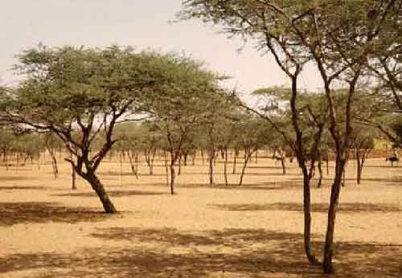

<h1>GUM ARABIC </h1>
<ul>
<li><b>Water-soluble gum mainly used in food industry
</b></li>
<li><b>From trees of the genus <i>Acacia</i>
</b></li>
<ul>
<li><i>A. senegal</i> and <i>A. seyal</i></li>
</ul></ul><ul>
<li><b>Almost all is of African origin (Sudan)
</b></li>
</ul><ul>
<li><b>international trade of 40.000 tonnes/year
</b></li>
<ul>
<li>4% of world hydrocolloids market (starch)</li>
<li>unit value of US$ 2 -5/kg</li></ul></ul>
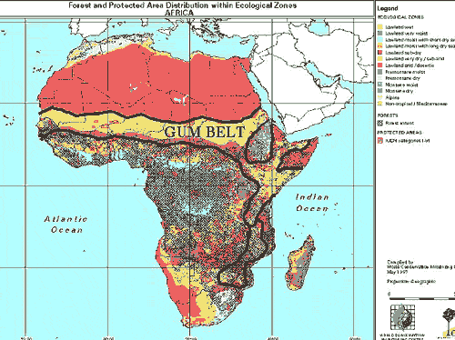

<h1>Non-Wood Forest Products:   Issues</h1>
<ul>
<li><b>Dynamics of NWFP  
</b></li>
<ul>
<li>All "crops" once were "NWFP"</li>
</ul>
<li><b>Domestication of NWFP  and related issues
</b></li>
<ul>
<li>technical, economical, social, environmental</li>
</ul>
<li><b>NWFP production/ interaction with agricultural crop/ grazing systems
</b></li>
<ul>
<li>NWFP as a by-/co-product of agricultural crops/agroforestry</li> </ul></ul>
<table><tr><td>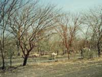</td><td>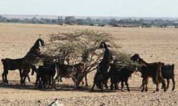</td></tr></table>
<table><tr><td><h2>Main characteristics of NWFP</h2>
<ul>
<li>Wild</li>
<li>Local use</li>
<li>Products for basic needs</li>
<li>Informal sector</li></ul></td><td><h2>Characteristics of Cultivated Production</h2>
<ul>
<li>Cultivated</li>
<li>International use</li>
<li>Luxury goods</li>
<li>Formal sector</li></ul></td></tr></table>
<table><tr><td>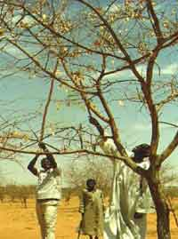</td><td>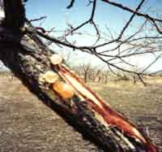</td></tr></table>
<table><tr><td>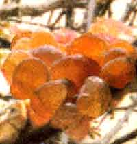</td><td>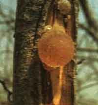</td><td>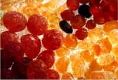</td></tr>
<tr><td colspan="3">The gum is exuded from trunks, branches and twigs</td></tr></table>
<h2>Constraints
</h2><ul>
<li>Lack of awareness (except in Sudan)
</li>
<li>Lack of institutional and policy support</li>
<li>Lack of information on resource availability</li>
<li>Irregular supply and product quality</li>
<li>Use of product unknown outside the region of origin</li>
<li>Risk of 'boom and burst cycle'</li></ul>
<table><tr><td>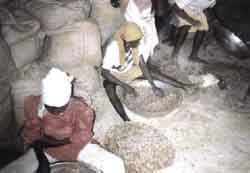</td><td>Primary cleaning and grading of gum arabic at the Gum Arabic Co. depot, El Obeid, Sudan (Photo: J.J.W. Copper)</td></tr></table>
<table><tr><td>Final inspection of mechanically cleaned gum arabic at the Gum Arabic Co. depot, El Obeid, Sudan (Photo: J.J.W. Copper)</td><td>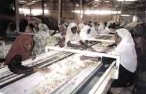</td></tr></table>
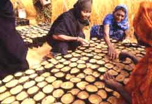
<h2>Opportunities</h2><ul>
<li>Products of "rural poor" (+ rural employment)</li>
<li>Local knowledge</li>
<li>Less-destructive exploitation</li>
<li>Low capital investment and technology</li>
<li>Low volume (high value) products</li>
<li>Market niches:
<ul>
<li>"Bio-products"--Organic gum (Chad)</li>
<li>Fair trade</li></ul></li></ul>

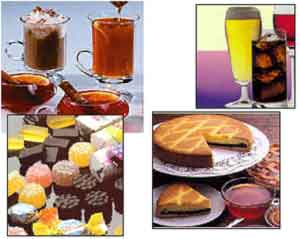

</body>
