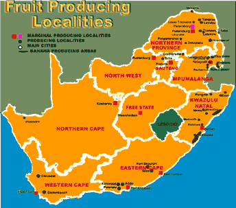

<body>

<h1>
Subtropical Fruits and Nuts in South Africa
</h1>

  
<h3></h3>

Rosemary du Preez  
E-mail: rose@itsc.agric.za  
  
  
/

Institute for Tropical &amp; Subtropical Crops  
Nelspruit 1200 South Africa  
Phone: 13-7532071 Fax: 13-7523854  
E-mail: rose@itsc.agric.za  
ATCROS Reference:  
  
  
  


<b>Abstract</b> 
A discussion of the research carried out by the Institute for Tropical &amp; Subtropical Crops in South Africa concerning the development of improved cultivars, orchard techniques and strategies to cope with pests and diseases.

South Africa is, I suppose, a small country and its fruit and nut industry is also actually very small although it plays a very important part in South Africa's economy. Stone fruits, apples, pears and grapes form part of a much larger industry but they are more centered in the Cape area which is quite a way from where I am.  I work at the Institute for Tropical and Subtropical Crops, which is situated in Nelspruit in the northern part of South Africa. It has been doing research on these crops for the last 75 years, basically on all tropical and subtropical crops which are suited to our area. The main areas of research include breeding which is either conventional or biotechnology, crop management and manipulation of trees, be it chemical manipulation, pruning, water requirements, nutrient requirements, disease and pest management.

The crops that we look at are citrus, mango, banana, litchi, guava, avocado, papaya, coffee, macadamia, pecan as well as some minor crops such as ginger, turmeric, tea or new crops which are either exotic or indigenous, as well as our herbs and spices and medicinal plants. These medicinal plants are usually just our traditional medicine plants.

<table><tr><td></td></tr></table>

Background of the citrus industry in South Africa: citrus is an important crop in the economy of South Africa and probably of all the tropical and subtropical crops, is the largest one. The fruit is used in the local and export markets. The main activities of research involve the breeding of better cultivars; seedlessness is an important aspect that is looked for, then improved fruit quality. Tree manipulation is very important. We have the tendency to plant our orchards out much closer, and most new citrus orchards are being planted out at 6 X 3 metres, which requires some pruning and manipulation of the trees. We are also looking at open hydroponic systems for certain citrus.

Citrus growing areas are widely distributed except for the west and northwest, which are very dry, arid areas. No citrus is grown here but all along the coastal regions and up in the northern province.

We produce about 1.7 million tons of citrus per annum with oranges equaling 990,000 tons, lemons 112,000 tons, easy peelers 90,000 tons, grapefruit 170,000 tons. The value is US$210 million. 56% of our citrus production is exported mainly to the European market.

Some of the cultivars we have developed at the Institute include Nova SL a seedless mandarin variety and on the right you can see the ordinary Nova mandarin. The two featured here are very similar but under selfing conditions we only get .8 to 1.16 seeds per fruit.

The most common lemon variety grown in South Africa is Eureka. Once again both seedless and ordinary varieties are similar but in our trials we have found no seeds in our fruit to date.

Another is grapefruit, such as a selection from the Henderson cultivar. It's a mutant. Two mutants with possibility have been found. First with higher sugar content TSS and lower Narangin and the second has a higher internal pigment colour. These are just some of the selections that are being done in the breeding program.

Another crop is mango and the industry is quite small if you consider the figures we heard this morning where Australia produces 60,000 tons. South Africa produces much less than that. The main aspects in research are breeding, pruning, pest control and disease control.

If you look at mango producing areas, you can see that most of them are concentrated in the north eastern parts of South Africa and a few places in Natal. But Natal's humidity seems to be a bit high and we have major problems with black spot.

Production of mangoes in South Africa is 39,000 tons per annum, so it is quite small compared to other places and its value is only about US$8 million. 28% of production is exported and the rest is sold on the local market where it is used either as fresh fruit or Atchar which is a type of chutney made from green mangoes. Juice and drying are also fairly important.

Heidi is one of our newer cultivars, but a lot of new plantings are made with Heidi. This is the seedling from a cross-pollination with Heidi.

Also in our selection program we select fruits for two different markets--for the local market and for the European market which is our main export market.

Here is another one with a slightly yellow fruit on the outside which does better on the local market. The red blush is what is looked for for the European market. Nelpetit is a cultivar that has been registered at the Institute. It's a little bit smaller than Heidi and other commercial cultivars, but is very popular on the local market, has a very good flavour with high sugar content.

Sensation is one of the mangoes which used to be planted. There are no real new plantings although there are a lot of old trees in production. This is a seedling from Sensation which has a lot of post harvest problems and this is one of the reasons it is not being planted any more.

Litchi is another crop grown on a small scale with annual production being only 7,340 tons with a value of US$2.5 million. 35% of the crop is exported to Europe and the rest is used on the local market either as fresh fruit but juice is also quite important. The problem with litchi is that the season is quite short and usually ripens in early November in the area near the Mozambique border, up until mid January with peak harvesting being over Christmas/New Year which is quite a problem for a lot of people. One of the aspects needing attention is to develop cultivars ? either early or late cultivars.

We have only two commercial cultivars at the  moment: HLH Mauritius and McLeans. McLeans is not a very popular litchi, most of the trees are old and no one plants them very much any more. The only reason some are planted is because it is a much later cultivar so that when Mauritius is not available on the market the people will eat McLeans instead. There is a total of 140,000 trees but only about 120,000 are in production.

In the years 95/96 and 96/97 we had a big reduction in the volumes of litchis produced and that was due mainly to a severe drought we had at that time. Of course the price to those who did have litchis was much improved.

Some of our new selections of litchi are Friedenheim and HLH Mauritius. Both have good colour but Mauritius is the most common cultivar.  Nelspruit also has good fruit colour and size. One of the aspects that receives attention is the number of chicken tongues in the fruit in the hopes that we get a cultivar that has a very high percentage of chicken tongues, which is a very small seed. That one again is a slightly different shape but also good colour and flavour.

The guava about which I already spoke on Sunday, is a small industry in South Africa with only a value of US$2 million. Annual production of 22,000 tons which has halved in the last 10 to12 years, probably. There are 2 major growing areas: the northeastern region and also the winter rainfall area of the Western Cape. So there are 2 totally different climatic regions but the guava does very well in both.

We have a very serious soil fungal disease called Guava Wilt disease which just wipes out orchards very quickly and very effectively. In the Nelspruit area the guava dropped from 700 to 160 hectares over a period of 5 or 6 years due to Guava Wilt disease. There is no chemical control of the disease. The only way is to plant tolerant rootstocks of which 2 have been released by the ITSC.

These are fruits from what was actually selected as tolerant rootstocks and the fruit is quite acceptable for processing. 80% of our guava production is used in processing mainly in the Western Cape in the canning industry and also in the northern parts it is mainly used in making a juice concentrate.

Bananas are quite a big crop as well. We produce about 227,000 tons per annum with a value of about US$27.5 million. All the fruit is sold locally, there is no exporting of bananas.

Banana growing areas are very restricted around the Natal coast, in the Nelspruit area and up in the northern province where also a lot of mango growing takes place.

Coffee is another little crop which is starting to be developed again in South Africa. We only produce 10% of local consumption so 90% has to be imported. The major problem that we found was that production declined rapidly with tree age. There were older plantations that people had removed due to the decline in production. South Africa produces only 1000 tons per annum with a value of US$1.5 million.

Coffee producing areas are also in the south areas of Natal, slightly north of Nelspruit, and then up in the northern parts of the Northern Province there is a coffee plantation.

In one 10 year old orchard production dropped from 2 tons per hectare to 480 kilos per hectare, and it is orchards such as this one that people are removing  because it is no longer economical.  We have looked at the problem and found that if you have a lot of dead wood in your trees on the lower parts, as the tree grows you have to shift up each year and you end up harvesting only on the top of the tree.

So we had a look at some selective pruning, opening the tree up to get better light penetration. The first year we did pruning in this orchard, the yield dropped from 480 kilos per hectare to 360 kilos per hectare but the following year we got 4 tons per hectare. That is where we are at now, but we will have to wait and see what happens in the future.

Another problem we get mainly due to our climate being subtropical and not tropical, is that (coffee likes tropical areas) you get uneven berry ripening. So if you harvest at this stage you have a whole lot of green berries that you have to throw away. If you wait till the green berries ripen, you've got a lot of rotten berries that you have to throw away. Either way, you lose. We looked at chemical spraying to get better ripening
We got fairly even ripening by spraying a young tree in production with ethephon.

Berries are ripening more evenly so coffee is becoming more important. So as long as we can address some of the problems, we can increase production.

Avocado has an annual production of 100,000 tons with a value of US$30 million. 65% of production is exported but in the last few years exports have been declining as the industry has to compete with South American avocados and we have a problem with Hass too often giving us small fruit, which is not acceptable on the European market. The local market has also seen a price decrease thought to be caused by over production. So the avocado industry in South Africa is in decline at this stage. We are also not doing research in this area any more. The funding is not there for us and unfortunately we can only do research that is funded on any commercial crop by the growers.

Macadamias are still quite small in South Africa. We have an annual production of 1400 tons of kernels (1999) with a value of US$6 million. 90% is exported. There is also a large number of young plantings, which are not in production yet so annual production should increase in the near future.

Pecans we grow on a very small scale with a production of 2,500 tons per annum with a value of US$1.25 million with 5% exported and the rest used locally.

Rural Development is one other aspect we are now really concentrating on,  away from commercial farming simply because of limited funding. We do get government funding at our Institute but only for certain aspects, definitely not for commercial growers. They have to fund the research they want done themselves. So all of the commercial growing activities depend on grower organization funding.

Rural development is centered on the planting of trees in areas not traditionally planted to perennial crops. Trees have never been planted traditionally and most plantings have been maize and vegetables for subsistence.

These rural areas are usually very highly populated areas, but with very little infra structure. They are very poor and we need to encourage the planting of perennial crops. This is difficult without infrastructure, there is no running water in the houses, and very few people have electricity in their houses. I heard someone here in Western Australia this morning blaming the floods on El Niño and on global warming.  Well in South Africa some people blame Nelson Mandela and the ANC for floods we had last year because they say he did promise everyone running water in their houses. Besides that, it is quite difficult in these areas to work, as there are often no roads to get to these places. We only do on-farm trials in these areas. It is basically a case of going into an environment where tree crops have not been planted, planting it in communities where we have what we call ?participatory rule' approaches where we discuss it with the communities first and then out of that we develop. This is a banana trial planted in this area.

The Eastern Cape is another area which we are targeting. It has a very suitable climate for subtropical crops, which have never been planted there before. It's a very inaccessible area and in a lot of cases you can only get in there with a four-wheel drive or on foot. It's a very hilly, mountainous area with good soil and climate and high humidity. Very different to mechanized farming though. We fertilize by hand and some times we are lucky to get a tractor in so we can do a little bit of ploughing and then planting.

One of the reasons for planting tree crops in these areas is for food security. A lot of these people are under nourished. Maize is the staple diet and they don't have fruits available to them. At the same time we are looking at community development and job creation. The idea is to plant crops where processing can be undertaken in our communes. Normal things like guavas and coffee are a possibility. Guava concentrate can be made in those areas, which means it's much easier to get it out of the area. Marketing of fresh fruit would be a major problem because of the lack of infrastructure and roads. If they process the fruit locally, it creates more jobs in the local area as well, which is a positive aim of the project. You can see in this photo that the best mechanization we can manage is a wheelbarrow.   If we are lucky enough we have a hosepipe to water the trees, otherwise it is done by bucket.

Another major problem to development of trees in the area, if I take the Eastern Cape as an example, we have no trees available in the area. There are no nurseries, which means the trees have to be transported from Nelspruit which is about1400 kilometers away, and the citrus 800 kilometers away.

The other problem for certain of our crops such as guava, we cannot transport material because of the threat of the Guava Wilt disease. So we can only transport them as tissue culture plants. This means we need at least some structure for hardening off before we can plant them out. We've erected suitable structures in these areas and do a lot of nursery training and tree propagation, which is totally new to most people there.
We look at different nursery structures; the most primitive we have used is just using the shade of a tree, but it works quite effectively in certain areas.  Shelter for  the seedbeds which can be made from reeds.
There is a little shade cloth one which you can just fold up and dismantle and put in a carry bag, carry it with you and put it up where you like.  The most sophisticated one to use is the tunnel.

At the same time we are looking at the development of new crops. They offer opportunities to diversify. They can also be quite important in rural development if we choose the crop correctly and there is a niche market for it.  It offers the chance to develop a market instead of having to compete in a market that has commercial growers who have mechanization and spraying programs and so on.

 
The indigenous fruits are well adapted to local conditions and lend themselves to processing so if we can develop them, especially with the tourist industry, the use of indigenous fruits offers quite a lot. The value adding then can lead to job creation.

Conclusion: 
 Subtropical tree crops are very small in South Africa but they play an important role in the economy of the country.
ARC-ITSC is involved in research to develop better cultivars, improve yield and quality, be it tree manipulation, better nutrients, better water use, and use our natural resources efficiently. Obviously water is very scarce in South Africa, being a very dry arid country.  Finally, other research activities on tree crops include rural development, new crops, exotics and indigenous species.

</body>
