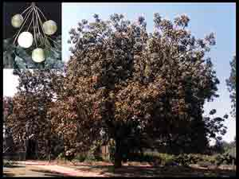
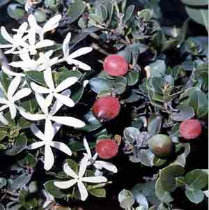
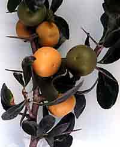
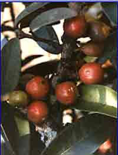
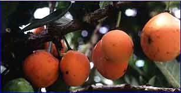
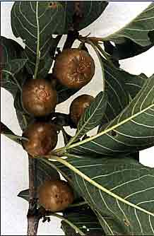
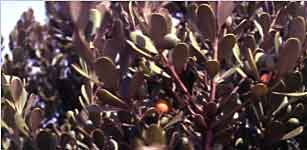

<body>

<h2>
Investigation into Commercial Potential of Indigenous South 
African Fruits
</h2>

  
<h3></h3>

Rosemary du Preez  
E-mail: rose@itsc.agric.za  
  
  
/

Institute for Tropical &amp; Subtropical Crops  
Nelspruit 1200 South Africa  
Phone: 13-7532071 Fax: 13-7523854  
E-mail: rose@itsc.agric.za  
ATCROS Reference:  
  
  
  


<b>Abstract</b> 
Some indigenous African fruits show promise and potential for development.

<h1>Introduction</h1>

<table><tr><td>
<b>The Importance of Indigenous Fruits</b>
<ul><li>
Important in conservation of biodiversity.  A lot of trees have been chopped down, often used as a source of firewood.</li>
<li>Indigenous trees are well adapted to local conditions.  Most of South Africa is fairly arid country, and exotic trees need irrigation.</li>
<li>They promote development in rural areas.</li>
<li>They contribute to:</li>
<ul><li>
   food security</li>
<li>community upliftment</li>
<li>job creation</li>
<li>improved quality of life</li>
</ul></ul>
</td><td>
<b>There is a wide diversity of indigenous fruits.</b>
<ul><li>They are a source of:</li>
<ul><li>
   vitamins</li>
<li>minerals</li>
<li>amino acids</li>
<li>trace elements</li></ul>
<li>They play an important role in the diet of rural populations.</li>
<li>Few African fruits have been developed.</li>
<li>A number are being investigated.  There are so many, it is quite difficult to choose which to look at first.</li>
<li>Market development is important.  Part of market development is value adding, processing fruit to make them easier to market.</li></ul>
</td></tr></table>

<table><tr><td width="25%"> </td><td>

<b>Numerous species have potential</b>

<ul><li>
<i>Sclerocarya birrea</i> (marula)</li>
<li><i>Carissa bispinosa</i> (num-num)</li>
<li><i>Dovyalis caffra</i> (Kei-apple)</li>
<li><i>Englerophytum magalismontanum</i> (Stem fruit)</li>
<li><i>Garcinia livingstonei</i> (African mangosteen)</li>
<li><i>Vangueria infausta</i> (wild medlar)</li>
<li><i>Mimusops zeyheri</i> (Transvaal red milkwood)</li>
<li><i>Parinari curatellifolia</i> (mobola plum)</li>
<li><i>Cordyla africana</i>   (wild mango)</li>
<li><i>Harpephyllum caffrum</i> (wild plum)</li>
<li><i>Adansonia digitata</i> (Baobab)</li></ul>
</td><td width="25%"> </td></tr></table>

<table><tr><td>
<b><i>Sclerocarya birrea,</i>  Marula</b>
<ul>
<li>Family: Anacardiaceae</li>
<li>A relative of the mango and cashew, and is the fruit that has received most attention to date.</li>
<li>Selections in wild</li>
<ul><li>Fruit mass 20-80 g.</li>
<li>Vegetative propagation has been undertaken.  Grafting can reduce the juvenile period.</li>
<li>Used to make a liqueur which is sold internationally.</li></ul>
<li>It is an enormously large tree.  Male and female trees often separate.</li>
<li>The flowering period is not well-known yet.  The flowers appear to be different genders in different years, and it is not known exactly what is happening.  Some university studies are being done.  Fruit ripen February-March.</li>
<li>Important source of Vitamin C (ascorbic acid),
   54 to 190 mg/100 g, and compares favourably with citrus.  The better ones have a better Vitamin C content than citrus.</li>
</ul></td><td></td></tr></table>
<ul>
<li><b>Uses of Fruit</b></li>
<ul><li>Fruit is juicy and aromatic.</li>
<li>Eaten as a fresh fruit.</li>
<li>Processed into jams, jellies, juices and alcoholic beverages.</li></ul>
<li><b>Uses of Marula Kernels</b></li>
<ul>
<li>Seed kernel used as a nut, eaten fresh or roasted.</li>
<li>Has a high protein content.</li>
<li>Contains a non-drying oil used in food and in soap making.</li></ul>
<li><b>Uses in Traditional Medicine</b></li>
<ul>
<li>Bark is used in treatment of dysentery and diarrhoea.  If collected before first flush of leaves, it prevents malaria (tincture) or powdered and swallowed cures the fever.</li>
<li>Oil is used as a cosmetic.</li></ul></ul>

<table><tr><td></td><td>
<b><i>Carissa bispinosa,</i>  Num-num, or Natal Plum</b>
<ul><li>Family: Apocynaceae</li>
<li>Numerous Carissa species.</li>
<li>Scrambling shrub or small tree with thorns.</li>
<li>Pollination problem occasionally, pollinated by small beetles, hawk-moths, night-flying insects.</li>
<li>Slow growing.</li>
<li>Subtropical but survives temperatures of -3oC.</li>
<li>Has a moderate drought tolerance.</li>
<li>Resistant to soil salinity and salt spray.</li>
<li>The fruit is ovoid and fleshy, red when ripe.</li>
<li>Eaten fresh in fruit salads, ice cream.</li>
<li>Cooked into sauce, jams and jellies.</li></ul>
</td></tr></table>

<table><tr><td>
<b><i>Dovyalis caffra,</i> Kei-apple</b>
<ul>
<li>
Family: Flacourtiaceae</li>
<li>Subtropical but can survive brief -6oC.</li>
<li>Drought resistant.</li>
<li>Tolerates saline soils.</li>
<li>Trees have large spines.  It is often used as a hedge in rural areas.  Harvesting is difficult.</li>
<li>Male and female flowers borne on separate trees.</li>
<li>Fruit pulp is juicy, highly acidic with an apricot texture.  We have a wide variety of selections, with a wide variety of acidity.  Our selection program selects from the wild.</li>
<li>Contains ascorbic acid, about 80 mg/100 g.</li>
<li>Eaten fresh or processed into jams and jellies.  Green fruit is pickled.  As long as they are not too acid, they make a good dried fruit roll, and compares favourably with dried apricot.</li>
<li>Fruit of selected varieties range in mass from 20.1 g to 26.3 g, and TSS ranges from 10.5 to 11.9 brix.</li></ul>
</td><td></td></tr></table>

<table><tr><td><td <i="">Englerophytum magalismontanum,<b>Stem fruit</b>
<ul>
<li>Family: Sapotaceae</li>
<li>Small bushy tree (3-10 m).</li>
<li>Flowers inconspicuous, borne in clusters on stems/branches.</li>
<li>Fruits ovoid and fleshy, and change from yellow to orange and finally dark red.</li>
<li>Fruits ripen during summer.</li>
<li>High ascorbic acid content.</li>
<li>Eaten fresh, processed into jellies, jams, syrup, or brewed into an alcoholic drink.</li>
<li>Susceptible to fruit fly.</li>
<li>Used in traditional medicines:</li>
<ul><li>Infusion of finely stamped fruits and roots used in treatment of epilepsy.</li>
<li>Pulverised bark for rheumatism.</li>
<li>Roots to relieve headaches.</li></ul>
</ul></td></td></tr></table>

<table><tr><td>
<b><i>Garcinia livingstonei,</i>  African mangosteen</b>
<ul>
<li>Family: Clusiacea
<li>Occurs at low altitudes.</li>
<li>Riverine fringes and open woodland.</li>
<li>Tree is small to medium (2-10 m).</li>
<li>Distinctive habit--stiff, rigid branches at acute angles.</li>
<li>Flowers borne on slender stalks in groups, clustered on older branches.</li>
<li>Fruits are spherical, about 25 mm diameter, yellow to orange when mature.</li>
<li>Harvested November to January.</li>
<li>Eaten fresh or processed into an alcoholic beverage or jams and jellies.</li>
<li>In traditional medicine, extracts of leaves and flowers show antibiotic properties.</li>
</li></ul>
</td><td></td></tr></table>

<table><tr><td></td><td>
<b><i>Vangueria infausta,</i> Mispel</b>
<ul>
<li>Family: Rubiaceae</li>
<li>Eastern and Northern regions of South Africa.</li>
<li>Drought resistant.</li>
<li>Fruits ripen between January and April.</li>
<li>Light brown when ripe</li>
<li>Subsistence from wild.  Local people utilise fruit in times of food scarcity.</li>
<li>Contains ascorbic acid.</li>
<li>Seed kernels eaten as nut--rich in protein.</li>
<li>Potential in processing.</li>
<li>Roots used in traditional medicine for a number of complaints including malaria and pneumonia.</li></ul>
</td></tr></table>

<table><tr>
<td>
<i>Mimusops zeyheri,</i> <b>Moepel</b>
<ul>
<li>Family: Sapotaceae</li>
<li>Northern region of South Africa, Zimbabwe, Botswana and Mozambique.</li>
<li>Low altitudes, hot areas.</li>
<li>Flowering season--November to December</li>
<li>Fruit ovoid, 20-30 mm in length, 10-25 mm in diameter.</li>
<li>Yellow to orange when mature.</li>
<li>Flesh is dry and floury.</li>
<ul><li>65% water</li>
<li>28% carbohydrates</li>
<li>90 mg ascorbic acid/100 g fruit</li></ul>
<li>Important in diet of rural people.</li>
<li>Eaten fresh or sundried and stored.</li>
<li>Crushed to extract juice which is fermented or made into jams and jellies.</li>
</ul></td>
<td colspan="2">

<h2>Conclusion</h2>

<ul>
<li>These are just a sample of the abundance of indigenous fruit trees.</li>
<li>Potential exists.</li>
<li>Research is required.</li>
<ul>
<li>Selections of suitable genotypes.  What we are doing at this stage is selecting from the wild.  We go around and survey where the trees are found naturally and speak to the local people who use it.</li>
<li>Propagation.  Once we have the selections, we need to propagate them vegetatively, which hasn't been done up till now.  The easiest way is to plant seedlings and graft them.  Grafting is usually successful, especially once we get the time of year correct.</li>
<li>Cultural needs.  Nothing is known about cultural methods: they have not been cultivated before.</li>
<li>Value adding.  We look at turning them into products that can be sold on the local market or exported.</li></ul></ul></td>
</tr>

Q.  In Australia there is a lot of interest in bush tucker, especially in relation to the tourist industry.  Is there a similar interest in South Africa?

A.  Yes, there is a big movement.  Other institutes in the Agricultural Research Council have been looking at indigenous vegetables like ground nut and amaranthus.  Tourists have these indigenous foods served to them.  A lot of the fruit is a dry and floury type which tourists aren't used to and don't like much.  Stem fruit jam is sold as a tourist attraction.  Private game lodges adjacent to Kruger National Park that cater to international tourists are a potential market.

Q.  What kind of temperatures does South Africa have?

A.  We don't get many days below zero.  We have occasional frost.  In summer, average temperatures are probably around 28 degrees C.  Altitude is about 500 to 600 m.

</table>

</body>
