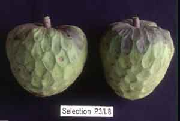

<body>

<h2>
Annonas and Carambolas
</h2>

  
<h3></h3>

Rosemary du Preez  
E-mail: rose@itsc.agric.za  
  
  
/

Institute for Tropical &amp; Subtropical Crops  
Nelspruit 1200 South Africa  
Phone: 13-7532071 Fax: 13-7523854  
E-mail: rose@itsc.agric.za  
ATCROS Reference:  
  
  
  


<b>Abstract</b> 
The Institute is doing research into the development, cultivation and marketing of several Annona species and Carambolas.  Trials of imported cultivars and seedlings are being made.  Selections are chosen for yield and fruit quality and adaptation to local conditions.

I come from the Institute for Tropical &amp; Subtropical Crops in Nelspruit, South Africa.  Nelspruit is on the eastern side of South Africa, and has a subtropical climate.  At the Institute we do research on commercial subtropical crops that grow in South Africa, which includes citrus, mangoes, lichees, coffee, macadamias.  I will speak here about annona and carambola, two of our exotic crops.

Other exotic crops we are studying include the pitanga, <i>Eugenia uniflora.</i>  We have a dark maroon variety with fruit size up to 12 or 15 grams, high sugar content, not at all sour compared to the red varieties.  There are people who have planted two or three hundred trees per smallholding, and they sell them on the local markets.  The other one I will mention today is jaboticaba.  We have a problem with the long juvenile phase.  They are good fruit to eat, but if you have to wait...some of our trees at the Institute are 12 years old before they started fruiting.  We have tried different methods of shortening the juvenile period, but haven't been very successful.  We have it down to 7 years, but they are still not considered a good prospect for commercial growing.  We recommend people plant them as hedges along their roads.  You can then forget about them: they don't have any pests.  In seven to ten years when you start harvesting, then you can sell the fruit locally.

There are 40 to 50 genera in the Annona family.  Common names in this family can be quite confusing.  People talk of custard apples, and that can be anything from <i>Annona cherimola</i> on through.  We don't use the term 'custard apple' in South Africa any more, to move away from that confusion.
<table><tr><td>

The atemoya is a hybrid between those two.  Its growth requirements are also a cross between the two parents.  The cherimoya can stand quite a bit of cold, squamosa cannot.  Atemoya fits right in  between.  If you look at the climate, growth is initiated in the cherimoya at a base temperature of about 7oC, and the atemoya at about 10oC.  The atemoya grows better in a warmer, humid climate.  The cherimoya can stand quite cold conditions, to -3oC.  A mature tree will probably survive to -6oC.

Dormancy is necessary.  The trees need leaf drop before you can get the new buds that are underneath the old leaves.  If the old leaf doesn't drop because it isn't cold enough, you have to stress the tree in some way, for example, by removing water.  In cool, subtropical climates, the atemoya fruit doesn't reach full maturity.  We struggle in Nelspruit with atemoyas.  We don't get a lot of fruit on the tree, we don't get good ripening.  Further down towards the Mozambique border the atemoyas do better than the cherimoyas.  If the climate is too tropical, the cherimoyas don't get a full flavour.

The work we are doing at the moment is the evaluation of seedlings and imported cultivars of atemoya and cherimoya.  We have imported material from Chile, Peru, USA, Israel, Canary Islands, Brazil and Australia.  We have 19 cherimoya cultivars, 3 atemoya cultivars and about 300 seedlings that are already in production.  We have Bronceada which I think is Chile's most important cultivar.  It doesn't do very well in Nelspruit.  The Spainish cultivar Fino de Jetè does very well in Nelspruit.

In cherimoyas, pollination is often thought to be a problem.  The flower is a hermaphrodite.  The stigma is receptive when the flower is just opening.  The pollen is only set free when the flower is right open, by which time the stigma is not receptive any more.  In its natural habitat in Central America, the nitidulidae beetles are responsible for pollination as they crawl in and out of the flowers.  When the stigma is receptive, a normal pollinating insect can't get in because the flowers are only open a little.  It is a green flower, so it is not attractive to bees even though it has the same smell as the fruit.

Environmental conditions during flowering are important for pollination.  We carried out experiments in hand pollination.  We found that if you didn't have good pollination you get mis-formed fruits, unacceptable.  We only used five of the cultivars in the pollination trial.  We took two trees and hand-pollinated every flower.  It took a few hours every day for six weeks.  Every flower that was pollinated had to be tagged, as well.  Two trees were the controls with no hand-pollination.  Every flower was counted. The number of fruit that set and the percentage that reached maturity were determined.  The trees were only two years old when they started flowering, so we did it over two years.

We used cherimoya pollen as a source.  We also used atemoya and pollen from our indigenous species, <i>Annona senegalensis,</i> which has a short flower and a lot of pollen, compared to other species.  These are our results.  In the first year, you can see that some of the cultivars there was better results from natural pollination compared to hand-pollination.  I think we were ignorant as to exactly how to do it.  The next year, hand-pollination was a little better, but not significantly.  They are not really mature trees, so it is difficult to say.

The conditions we found necessary for successful pollination, and successful hand-pollination, were that you must collect the pollen from flowers that were fully open.  If we collected the pollen too early, the viability was low.  We collected pollen only between 3:00 and 4:00 in the afternoon.  If we pollinated a cherimoya with pollen from a <i>Annona senegalensis,</i> we still got a good fruit set.  The flowers we pollinated had to be within the canopy and very newly opened.  There was a specific time when the flower was newly opened and the stigma was receptive.  Pollination had to be finished by 9:30 am at the latest.  Any pollination after 10:00, you didn't get any fruit set.  So, you have to start about 5:00 or 6:00 in the morning, until 9:30.  I think it gets too hot after that, and the humidity is too low.  In Nelspruit in January and February, daytime temperatures get up to 28 to 30 degrees Celsius.  Early in the morning, it is around 22 or 23 degrees.  Removal of petals after pollination is not conducive to fruit set.

We kept the pollen we collected in the afternoon in an air-conditioned room.  You can probably keep it in a refrigerator for about 3 days.  Some people say longer, but we found the viability fell off.  You can just put the flowers on glass, and the next morning, you collect the pollen off the glass.

Flowers on new vegetative growth set fruit better than flowers on old growth.  If your leaf canopy was fully developed, there was a better fruit set.  If the tree was flushing or growing excessively, the set was poor.  Hot, dry weather was detrimental to fruit set, but overcast days were also detrimental.  So, you want a hot day with high humidity.

Evaluation of the fruit consists of evaluation of the yield, the necessity for hand-pollination of a particular cultivar, fruit quality, the time of maturity, and the susceptibility to fruit splitting, which is quite a problem with some of our cultivars.

In 2000, the trees were four years old.  The two cultivars that did by far the best were the two Spanish cultivars.  There were some two-year-old seedlings which bore fruit, which is quite unusual.  So far, only one seedling has produced a good crop, but they will probably improve as they get older.

When comparing fruit mass with yield, the two best yielders  were (?) and (?).   With a good yield you often get a smaller fruit size, but we got acceptable fruit size, between 450 and 500 grams.  We got some fruit of over a kilogram.  For commercial purposes, that is actually too large.  We try to select for fruit that is in the vicinity of 500 grams.

Some of the cultivars have high total soluble solids, up to about 50.  The two best cultivars were about 20 and 25, quite acceptable.  The seedlings were in the same range.  Our best selection of good yield and fruit size gave us a TSS value of 17 or 18.

Another important aspect of our selection is the number of seeds per 100 grams.  You don't want more than 10 seeds per 100 grams of fruit flesh.  The best cultivar gave us 5 seeds per 100 grams with a good fruit size.  Some of the seedlings went up to 20 seeds per 100 grams, which is not acceptable.

<table><tr><td></td><td>Jetè, left 

A Selection, right</td><td></td></tr></table>

Here are some of the cultivars we have.  One is White, which is a Californian cultivar, but it has protuberances which we also don't want, as they make packing difficult.  Our best seedling was the R20 selection.

 
<h2>Imported Cultivars Evaluated at Nelspruit</h2>
<table><tr><td>SOURCE</td><td>CULTIVAR</td></tr>
<tr><td>Chile</td><td>Bronceada, Local Serena, Santa Julia</td></tr>
<tr><td>Canary Islands</td><td>Jetè, Campas, Gefner</td></tr>
<tr><td>Spain</td><td>Campas, Fino de Jetè, Manteca, Pasicas</td></tr>
<tr><td>USA</td><td>White, Chaffey, Bays, Pierce, Bonita</td></tr>
<tr><td>Peru</td><td>Chiuna 1, Chiuna 2, Chiuna 3, Chiuna 4, Cholan</td></tr>
<tr><td>Australia</td><td>African Pride (Atemoya) Pink's Mammoth (Atemoya)</td></tr></table>

Problems we have encountered include fruit fly, which is always a problem in Nelspruit.  We manage to control it fairly effectively with spraying and bait traps.  False codling moths, which we haven't yet controlled effectively.  Fruit splitting was confined to 7 cultivars which were late-maturing.  When there were cold days, we ended up with a lot of fruit splitting.   You can't market split fruit.

At the moment, the limiting factors on developing  further is the final selection of the best-suited cultivars for the local area.  We have very limited propagation material.  The only annonas in South Africa are at the Institute, which means we can grow seedlings for root stock but bud material is very limited.  We only have a few mother trees.  We are beginning to look at tissue culture.  Cuttings were successful, but they are very shallow-rooted.  The trees blow over in the wind.  We need to look at effective pest control methods.  And the fruit has a limited shelf life, so that needs to be kept in mind, also.

The research we still need to do includes rapid methods of clonal propagation and tree training.  The trees are very vigourous in our area; we prune them every year.  We originally pruned them into an open vase shape, but now, after having worked with them for a while, the new plantings are being pruned into central leaders.  We will see if we do better with those.  We plant them on a spacing of 5 m by 2.5 m.  We are starting to look at production systems. Fertiliser requirements and things like that haven't been done in South Africa yet.  We are only using what we have learned from the literature.  The local market needs to be developed.  Most people in South Africa don't know cherimoyas, but once they have tasted them, there is no problem.

At this stage, we can say that the cherimoya grows very well in South Africa.  We have got 7 cultivars and selections, pollination is not necessary.  We are aiming to get cultivars that do not need hand-pollination, which is very labour-intensive.  We have made two selections so far that give us adequate yields and fruit quality.  The potential certainly exists for the development of cherimoya in South Africa.

<table><tr><td><h2>Carambola</h2></td><td></td></tr></table>

Everyone probably knows the carambola better as the 'star fruit.'  It is a fruit with an unusual shape.  There are no large plantings in South Africa, but people have them in their gardens.  They sell the fruit in the local markets for good prices.  Last year they got 15 Rand, about $4, for two fruit, and they weren't even very good fruit.

Most of the commercial plantings are in Malaysia, Taiwan, Israel and Thailand.  If you look at some old figures, in Florida, it has increased from 10 hectares to about 600 hectares in 1991.  In Malaysia, they have 760 hectares of carambolas.  The UK imports about1,600 tonnes, mainly from Malaysia and Brazil.  South Africa also imports carambolas, mainly from Malaysia.

Our research, again, consists of looking at methods of rapid vegetative propagation.  We are looking at cuttings, grafting, and also the choice of genotypes suited to local conditions: evaluation of imported cultivars as well as selection of locally adapted genotypes from seedling orchards.  We don't have a lot of fruit trees in production, but only an orchard which was planted in 1998 of 450 seedlings.  The fruit varies from the sweet to the tart in the seedlings.  There are 7 imported cultivars from Hawaii which are still quite young.  They were first quarantined for a year before being planted out.

Evaluation is done of fruit quality and yield.  We get up to three harvests per year from some of the trees.  If we look at the yield from 2-year-old trees: we harvest in April, August and January.  The January harvest is very small.  We get a yield of up to 25 kg per tree, which isn't actually all that high, compared to figures from the Canary Islands and Malaysia where they get up to 50 or 60 kg per 2-year-old tree.  They do bear a lot of fruit.  The fruit mass varies between 80 grams up to 140 grams.  Under 100 grams is probably a little small, so we are looking for fruits between 100 and 120 grams.  The total soluble solids content is actually very low in ours, especially from fruit harvested in April. This year we had a lot of rain.  The fruit harvested in August had a better TSS.  It only ranged between 8 and 12, which is a bit low.

In our research, we are looking at propagation.  Our propagation material is very limited.  We selected a seedling tree: we have one tree.  There are four or five growers who have planted one or two thousand trees in the last year.  We don't get cuttings to root very well.  Those that do root have poor root systems.  Cuttings don't seem to be an option at this stage.  We are grafting onto seedlings.

<table><tr><td></td><td>Branches broken on a young carambola tree with a heavy crop.</td></tr></table>

We don't know anything about cultural practices, especially pruning.  We have a problem with breaking of branches under heavy fruit loads.  We need to look at the correct angle of branch attachment.  The nutrient requirements are not known.  Because it is high bearing, we are probably under-fertilising at this stage.  We need to look at norms for local conditions.  We will continue breeding selection of cultivars and locally-adapted seedlings.  Markets need to be developed.  Some of our local processors are now looking at using carambola in fruit juice mixtures.  If they put pictures of carambola on the packaging, it sells just on the shape of the fruit, even if the taste isn't very strong in the fruit flavours.  We have also dried fruits, cut into sections and dried as stars.  It is popular just for the attractive appearance.

We have had problems with thrips, so we will have to control them by spraying.  We also have false codling moth in the carambola, fruit fly.  Fruit fly has not been a serious pest in carambola.  And there is the coconut stink bug that marks the fruit.

Carambola seems to do quite well in our area.  Once the marketing matters have been addressed, there is certainly potential for carambola, locally.

</td></tr></table>
</img></body>
